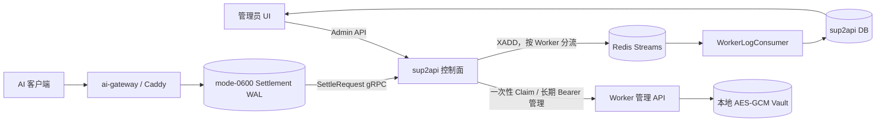
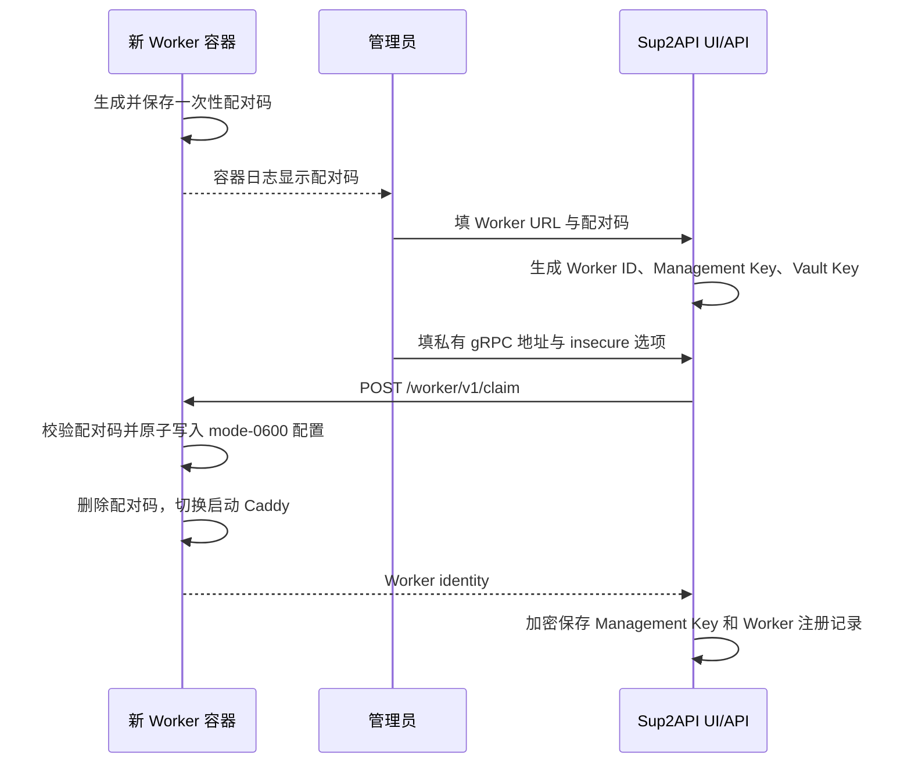

# AI Gateway Worker 管理架构

## 1. 架构结论

`sup2api` 是唯一控制面，`ai-gateway` 是以独立容器运行的 Caddy Worker。标准边界如下：

- 管理操作：`sup2api -> Worker HTTP/JSON /worker/v1/*`。
- AI 请求控制与结算：`Worker -> sup2api 私有 gRPC`。
- 消费日志：`Worker settlement WAL -> 私有 gRPC -> sup2api -> Redis Stream -> WorkerLogConsumer -> DB/UI`。
- Worker 不连接 Redis，不持有 Redis URL、账号、密码、Stream Key 或 Consumer Group。
- Worker ID、管理密钥、Vault 密钥、控制面地址由 Worker 管理 UI 首次下发，不作为容器环境变量注入。
- 容器生命周期仍由 Docker/Kubernetes 管理；`sup2api` 不挂载 Docker Socket。

管理面选择 HTTP/JSON，是为了跨容器、跨语言、便于版本化；请求准入、租约和结算继续使用私有 gRPC，是为了保持强类型、低开销及明确的失败语义。

## 2. 组件与信任边界



必须遵守的边界：

1. 浏览器只访问 `sup2api`，不直接调用 Worker，也不持有长期管理密钥。
2. Worker 只访问私有 gRPC 控制面和上游 AI 服务，不访问 Redis 或主数据库。
3. `sup2api` 只调用固定 Worker 路径，禁止把管理 API 做成任意 URL 转发器。
4. Worker 返回账号摘要，绝不返回 API Key、access token、refresh token 或 Vault key。
5. 生产环境应通过容器网络、防火墙、HTTPS/mTLS 隔离 `/worker/v1/*` 和 gRPC 端口。

## 3. 容器首次配对

### 3.1 未认领状态

新容器只需要监听地址和持久化数据卷。找不到 `worker-config.json` 时，进程不会启动 Caddy 数据面，只启动最小 Bootstrap HTTP：

| 方法与路径 | 用途 |
|---|---|
| `GET /healthz` | 进程存活 |
| `GET /worker/v1/bootstrap` | 返回协议版本、未认领状态和实例 ID，不返回配对码 |
| `POST /worker/v1/claim` | 使用一次性配对码下发长期配置 |

Worker 使用 CSPRNG 生成一次性配对码，以 mode `0600` 保存在数据卷并打印到容器日志。配对码是新容器的启动信任锚，不是长期运行配置。

### 3.2 UI Claim 流程



Claim 请求包含：

```json
{
  "pairing_token": "one-time-code",
  "worker_id": "gateway-sh-01",
  "management_key": "at-least-32-characters",
  "vault_key": "base64-or-hex-encoded-32-bytes",
  "control_plane_target": "sub2api:9090",
  "control_plane_insecure": true
}
```

成功后一次性配对码立即删除且不可再次 Claim。长期配置写入 Worker 数据卷：

```text
/var/lib/ai-gateway/data/worker-config.json  mode 0600
/var/lib/ai-gateway/data/worker-vault.db
/var/lib/ai-gateway/data/settlements/
```

`worker-config.json` 包含 Management Key 和 Vault Key，其保密性依赖宿主数据卷权限。更高安全等级应使用加密磁盘、Kubernetes Secret/KMS 包装或后续引入设备密钥封装，不能把该文件放入镜像或提交到 Git。

## 4. Worker 身份与状态机

| 字段 | 语义 | 生命周期 |
|---|---|---|
| `worker_id` | 稳定业务身份，全局唯一 | UI 创建，容器重建后保持 |
| `instance_id` | 当前进程实例 | 每次进程启动重新生成 |
| `protocol_version` | 管理协议兼容边界 | 当前 `aicodex.proxy-worker/v1` |
| `version` | Worker 镜像/程序版本 | 随发布变化 |
| `generation` | 部署代次 | 后续部署系统使用 |
| `config_revision` | 期望配置版本 | 后续配置发布使用 |

状态转换：

```text
unclaimed --claim--> starting --gRPC/Vault ready--> ready
                                \--> unready
ready/unready --探测失败--> unreachable
```

容器 IP、容器名和数据库自增 ID 都不能替代 `worker_id`。`instance_id` 只用于诊断重启、替换和日志来源。

## 5. 长期管理协议 v1

Claim 成功后，长期管理请求使用：

```http
Authorization: Bearer <management-key>
Content-Type: application/json
```

主要端点：

| 方法与路径 | 用途 |
|---|---|
| `GET /worker/v1/identity` | 身份和 capability 协商 |
| `GET /worker/v1/live` | Worker 进程存活 |
| `GET /worker/v1/ready` | Caddy、gRPC 控制面和 Vault 就绪 |
| `GET /worker/v1/status` | 运行状态，日志传输标记为 `control_plane_grpc` |
| `GET /worker/v1/accounts` | 本地账号摘要 |
| `POST /worker/v1/accounts/openai/api-key` | 创建本地 API Key 账号 |
| `POST /worker/v1/accounts/openai/oauth/start` | 创建本地 PKCE 会话 |
| `POST /worker/v1/accounts/openai/oauth/complete` | 在 Worker 内换取并保存 token |
| `POST /worker/v1/accounts/{id}/refresh` | 在目标 Worker 刷新 OAuth |
| `POST /worker/v1/accounts/{id}/test` | 在目标 Worker 测试账号 |
| `DELETE /worker/v1/accounts/{id}` | 删除本地账号和凭据 |

传输标准：

- Worker URL 只允许 `http/https`，禁止 userinfo、query 和 fragment。
- 控制面禁止跟随 Worker 重定向，避免 Bearer 泄漏到其他主机。
- 管理响应限制为 2 MiB，调用设置总超时。
- v1 只增加可选字段或 capability；破坏性变化发布 `/worker/v2`。
- 错误采用稳定 `code` 和诊断 `message`，调用方不能依赖 message 文本。

## 6. Redis 隔离与日志可靠性

### 6.1 唯一合法链路

```text
AI request finished
  -> Worker fsync settlement WAL
  -> Worker SettleRequest(private gRPC)
  -> sup2api authoritative settlement/dedup
  -> sup2api 根据 data_plane_id 查询已注册 Worker
  -> sup2api XADD 到该 Worker 独立 Redis Stream
  -> gRPC success
  -> Worker 删除 WAL
```

主进程拥有全部 MQ topology。默认 Stream 命名为：

```text
aicodex:worker:consume-logs:<base64url(worker_id)>
```

Consumer Group：

```text
sub2api-worker-logs-v1
```

Worker 不计算、不接收也不报告 Stream Key。主进程从数据库解析 `data_plane_id` 对应的 Worker；未注册的普通数据面保持兼容，不产生 Worker Stream 日志。

### 6.2 消息与隔离

Stream 消息至少包含：

| 字段 | 含义 |
|---|---|
| `event_id` | 幂等事件 ID，当前使用 request ID |
| `event_type` | `consume` |
| `worker_id` / `instance_id` | 稳定 Worker 与本次进程身份 |
| `request_id` | 请求追踪 ID |
| `channel_id` | 中央调度租约中的上游账号/渠道标识 |
| `model_name` | 实际映射模型 |
| `created_at` | 完成时间 Unix 秒 |
| `payload_json` | account、token、耗时、上游状态等用量事实 |

每个 Worker 使用独立 Stream，消息还携带 `worker_id`。Consumer 将 Stream 与数据库 Worker 记录预先绑定，并拒绝消息中的身份不匹配；落库使用控制面自己的 Worker 外键，消息不能自行选择目标 Worker。

### 6.3 故障语义

- Redis `XADD` 失败时，gRPC 返回 `Unavailable`，Worker 不删除 WAL并重试。
- 结算已完成但 XADD 失败时，重试会进入结算 duplicate 路径并再次尝试 XADD，不会重复扣费。
- XADD 成功但 gRPC 响应丢失时可能重复发布；数据库唯一键 `(worker_id, event_id)` 保证幂等。
- Consumer 只有数据库写入成功才 `XACK`，重启后用 `XAUTOCLAIM` 接管 pending 消息。
- 因此端到端语义为 at-least-once，财务结算和日志持久化分别有幂等保护。

## 7. 容器运行标准

首次启动只需要端口、数据卷和可选运行参数：

```yaml
services:
  ai-gateway:
    image: sup2api/ai-gateway:latest
    ports:
      - "9999:9999"
    volumes:
      - ai_gateway_data:/var/lib/ai-gateway/data
    environment:
      AI_GATEWAY_LISTEN: :9999
      AI_GATEWAY_WORKER_CONFIG_PATH: /var/lib/ai-gateway/data/worker-config.json
      AI_GATEWAY_WORKER_VAULT_PATH: /var/lib/ai-gateway/data/worker-vault.db
      AI_GATEWAY_SETTLEMENT_WAL_PATH: /var/lib/ai-gateway/data/settlements
```

明确禁止向 Worker 注入：

```text
AI_GATEWAY_WORKER_ID
AI_GATEWAY_MANAGEMENT_KEY
AI_GATEWAY_VAULT_KEY
AI_GATEWAY_REDIS_URL
AI_GATEWAY_CONTROL_PLANE
```

其中 Worker ID、两个密钥和控制面地址全部从 UI Claim 下发；Redis URL 在 Worker 配置模型中根本不存在。`GET /healthz` 在 Bootstrap 和 Caddy 两种状态都可用，因此容器健康检查不需要管理密钥。

mTLS 部署目前仍通过只读 Secret 文件挂载 CA/客户端证书，并由传输层环境变量指定文件路径；这些不是 Redis 配置。若要求所有跨主机 TLS 材料也由 UI 管理，下一版本需要设计证书签发、轮换和吊销协议，不能简单把 PEM 文本复用到当前 Claim 字段。

## 8. 数据所有权

| 数据 | 权威方 | `sup2api` 保存内容 |
|---|---|---|
| Worker 长期身份和期望连接 | `sup2api` UI/DB | 注册记录、加密后的 Management Key |
| Management/Vault Key | UI 首次生成 | Management Key 加密保存；Vault Key 不回传 |
| OpenAI 真实凭据 | Worker Vault | 仅账号摘要索引 |
| OAuth PKCE 临时状态 | Worker 内存 | 仅中转 session ID |
| 准入、租约、计费 | `sup2api` | 权威记录 |
| Settlement WAL | Worker 数据卷 | 不保存 WAL 文件 |
| Redis topology 和消费日志 | `sup2api` | Stream 配置、按 Worker 外键的查询副本 |
| 容器生命周期 | Docker/Kubernetes | 不持有运行时控制权 |

删除 `/admin/workers/{id}` 只表示解除注册，不停止容器、不删除 Worker Vault。远程重置或销毁必须设计单独的高风险端点和审计流程。

## 9. 当前范围和后续演进

当前 Worker-local OpenAI 账号可以创建、OAuth、刷新、测试和删除，但中央请求调度仍使用现有中央账号。若要让 Worker-local 账号承载公共流量，ExecutionPlan 必须增加 remote account reference，并明确账号租约、并发和故障迁移语义，不能仅靠管理 API 自动接入 scheduler。

建议后续顺序：

1. Claim 前的本地 pending 注册和失败恢复，消除“Worker 已认领但数据库写入失败”的不确定窗口。
2. 周期心跳、实例替换检测和状态历史。
3. 管理写操作 `Idempotency-Key`。
4. Management Key 双密钥轮换或设备证书身份。
5. mTLS 证书签发、轮换、吊销的 UI 工作流。
6. desired/applied config revision 和受审计的配置发布。
