# sub2api-next 架构设计（初始版本）

> 状态：草案，待确认
> 目标：基于"用户 / 角色 / 权限 + 插件"的架构，重写一个全新的服务。旧代码保留，仅作参考。
> 平台方面，初始版本只实现 Anthropic Messages 协议的 API Key 转发；插件体系的各项能力在本期全部落地。

---

## 0. 阅读指引

| 章节 | 内容 |
|---|---|
| 1 | 初始版本做什么、不做什么 |
| 2 | 部署架构、节点内部架构、多节点协作（**节点架构图**） |
| 3 | 核心与插件的划分 |
| 4 | 数据模型 |
| 5 | 插件系统：插件包、manifest、gRPC 契约、生命周期、授权确认、数据库 schema 与迁移、多节点发布 |
| 6 | 网关：请求流水线、调度、钩子 |
| 7 | 分组、计费与余额 |
| 8 | 插件后台任务与事件订阅 |
| 9 | 插件网络：出口隧道与严格模式 |
| 10 | 插件资源限制 |
| 11 | 插件签名、信任与插件市场 |
| 12 | 前端：控制台、插件界面（schema / iframe / 原生微前端） |
| 13 | 用户 / 角色 / 权限 |
| 14 | 其他关键流程：账号录入、插件安装 |
| 15 | 两个演示插件：anthropic、guard |
| 16 | 代码仓库结构与技术选型 |
| 17 | 实施计划、Agent 团队、验收标准 |
| 18 | 决策记录与待确认事项 |
| 附录 A | 控制台界面线框图 |

---

## 1. 范围

### 1.1 本期要做的

| 类别 | 模块 | 内容 |
|---|---|---|
| 核心数据 | 用户 | 管理员创建用户、登录（JWT）、启用/禁用、每用户并发上限；首次启动通过环境变量创建超级管理员 |
| | 角色 / 权限 | 自定义角色、权限目录（核心权限 + 插件注册的权限）、给角色授权、给用户分配角色；后端鉴权；前端按权限显示菜单和按钮 |
| | API Key | 用户创建、查看、删除自己的 Key，每个 Key 绑定一个分组；只保存哈希 |
| | 分组 | 分组包含哪些账号、倍率、模型白名单、哪些用户可用 |
| | 代理 | 增删改查（http / https / socks5），账号可以绑定代理 |
| | 账号 | 通用账号表；录入时先选择插件定义的账号类型，再由插件提供录入界面；凭证加密存储 |
| | 计费与余额 | 独立的模型价格页面，支持按次、按 token、按表达式三种计费方式（表达式可以按上下文长度分档、给缓存单独定价、按请求头/参数/时段加价），插件提供默认价格，管理员可覆盖；价格试算；用户余额、余额流水（账本）、请求前余额检查、请求后结算、管理员调整余额 |
| | 使用记录 | 每次请求记录用户、Key、分组、账号、模型、token 数、费用、耗时、状态 |
| 网关 | 转发 | 端点属于平台：核心内置 anthropic、openai、gemini 平台及端点，插件可声明新平台；核心按声明执行通用流水线；流式和非流式；分组内选账号（按账号类型支持的平台）、账号和用户并发控制、失败切换、账号冷却 |
| | 粘性会话 | 核心提供调度引擎（规则匹配、会话 key、Redis 绑定、成功后切换、失败策略、命中统计）；平台插件提供默认规则，管理员可覆盖和新增；复杂取值可由插件实现扩展点 |
| | 网关钩子 | 插件可以在请求进入调度之前检查、修改或拒绝请求（用于审核、拦截），支持按协议/模型/分组匹配、超时、失败策略、熔断 |
| 插件体系 | 运行时 | gRPC 独立进程；上传、授权确认、安装、启用、禁用、升级、卸载；多节点"先准备、再激活"发布 |
| | 插件能力 | 声明网关端点和协议格式、账号类型和录入界面、粘性会话默认规则、注册用户权限、数据库 schema 和迁移脚本（含数据迁移）、插件接口、菜单和页面、网关钩子、后台任务、事件订阅、默认模型价格 |
| | 出口隧道 + 严格模式 | 插件的对外连接经过核心转发并记录；Linux 上用 seccomp 保证无法绕过；默认全部放行，可切换为白名单 |
| | 资源限制 | 每个插件的内存、CPU、文件数限制：GOMEMLIMIT + 内存看门狗 + oom_score_adj + nice + rlimit，都不需要特权（cgroup 预留） |
| | 签名与市场 | Ed25519 发布者签名、信任级别、发布者密钥管理与吊销；从插件市场索引（签名的静态 JSON）浏览、安装、检查更新 |
| | 前端扩展 | schema 表单、沙箱 iframe、**原生微前端**（受信插件把 Vue 组件挂进控制台） |
| 演示插件 | anthropic | API Key 账号类型 + 默认价格 + 模型目录（内置插件）；另有市场插件 relay（中转 Key 账号类型） |
| | guard | 网关钩子（关键词拦截）+ 事件订阅 + 后台任务 + 出口访问 + 原生界面 + 资源限制 |
| 部署 | docker compose | PostgreSQL、Redis、2 个节点、Caddy 负载均衡 |

### 1.2 本期不做（预留）

支付和用户自助充值（本期只支持管理员调整余额）、OAuth 类账号、其他平台、JS 插件运行方式、插件 UDP 访问、透明代理（网络命名空间方式）、基于 cgroup 的硬性资源隔离、Windows/macOS 上的严格模式和资源限制、插件市场的服务端（本期只消费静态索引文件）、导入旧系统数据。

---

## 2. 架构总览

### 2.1 部署架构（节点架构图）

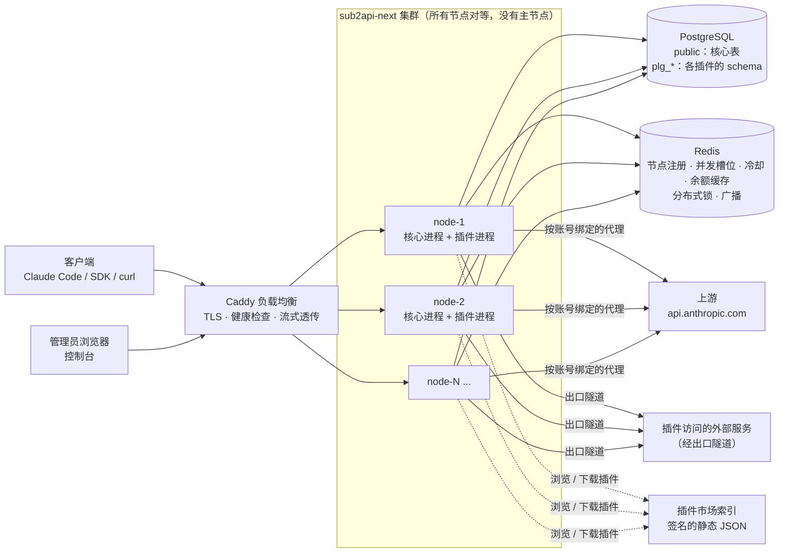

要点：

- **节点对等**：任何节点都能处理网关请求和管理请求
- **PostgreSQL 是期望状态和账本的唯一依据**
- **Redis 保存实时状态**，数据丢失后几秒内自动恢复；余额缓存丢失时回源 PG
- **插件进程运行在每个节点本地**，通过本机 unix socket 与核心通信，所有对外连接经核心的出口隧道

### 2.2 节点内部架构

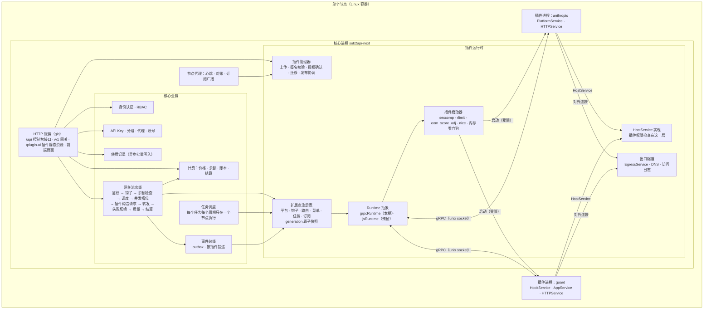

**分层规则**：

- 核心业务只依赖 `Runtime` / `Instance` 接口；**除 `grpcruntime` 包以外，任何地方都不直接使用 go-plugin 或 gRPC 客户端**
- 网关热路径上，每个请求最多调用：每个匹配的请求钩子一次 + 平台插件一次；流式响应的逐块处理由核心按插件声明的规则执行
- 上游请求由**核心**发出；插件自己的对外连接也由核心的出口隧道转发

### 2.3 多节点协作

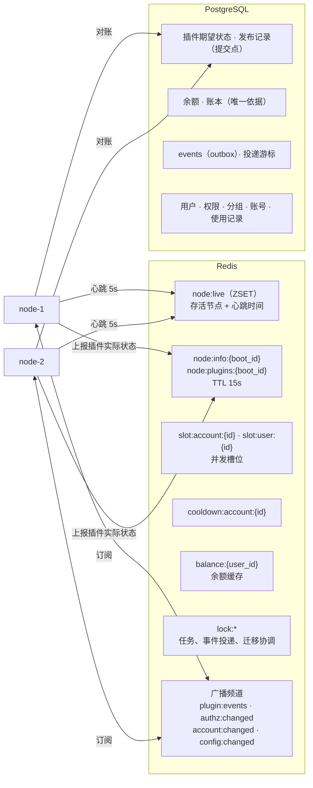

| 机制 | 说明 |
|---|---|
| 节点身份 | `node_id`（环境变量 `NODE_ID`，其次主机名）+ `boot_id`（每次启动生成） |
| 存活判断 | 每 5 秒心跳，15 秒没有心跳视为下线 |
| 状态同步 | 状态变更通过 Redis 广播，节点收到后立即对账；另有每 5 秒一次对账兜底 |
| 自我隔离 | 连续 15 秒无法和 Redis/PG 通信的节点，停止接收依赖插件的请求（返回 503） |
| 并发槽位 | 槽位成员带 `boot_id` 前缀；节点启动时只清理已下线节点的槽位 |
| 单节点执行 | 插件任务、事件投递、迁移用 Redis 锁（失败时退到 PG advisory lock）保证只在一个节点执行 |

---

## 3. 核心与插件的划分

| 模块 | 职责 | 属于 |
|---|---|---|
| `iam` / `authz` | 用户、登录、JWT；权限目录、角色、鉴权、缓存与失效 | 核心 |
| `apikey` / `group` | API Key；分组、账号归属、倍率、模型白名单、可用用户 | 核心 |
| `proxy` / `account` | 代理；通用账号表、凭证加密、状态与冷却 | 核心 |
| `billing` | 模型价格、余额、账本、余额检查、结算 | 核心 |
| `usage` | 使用记录的异步写入与查询 | 核心 |
| `gateway` | 网关流水线（协议无关）、动态端点路由、调度、粘性会话、并发、转发、失败切换、钩子执行、用量提取 | 核心 |
| `event` / `job` | 事件 outbox 与投递、任务调度 | 核心 |
| `cluster` | 节点注册、心跳、广播、分布式锁 | 核心 |
| `plugin` | 插件包、签名与信任、manifest、授权确认、迁移、注册表、发布、Runtime 抽象、市场索引 | 核心 |
| `plugin/grpcruntime` | go-plugin 进程管理、HostService、EgressService | 核心 |
| `plugin/sandbox` | 启动器：seccomp、rlimit、oom_score_adj、nice；内存看门狗 | 核心 |
| anthropic 插件 | `apikey` 账号类型（支持内置平台 anthropic）：构造请求、错误分类；默认价格、模型目录 | **插件** |
| guard 插件 | 请求钩子（关键词拦截）、事件订阅（统计）、后台任务（汇总与清理）、对外告警、原生界面 | **插件** |

**划分原则**：核心负责"数据、钱、安全、调度"，以及内置平台（anthropic、openai、gemini）的端点定义——它们是数据文件（`server/internal/platforms/*.json`），流水线代码本身不针对任何平台写死逻辑；插件负责"某种账号怎么对接上游"以及"额外的业务逻辑"。插件**永远不能直接改余额**，只能调用受限的账本接口。

---

## 4. 数据模型

### 4.1 ER 图

```mermaid
erDiagram
  users ||--o{ user_roles : has
  roles ||--o{ user_roles : assigned
  roles ||--o{ role_permissions : grants
  permissions ||--o{ role_permissions : granted
  plugins ||--o{ permissions : registers
  users ||--|| user_balances : owns
  users ||--o{ balance_ledger : entries
  users ||--o{ api_keys : owns
  groups ||--o{ api_keys : binds
  groups ||--o{ account_groups : contains
  accounts ||--o{ account_groups : member
  groups ||--o{ user_groups : visible_to
  users ||--o{ user_groups : allowed
  proxies ||--o{ accounts : used_by
  plugins ||--o{ accounts : defines_type
  plugins ||--o{ model_prices : default_price
  users ||--o{ usage_logs : makes
  accounts ||--o{ usage_logs : served_by
  publishers ||--o{ publisher_keys : has
  publishers ||--o{ plugin_versions : signs
  plugins ||--o{ plugin_versions : has
  plugins ||--o{ plugin_permission_grants : approved
  plugins ||--o{ plugin_migrations : applied
  plugins ||--o{ plugin_rollouts : rollout
  plugins ||--o{ plugin_event_cursors : consumes
  plugins ||--o{ plugin_job_runs : runs
  plugins ||--o{ plugin_egress_logs : connects

  users {
    bigint id PK
    string email
    string password_hash
    string status
    int max_concurrency
  }
  user_balances {
    bigint user_id PK
    numeric balance
  }
  balance_ledger {
    bigint id PK
    bigint user_id FK
    numeric delta
    numeric balance_after
    string kind
    string idempotency_key
    string plugin_key
  }
  groups {
    bigint id PK
    string name
    numeric rate_multiplier
    string visibility
    jsonb model_allowlist
  }
  api_keys {
    bigint id PK
    bigint user_id FK
    bigint group_id FK
    string key_hash
    string status
  }
  accounts {
    bigint id PK
    string plugin_key FK
    string platform
    string type
    bytea credentials_enc
    jsonb settings
    bigint proxy_id FK
    string status
    int priority
    int max_concurrency
  }
  model_prices {
    bigint id PK
    string model
    string mode
    jsonb config
    string expression
    string expr_hash
    string source
  }
  usage_logs {
    bigint id PK
    string request_id
    bigint user_id FK
    bigint group_id FK
    bigint account_id FK
    string model
    int input_tokens
    int output_tokens
    numeric total_cost
    string billing_mode
    string matched_tier
    string expr_hash
    string billing_status
  }
  permissions {
    bigint id PK
    string key
    string source
    string plugin_key FK
    string status
  }
  plugins {
    string key PK
    string status
    string active_version
    jsonb resource_limits
    string egress_policy
  }
  plugin_versions {
    string plugin_key PK
    string version PK
    jsonb manifest
    bigint publisher_id FK
    string signature_status
  }
  publishers {
    bigint id PK
    string name
    string trust_level
    string status
  }
  publisher_keys {
    string key_id PK
    bigint publisher_id FK
    string public_key
    string status
  }
```

`roles`、`user_roles`、`role_permissions`、`proxies`、`user_groups`、`account_groups`、`plugin_permission_grants`、`plugin_migrations`、`plugin_rollouts`、`events`、`plugin_event_cursors`、`plugin_event_deadletters`、`plugin_job_runs`、`plugin_egress_logs` 的字段见各章节。

### 4.2 PostgreSQL schema 划分

| schema | 内容 | 谁来迁移 |
|---|---|---|
| `public` | 所有核心表 | 核心启动时执行（advisory lock 保证只执行一次） |
| `plg_<插件key>` | 插件自己的表 | 核心在发布插件时执行插件包里的迁移脚本 |

### 4.3 accounts（通用账号表）

| 字段 | 说明 |
|---|---|
| `plugin_key` / `type` | 账号类型（`(plugin_key, type)` 唯一标识），合法取值来自插件注册表，**不在 SQL 里写死**；账号能服务哪些端点由账号类型声明的协议决定（6.6） |
| `credentials_enc` | 凭证整体 AES-256-GCM 加密（主密钥 `MASTER_KEY`）；插件声明的敏感字段接口中永远脱敏 |
| `settings` | 非敏感配置（base_url 等，由账号类型的 `settingsFields` 决定），明文 JSONB |
| `proxy_id` / `status` / `schedulable` / `priority` / `weight` / `max_concurrency` | 代理、状态、是否参与调度、优先级（越小越优先）、权重（同优先级内加权随机）、最大并发 |
| `models` / `model_mapping` | 账号可服务的模型列表（完整模型 ID，空 = 全部）与"客户端模型 → 上游模型"映射；都是核心属性，与插件无关（CONTRACTS §18）。核心在调插件 `BuildUpstreamRequest` 前改写模型。模型列表可从上游拉取：插件 `BuildModelsRequest` 构造请求，核心发出并提取 ID（CONTRACTS §19） |
| `rpm_limit` / `tpm_limit` / `tpd_limit` / `spm_limit` | 每分钟请求数、每分钟 token 数、每天（UTC）token 数、每分钟会话数上限，0 = 不限；计数在 Redis `rl:account:{id}:*` |
| 冷却 | Redis `cooldown:account:{id}`，不写 PG |

插件被**禁用**时账号保留、不参与调度；被**卸载**时账号默认保留（标记"所属插件已卸载"），勾选"清除数据"才删除。

---

## 5. 插件系统

### 5.1 插件包结构（`.s2plugin`，zip 格式）

```
guard-0.1.0.s2plugin
├── manifest.json               # 插件元数据
├── signature.json              # 发布者签名（见第 11 章）
├── runtimes/
│   ├── linux-amd64/plugin      # 生产环境只需要 Linux 版本
│   └── linux-arm64/plugin
├── forms/                      # schema 表单（账号录入、插件设置）
├── ui/
│   ├── iframe/                 # 沙箱 iframe 页面（可选）
│   └── native/                 # 原生微前端：entry.js + chunks + css（可选，需要受信）
├── migrations/                 # 插件 schema 的迁移脚本
└── i18n/{zh,en}.json
```

### 5.2 manifest.json（完整字段）

```jsonc
{
  "apiVersion": 1,
  "key": "guard",                               // 全局唯一：小写字母、数字、下划线
  "name": { "zh": "请求守卫", "en": "Guard" },
  "version": "0.1.0",                           // semver
  "publisher": "sub2api",                       // 与 signature.json 中的发布者一致
  "runtime": "grpc",                            // 预留 "js"
  "entry": { "grpc": { "binaries": "runtimes/{os}-{arch}/plugin" } },
  "hostCompat": ">=0.1.0 <0.2.0",
  "hostUICompat": "^1.0",                       // 使用原生微前端时必填

  "capabilities": [                             // 插件实现了哪些能力
    { "id": "gateway.hook.v1" }, { "id": "app.events.v1" }, { "id": "app.jobs.v1" },
    { "id": "http.routes.v1" }
  ],

  "platform": { /* 平台插件才有，见 15.1 */ },

  "hooks": [ {
    "point": "gateway.request",
    "order": 100,                               // 越小越先执行
    "match": { "protocols": ["anthropic.messages"], "models": ["*"], "groups": ["*"] },
    "needs": ["model", "prompt_text"],          // 需要的请求字段；prompt_text 由核心从请求体中提取纯文本
    "maxPromptBytes": 32768,
    "timeoutMs": 300,
    "failure": "open"                           // 超时或出错时：open 放行 / closed 拒绝
  } ],

  "events": { "subscribe": ["usage.recorded"], "batchSize": 100 },
  "jobs": [ { "id": "rollup", "schedule": "@every 5m", "timeoutSec": 60 },
            { "id": "cleanup", "schedule": "0 3 * * *", "timeoutSec": 300 } ],

  "database": { "schema": "plg_guard", "migrations": "migrations/" },

  "userPermissions": [
    { "key": "rules:read",   "label": { "zh": "查看拦截规则" } },
    { "key": "rules:manage", "label": { "zh": "管理拦截规则" } },
    { "key": "stats:read",   "label": { "zh": "查看拦截统计" } }
  ],

  "routes": [                                   // 挂在 /api/plugins/guard/ 下，核心先鉴权再转发
    { "method": "GET",  "path": "/rules", "scope": "admin", "permission": "rules:read" },
    { "method": "PUT",  "path": "/rules", "scope": "admin", "permission": "rules:manage" },
    { "method": "GET",  "path": "/stats", "scope": "admin", "permission": "stats:read" }
  ],

  "ui": {
    "menus": [ { "id": "guard", "section": "plugins", "label": { "zh": "请求守卫" },
                 "page": "dashboard", "permission": "stats:read" } ],
    "pages": { "dashboard": { "type": "native", "component": "GuardDashboard" } },
    "slots": [ { "slot": "dashboard.widgets", "component": "BlockedTodayCard",
                 "permission": "stats:read" } ],
    "native": { "entry": "ui/native/entry.js" },
    "settings": { "type": "schema", "schema": "forms/settings.schema.json" }
  },

  "resources": { "memoryMB": 128, "cpu": 0.25, "maxProcs": 64, "maxOpenFiles": 256 },

  "hostPermissions": [
    { "id": "kv" },
    { "id": "db.schema", "reason": { "zh": "保存拦截规则和统计" } },
    { "id": "gateway.hook", "scope": { "points": ["gateway.request"], "fields": ["model", "prompt_text"] },
      "reason": { "zh": "检查请求内容" } },
    { "id": "events", "scope": { "subscribe": ["usage.recorded"] } },
    { "id": "jobs" },
    { "id": "routes.admin" },
    { "id": "ui.native", "reason": { "zh": "提供统计大盘" } },
    { "id": "net", "scope": { "domains": ["hooks.example.com"] }, "optional": true,
      "reason": { "zh": "命中规则时发送告警（出口策略为白名单时生效）" } }
  ],

  "externalServices": ["hooks.example.com"]
}
```

安装时核心做一致性检查：manifest 里用到的每一种能力都必须申请对应的 `hostPermissions`（比如声明了 `hooks` 就必须申请 `gateway.hook`，且 `needs` 不能超出批准的 `fields`）；`capabilities` 必须是 `runtime` 支持的；`userPermissions` 的 key 不能冲突；`ui.native` 要求发布者信任级别为 official 或 verified。

### 5.3 gRPC 契约

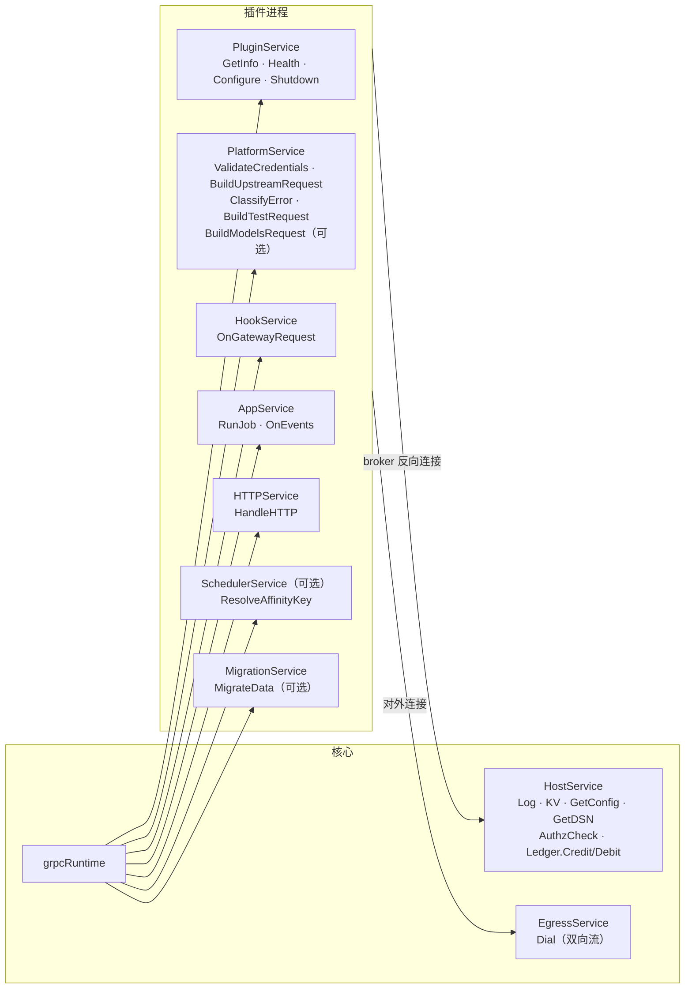

proto 设计规则（为以后的 JS 运行方式预留）：

- 除 `EgressService.Dial` 外，所有方法都是"一次请求、一次响应"
- 不使用 `google.protobuf.Any`；字段按 protojson 规则可以直接映射成 JS 对象
- 请求体不整体传给插件：插件声明需要的字段，返回"设置/删除"指令，由核心执行

关键消息（示意）：

```proto
// 平台插件：构造上游请求
message BuildUpstreamRequestRequest {
  string protocol = 1;                       // "anthropic.messages"
  Account account = 2;                       // 含解密后的凭证和 settings
  map<string, string> fields = 3;            // requestFields 声明的字段（JSON 字符串）
  map<string, string> inbound_headers = 4;   // 白名单内的客户端请求头
}
message BuildUpstreamRequestResponse {
  string method = 1;
  string url = 2;                            // 核心校验：http(s)，不指向内网
  map<string, string> headers = 3;
  repeated BodyPatch patches = 4;            // {op: set|delete, path, value_json}
}

// 平台插件：错误分类
message ClassifyErrorResponse {
  Action action = 1;                         // RETURN_TO_CLIENT / FAILOVER
  AccountEffect account_effect = 2;          // NONE / COOLDOWN(until) / DISABLE(reason)
  int32 client_status = 3;
}

// 钩子插件：请求检查
message GatewayRequestHookRequest {
  RequestMeta meta = 1;                      // request_id、protocol、model、stream、user_id、api_key_id、group_id、client_ip
  map<string, string> fields = 2;            // 按 needs 提供，prompt_text 为提取出的纯文本
}
message GatewayRequestHookResponse {
  Decision decision = 1;                     // ALLOW / DENY
  int32 deny_status = 2;                     // 默认 403
  string deny_code = 3;
  string deny_message = 4;
  repeated BodyPatch patches = 5;            // 只能改 needs 里声明过的字段
}

// 应用插件：任务与事件
message RunJobRequest   { string job_id = 1; int64 scheduled_at = 2; }
message OnEventsRequest { repeated Event events = 1; }   // Event{id, type, occurred_at, payload_json}
message OnEventsResponse { int64 acked_through_id = 1; } // 已处理到的事件 ID

// 出口隧道
service EgressService { rpc Dial(stream EgressFrame) returns (stream EgressFrame); }
message EgressFrame {
  oneof kind { DialOpen open = 1; DialResult result = 2; bytes data = 3; DialClose close = 4; }
}
```

### 5.4 插件生命周期

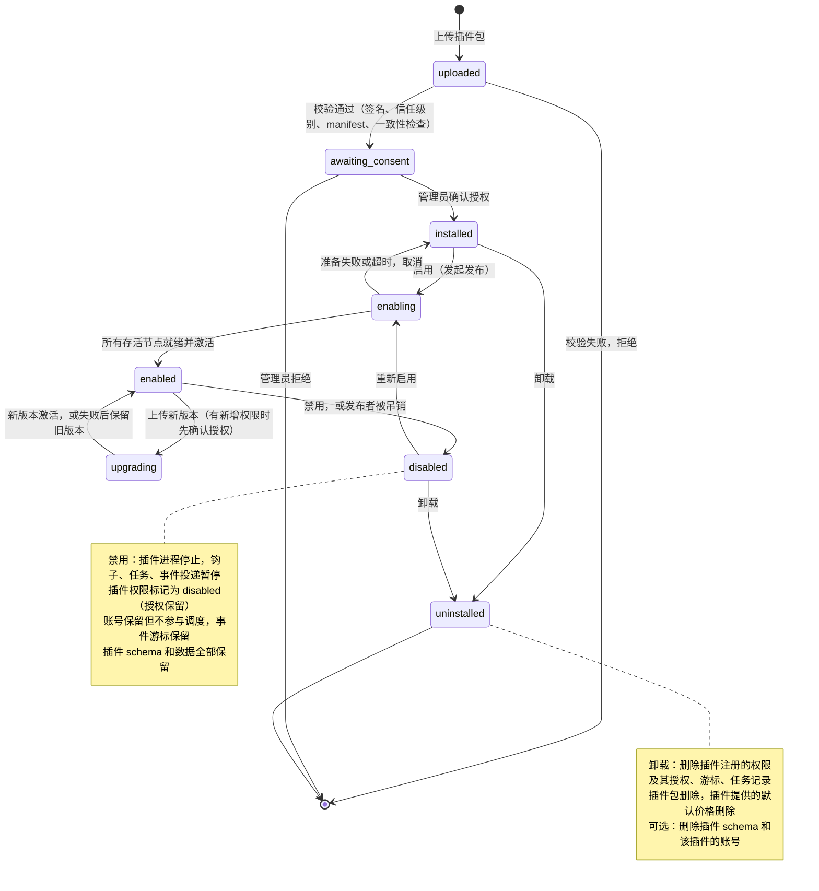

### 5.5 授权确认

- `hostPermissions` 按风险分级：

| 等级 | 权限 |
|---|---|
| 🟢 低 | `kv`、`config`、`log` |
| 🟡 中 | `routes.admin`、`routes.user`、`events`、`jobs`、`ui.menu`、`ui.iframe`、`accounts.read` |
| 🟠 高 | `db.schema`、`net`（白名单模式下）、`routes.public`、`routes.webhook`、`gateway.hook`、`platform.register`、`users.read` |
| 🔴 极高 | `accounts.credentials`、`ledger.credit`、`ledger.debit`、`ui.native`、`users.write`、`db.core_views` |

- 高和极高风险需要逐项勾选；极高风险只能由拥有 `plugin:grant:critical` 的用户批准，并再次输入密码
- 批准结果写入 `plugin_permission_grants(plugin_key, permission, scope, status, plugin_version, manifest_hash, granted_by, granted_at)`；管理员可以把范围改得比申请的更小（比如入账上限）
- 运行时插件每次调用 HostService，核心都在服务端检查授权
- 升级时新增权限或扩大范围，新版本进入 `awaiting_consent`，旧版本继续运行

### 5.6 插件数据库 schema 与迁移

| 项目 | 做法 |
|---|---|
| schema | 首次发布前创建 `plg_<key>` |
| 隔离 | 数据库账号有 `CREATEROLE` 时创建角色 `plg_<key>`，只授予自己 schema 的权限；插件通过 `HostService.GetDSN` 拿到受限 DSN，连接经出口隧道。没有该权限时退化为"只隔离 schema"，后台提示 |
| 迁移脚本 | `migrations/*.sql` 按文件名排序，每个文件一个事务，执行前 `SET LOCAL search_path TO plg_<key>` |
| 迁移记录 | `plugin_migrations(plugin_key, migration_id, checksum, applied_at)`；已执行文件被修改时拒绝发布 |
| 执行时机 | 发布的"准备"阶段、任何节点激活新版本之前；`pg_advisory_lock(hash(plugin_key))` |
| 数据迁移 | 简单转换写在 SQL 里；复杂转换实现 `MigrationService.MigrateData(from, to)`，在 SQL 之后调用 |
| 兼容要求 | 升级期间新旧版本同时运行，迁移必须"先扩展、后收缩" |
| 卸载 | 选择"清除数据"时 `DROP SCHEMA plg_<key> CASCADE`，删除角色和迁移记录 |

### 5.7 多节点发布（先准备、再激活）

由**发起操作的节点**负责协调；它宕机后，其他节点在租约过期后接管。

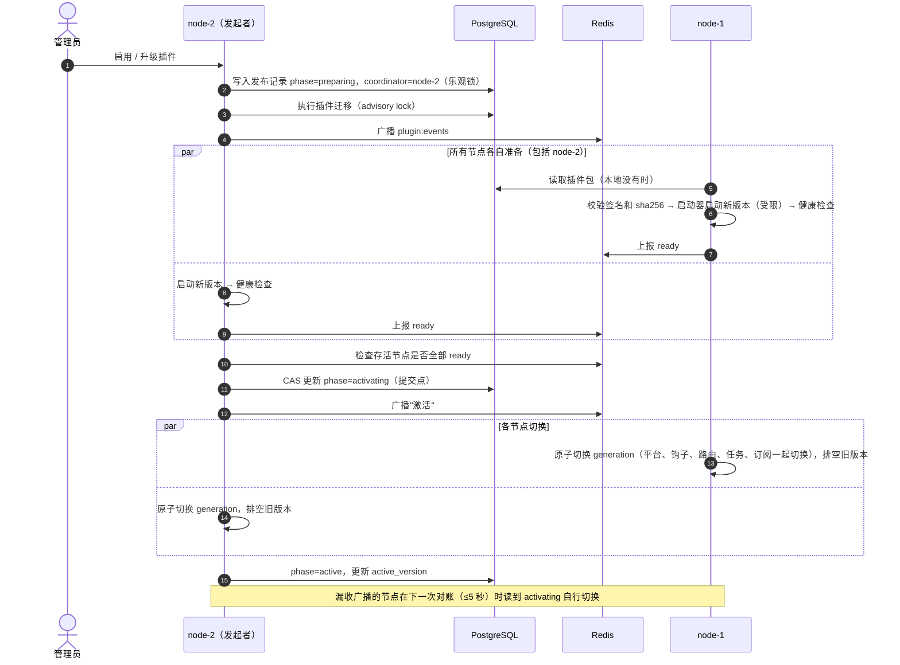

| 异常 | 处理 |
|---|---|
| 某节点准备失败或超时 | 取消发布，所有节点继续使用旧版本 |
| 发起者在提交点之前宕机 | 租约过期后其他节点接管，继续等待或判定超时 |
| 发起者在提交点之后宕机 | 所有节点读到 `activating` 就必须切换，接管者只负责收尾 |
| 发布期间有节点加入 | 读到 `preparing` 就启动旧版本接流量、新版本待命；读到 `activating`/`active` 直接启动新版本 |
| 激活时某节点新版本进程已崩溃 | 该节点把插件标记为不可用（不退回旧版本），调度器和钩子执行器跳过；由协调者决定重试或回滚 |

---

## 6. 网关

### 6.1 请求流水线（`POST /v1/messages`）

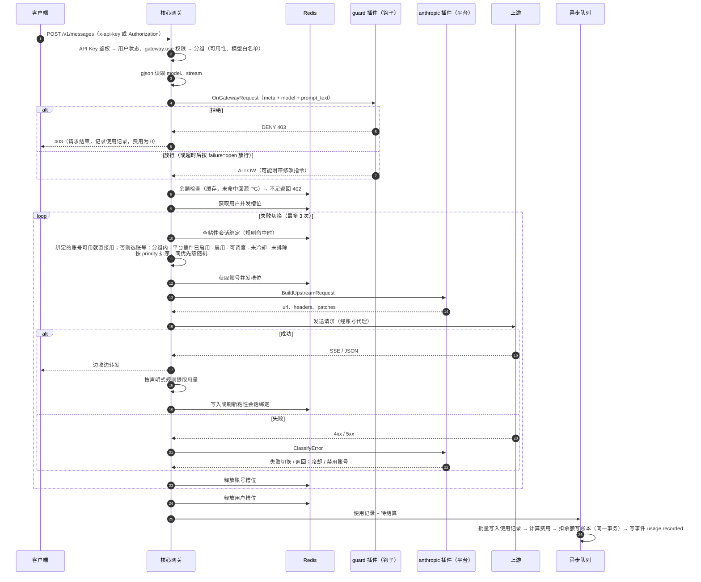

说明：

- 流式响应一旦开始输出，就不再失败切换
- 插件调用超时（平台默认 2 秒）或不可用时，该账号视为不可用；所有账号不可用返回 503
- 客户端断开时取消上游请求、释放槽位；已产生的用量照常结算

### 6.2 调度

- 候选账号 = API Key 所属分组的账号 ∩ 账号类型能服务该端点（原生或经转换）的账号 ∩ 状态正常 ∩ 参与调度 ∩ `models` 为空或含请求模型 ∩ 未冷却 ∩ 未达 rpm/tpm/tpd/spm 上限
- 顺序：粘性绑定的账号优先；其余按 `priority` 升序，同优先级按 `weight` 加权随机（不放回抽样）；逐个获取并发槽位，失败切换时跳过已试过的账号（CONTRACTS §18）
- 限流：rpm/tpm/tpd 是固定窗口计数（分钟 / UTC 日），spm 是 60 秒滚动窗口内去重的会话数（会话 = 粘性会话键，无粘性规则时每请求一会话；窗口内已有的会话总是放行）。达到上限的账号在本窗口内不参与调度；全部不可用时返回 429 `rate_limited`
- 模型映射：选定账号后，核心把请求里的模型（body `modelPath` / 路径参数 / `RequestMeta.model`）换成映射后的模型再交给插件，`usage_logs.upstream_model` 记录映射后的模型；计费、白名单、粘性、钩子都看客户端模型
- 每个节点缓存分组内的账号快照，`account:changed` 广播时失效
- 并发：账号槽位按 `accounts.max_concurrency`，用户槽位按 `users.max_concurrency`，都在 Redis 用 Lua 原子获取

### 6.3 网关钩子

| 项目 | 设计 |
|---|---|
| 钩子点（本期） | `gateway.request`：鉴权和分组解析之后、余额检查和调度之前，同步执行，可以放行、拒绝或修改请求 |
| 请求完成后 | 不做同步钩子，改由事件 `usage.recorded` 异步通知（见第 8 章） |
| 匹配 | 按协议、模型（通配符）、分组过滤，只调用匹配的插件 |
| 顺序 | 按 `order` 依次执行；任一插件拒绝即停止；修改指令按顺序叠加 |
| 数据 | 只传 `needs` 声明且已获批准的字段；`prompt_text` 由核心从 messages 中提取纯文本，最多 `maxPromptBytes` |
| 超时与失败 | 每个钩子单独超时（默认 300ms，上限 2 秒）；超时或出错按 `failure` 处理：`open` 放行、`closed` 拒绝（返回 503） |
| 熔断 | 同一钩子连续失败 10 次后熔断 30 秒，熔断期间直接按 `failure` 处理，不调用插件 |
| 观测 | 每个钩子的调用次数、拒绝次数、超时次数、耗时，显示在插件详情页 |

### 6.4 网关端点由平台声明

端点属于平台：核心内置 anthropic、openai、gemini 三个平台的端点，插件可以在 manifest 的 `platforms[].endpoints` 里为自己的新平台声明端点（见 6.6），核心流水线按声明执行。端点字段如下（以 anthropic 为例）：

```jsonc
{ "id": "anthropic",                          // 平台（内置平台在 server/internal/platforms/*.json）
  "endpoints": [ {
    "id": "messages",
    "method": "POST",
    "path": "/v1/messages",
    "protocol": "anthropic.messages",       // 协议 id："<平台 id>.<名称>"，全局唯一
    "kind": "proxy",                         // 本期只有 proxy：鉴权 → 钩子 → 调度 → 转发 → 计费
    "auth": { "headers": ["x-api-key", "authorization"] },  // 从哪些请求头读 API Key
    "request": {
      "modelPath": "model",                  // gjson 路径
      "streamPath": "stream",
      "promptTextPaths": ["system", "messages.#.content"]   // 供钩子提取 prompt_text
    },
    "response": { "stream": "sse", "nonStream": "json" },
    "errorFormat": "anthropic",              // 核心内置 anthropic / openai / gemini / plain 四种错误格式
    "billing": "usage"                       // usage：按用量计费；free：不计费（如 count_tokens）
  } ]
}
```

| 项目 | 设计 |
|---|---|
| 路由 | 每个 generation 构建一个内层路由表，挂在核心路由之后；插件启用、禁用、升级时随 generation 原子切换（参考 new-api 的 `plugin-router.go`） |
| 冲突检查 | 安装和启用时检查：不能占用核心路由（`/api`、`/plugin-ui`、`/health` 等）；插件平台的 id 不能与内置平台或其他插件的平台重复，端点不能与任何其他平台的端点冲突 |
| 协议归属 | 协议由平台的端点定义；账号类型通过 `accountTypes[].platforms` 声明支持哪些平台，从而为这些平台的端点提供服务（见 6.6） |
| 协议转换 | 核心内置转换器（`gateway/convert`）；端点协议和账号上游协议不同时，核心有对应转换器就自动转换，没有就只调度原生支持该协议的账号（见 6.6） |
| 以后的扩展 | `kind: "custom"`：由插件的 HTTPService 处理，但复用核心的 API Key 鉴权和计费（用于异步任务类接口） |

### 6.5 粘性会话

同一个会话的连续请求尽量落到同一个账号，以提高上游的缓存命中率。参考 new-api 的 channel affinity 设计，代码自行实现。

**核心负责调度，插件提供默认规则**：

| 谁 | 负责什么 |
|---|---|
| 核心 | 规则匹配、会话 key 计算、绑定的存取（Redis，多节点共享）、账号可用性检查、失败策略、命中统计、管理页面 |
| 平台插件 | 在 manifest `platform.stickyRules` 里提供默认规则（只有插件知道哪个字段代表会话） |
| 管理员 | 在控制台覆盖、停用插件规则，或新增规则 |
| 插件（可选扩展） | 规则取值太复杂、无法声明时，实现 `SchedulerService.ResolveAffinityKey`，规则里用 `{"type": "plugin"}` 引用 |

**规则**：

```jsonc
"stickyRules": [ {
  "name": "claude-code-session",
  "match": { "protocols": ["anthropic.messages"], "models": ["claude-*"],
             "userAgentContains": [] },
  "keySources": [                               // 按顺序取第一个非空值
    { "type": "body",   "path": "metadata.user_id" },
    { "type": "header", "name": "x-session-id" }
  ],
  "valueRegex": "",                             // 可选：对取到的值做正则截取
  "ttlSeconds": 3600,
  "keyIncludes": ["group", "model", "rule"],    // 会话 key 还包含哪些维度
  "onFailure": "failover"                       // failover：失败时照常切换账号；stick：不切换，直接返回错误（保护缓存）
} ]
```

**调度过程**：

1. 按顺序找第一条命中的规则，计算会话 key：`sticky:{规则名}:{分组}:{模型}:{sha256(取到的值)}`
2. 从 Redis 读取绑定的账号；该账号仍在分组内、可调度、未冷却、能拿到并发槽位，就直接使用
3. 否则走普通调度
4. 请求成功后写入或刷新绑定（TTL 重新计时）；如果这次用的是新账号，就改绑到新账号（相当于 new-api 的 switch_on_success）
5. 绑定的账号被禁用时，默认删除绑定（可配置为保留）

**其他**：

- 全局开关、默认 TTL、每条规则的命中率统计（Redis 计数），在控制台"粘性会话"页查看和管理，支持按规则清空绑定
- 使用记录中记录本次请求是否命中粘性绑定（`sticky_rule`、`sticky_hit`）
- 规则存在 `sticky_rules` 表：`source=plugin_default` 由插件安装和升级时写入、卸载时删除；`source=admin` 由管理员维护，插件变更不影响

### 6.6 平台、账号类型、账号、分组与端点

> 2026-09-25 决定（取代 2026-09-24 的"账号类型直接声明协议"版本）。

**关系**

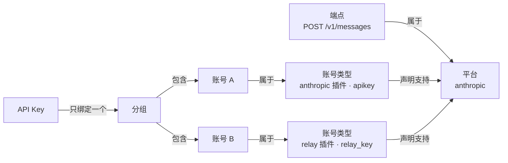

| 概念 | 由谁声明 | 规则 |
|---|---|---|
| 平台 | **核心内置**：`anthropic`、`openai`、`gemini`；插件可以声明新平台 | 平台声明自己的端点（method + path + 协议 + 错误格式 + 用量规则等）。插件不能声明与内置平台或其他插件同 id 的平台；**不同平台的端点不能冲突**（安装时检查，含路径参数的重叠） |
| 端点 | 平台 | 每个端点只属于一个平台；内置平台的端点始终存在，插件平台的端点在插件启用时存在、禁用后 404 |
| 账号类型 | 插件 | 声明支持哪些平台（内置平台或插件平台，可多个）；不同账号类型可以支持同一个平台；声明它的插件负责构造上游请求、分类错误 |
| 账号 | 管理员 | 属于一个账号类型 |
| 分组 | 管理员 | 一组账号（可混放不同类型），一起提供服务 |
| API Key | 用户 | **只绑定一个分组** |

**请求如何调度**

1. 按请求路径匹配端点 → 得到平台 P 和协议
2. API Key → 分组 G
3. 候选账号 = G 中账号类型**支持平台 P** 的账号；此外，账号类型支持的其他平台里若有协议能由核心转换器从本端点协议转换过去，这些账号也是候选（原生优先）
4. 没有候选账号 → 503 `no_available_account`；有则按优先级、粘性会话、并发、失败切换调度
5. 选中账号后由其账号类型所属插件构造上游请求；需转换时由核心转换请求和响应

**内置平台**（定义在核心 `server/internal/platforms`，不再由插件声明）

| 平台 | 端点 | 协议 | 错误格式 | 用量口径 |
|---|---|---|---|---|
| anthropic | `POST /v1/messages` · `POST /v1/messages/count_tokens`（不计费） | `anthropic.messages` · `anthropic.count_tokens` | anthropic | exclusive |
| openai | `POST /v1/chat/completions` · `POST /v1/responses` · `POST /v1/embeddings` | `openai.chat` · `openai.responses` · `openai.embeddings` | openai | inclusive |
| gemini | `POST /v1beta/models/{model}:generateContent` · `POST /v1beta/models/{model}:streamGenerateContent` · `POST /v1beta/models/{model}:countTokens`（不计费） | `gemini.generate` · `gemini.stream_generate` · `gemini.count_tokens` | gemini | inclusive |

内置平台同时提供：API Key 读取方式（anthropic：`x-api-key`/`Authorization`；openai：`Authorization: Bearer`；gemini：`x-goog-api-key` 或 `?key=`）、模型与流式标志的位置（gemini 的模型在路径里，流式由端点决定）、转发给插件的请求字段和请求头、用量提取规则、默认粘性规则（`source=builtin`）。

**manifest**

```jsonc
"platforms": [ {                       // 可选：插件自己的新平台（不能与内置或其他插件重名）
  "id": "myvideo", "label": {...},
  "endpoints": [ { "id": "gen", "method": "POST", "path": "/v1/video/generations",
                   "protocol": "myvideo.gen", "auth": {...}, "request": {...}, "response": {...},
                   "errorFormat": "plain", "billing": "usage", "usage": {...} } ],
  "requestFields": [...], "passHeaders": [...], "usage": {...}, "stickyRules": [...]
} ],
"accountTypes": [ {
  "id": "relay_key", "label": {...}, "form": {...}, "sensitiveFields": ["api_key"],
  "platforms": [ { "platform": "anthropic",           // 内置或插件平台
                   "requestFields": [...], "passHeaders": [...],   // 可选覆盖
                   "usage": { "<protocol>": {...} } } ]            // 可选：按协议覆盖用量规则
} ]
```

顶层 `gateway` 与 `platform` 字段删除（端点归属平台）。

**计费**：价格只按模型全局设置（7.3）。**凭证授权**：`accounts.credentials`（`{"types":"own"}`）授权后，插件的账号类型才注册。**控制台**：账号类型显示支持的平台和可服务的端点；分组可放任意类型账号，并显示分组能服务哪些平台（由其账号类型推出）；API Key 显示所属分组能访问的平台和端点。


---

## 7. 分组、计费与余额

### 7.1 分组

| 字段 | 说明 |
|---|---|
| `name` / `description` / `status` | |
| `rate_multiplier` | 费用倍率，默认 1 |
| `model_allowlist` | 允许的模型（通配符列表），为空表示不限制 |
| `visibility` | `public` 所有用户可用；`restricted` 只有 `user_groups` 中的用户可用 |
| `account_groups(account_id, group_id)` | 分组包含哪些账号，一个账号可以属于多个分组 |

API Key 创建时选择分组（只能选自己可用的分组），网关按 Key 的分组调度。

### 7.2 余额与账本

```sql
CREATE TABLE user_balances (
  user_id    bigint PRIMARY KEY REFERENCES users(id),
  balance    numeric(20,8) NOT NULL DEFAULT 0,
  updated_at timestamptz NOT NULL DEFAULT now()
);

CREATE TABLE balance_ledger (
  id              bigserial PRIMARY KEY,
  user_id         bigint NOT NULL REFERENCES users(id),
  delta           numeric(20,8) NOT NULL,      -- 正数入账，负数扣减
  balance_after   numeric(20,8) NOT NULL,
  kind            varchar(30) NOT NULL,        -- usage / admin_adjust / plugin_credit / plugin_debit / refund
  ref_type        varchar(30), ref_id varchar(100),
  idempotency_key varchar(150) NOT NULL UNIQUE, -- usage 结算用 "usage:<request_id>"
  operator_id     bigint,                      -- 管理员操作时记录
  plugin_key      varchar(100),                -- 插件入账时记录
  note            text,
  created_at      timestamptz NOT NULL DEFAULT now()
);
```

- **余额的唯一修改入口是账本**：每次变动在同一个事务里插入账本记录并更新 `user_balances`（`SELECT ... FOR UPDATE`），幂等键保证重复提交不会重复扣款
- 管理员调整余额需要 `balance:adjust`（敏感权限）
- 插件通过 `HostService.Ledger.Credit/Debit` 变动余额，需要 🔴 权限，受批准的单笔和每日上限约束，并强制幂等键（为以后的支付插件准备）

### 7.3 模型价格（独立页面）

参考 new-api 的计费表达式设计（`pkg/billingexpr`），**代码自行实现，不复制**：new-api 是 AGPL-3.0，sub2api 是 LGPL-3.0，直接复制会带来许可证冲突。表达式引擎使用 MIT 协议的 `expr-lang/expr`。

#### 三种计费方式

| 方式 | 适用 | 配置 | 生成的表达式 |
|---|---|---|---|
| **按次** | 固定价格的调用（图片、搜索等） | 每次价格（USD） | `tier("base", flat(0.04))` |
| **按 token** | 大多数模型 | 输入、输出、缓存读、缓存写（5 分钟 / 1 小时）的每百万 token 价格 | `tier("base", p*3 + c*15 + cr*0.3 + cc*3.75 + cc1h*6)` |
| **表达式** | 按上下文长度分档、按请求参数加价、时段折扣、固定费 + token 费 | 可视化阶梯编辑器，或直接编写表达式 | 任意合法表达式 |

三种方式最终都保存为一条表达式，**计费只以表达式为准**；"按次"和"按 token"只是表达式的可视化编辑方式。

#### 定价范围（2026-09-24 决定）

- **价格只按模型全局设置**：同一个模型不论由哪个平台的端点、哪种账号类型提供服务，都用同一个价格；价格表不区分平台
- 价格表达式算出的是**基础价格**，之后只能通过倍率调整（本期为分组倍率）
- 价格按**完整模型 ID** 设置、精确匹配，**不支持通配符**（2026-09-25 决定）：别名和带日期的 ID 是不同的模型，需要分别定价。**价格归核心所有，只能由管理员配置**，插件不提供价格；管理员可以手动录入，也可以从价格同步源（LiteLLM、models.dev 等公开价格库，或上游 sup2api）预览后选择导入，见 CONTRACTS §17

#### 表达式语言（v1）

| 类别 | 内容 |
|---|---|
| token 变量 | `p` 输入（已扣除单独计价的部分）· `c` 输出 · `cr` 缓存读 · `cc` 缓存写（5 分钟）· `cc1h` 缓存写（1 小时）· `len` 完整上下文长度（用于分档判断，不受缓存扣除影响）· 预留 `img` `img_o` `ai` `ao` |
| 插件计量值 | `u("key")`：平台插件在 manifest 里声明的其他计量值（张数、秒数等）；保存时校验 key 是否已声明 |
| 单位约定 | token 系数是**每百万 token 的美元价格**；`flat(x)` 表示 x 美元的固定费用 |
| 函数 | `tier(名称, 值)` 标记命中的档位 · `param(路径)` 读取请求体字段 · `header(名称)` · `has(字符串, 子串)` · `hour/weekday/day/month(时区)` · `max` `min` `abs` `ceil` `floor` |
| 请求加价规则 | 在表达式后用三个竖线（见下方示例）追加，形如 `条件 ? 倍数 : 1`；每条规则都记录是否命中 |
| 版本 | 可带版本前缀 `v1:`，不写即 v1；版本决定可用的变量、函数和换算方式，以后升级不影响已有价格 |

示例：

```
# 按上下文长度分两档（Claude 风格）
len <= 200000
  ? tier("standard",     p*3 + c*15   + cr*0.3 + cc*3.75 + cc1h*6)
  : tier("long_context", p*6 + c*22.5 + cr*0.6 + cc*7.5  + cc1h*12)

# 每次 1 美分固定费 + token 费用，北京时间 0~8 点打 8 折
tier("base", flat(0.01) + p*3 + c*15) * (hour("Asia/Shanghai") < 8 ? 0.8 : 1)

# 按请求参数和请求头加价
tier("base", p*5 + c*25) ||| param("service_tier") == "priority" ? 1.5 : 1 ||| has(header("anthropic-beta"), "fast-mode") ? 2 : 1
```

（示例中的价格仅用于说明，实际以官方公布价格为准。）

#### 用量归一化

各家上游统计输入 token 的口径不同，平台插件在 manifest 里声明 `usage.semantics`：

| 口径 | 代表 | `len` |
|---|---|---|
| `exclusive` | Anthropic：`input_tokens` 不含缓存 | 输入 + 缓存读 + 缓存写 |
| `inclusive` | OpenAI 风格：`prompt_tokens` 包含缓存 | `prompt_tokens` |

两种口径下 `p` 都是不含任何缓存的纯输入 token（inclusive 口径由核心从 `prompt_tokens` 中扣除全部缓存）。缓存 token 只有在表达式写了对应变量（`cr`、`cc`、`cc1h`）时才计费，没写的不收费。只给 `cc` 定价时，1 小时缓存写也按 `cc` 计。因此表达式只写 `p*3 + c*15` 时，缓存 token 不收费；要收缓存费，需在表达式里写出 `cr`、`cc`（价格编辑器的"按 token"模式会自动写入）。

#### 存储

```sql
CREATE TABLE model_prices (
  id            bigserial PRIMARY KEY,
  model         varchar(200) NOT NULL,        -- 完整模型 ID，不允许通配符（CHECK 只允许字母、数字和 . _ : / @ + -）
  mode          varchar(20)  NOT NULL,        -- per_request / per_token / expression
  config        jsonb        NOT NULL,        -- 可视化编辑的原始值（按次价格、各类 token 单价、分档定义）
  expression    text         NOT NULL,        -- 由 config 生成，或直接编写；计费以它为准
  expr_version  int          NOT NULL DEFAULT 1,
  expr_hash     varchar(64)  NOT NULL,
  source        varchar(20)  NOT NULL,        -- manual（管理员录入）/ sync（从同步源导入）
  sync_source_id bigint REFERENCES price_sync_sources(id) ON DELETE SET NULL,
  synced_at     timestamptz,
  enabled       boolean      NOT NULL DEFAULT true,
  note          text,
  updated_by    bigint,
  updated_at    timestamptz  NOT NULL DEFAULT now()
);
-- 每个 model 一条（唯一索引）；同步源见 price_sync_sources（CONTRACTS §17）

-- 每一版表达式都按 hash 保存，使用记录通过 expr_hash 追溯当时的计算方式
CREATE TABLE model_price_history (
  expr_hash    varchar(64) PRIMARY KEY,
  expression   text NOT NULL,
  expr_version int  NOT NULL,
  created_at   timestamptz NOT NULL DEFAULT now()
);
```

#### 匹配与计算

- 匹配：按完整模型 ID 精确匹配（每个模型只有一条价格）
- 费用 = 表达式结果 × 分组倍率
- 找不到价格：默认拒绝请求（返回 403 `model_price_not_configured`），可配置为免费放行
- 编译结果按 `expr_hash` 缓存；价格变更通过 `config:changed` 广播，各节点立即生效
- 价格试算接口 `POST /api/prices/preview`：输入用量样本、请求头、请求参数，返回费用、命中档位、加价规则；页面上的计算器和保存前的预览都用它

#### 保存时校验

- 能编译通过，只使用允许的变量和函数，`u()` 的 key 已被插件声明
- 冒烟测试：用一组用量样本执行（各变量分别取 0、1、1000、100 万，`len` 覆盖各分档的边界），结果必须是有限的非负数
- 按 100 万输入 token 计算的单次费用超过阈值（默认 $10）时给出警告，需要二次确认

#### 可追溯

使用记录保存 `price_id`、`expr_hash`、`billing_mode`、`matched_tier`，以及 `billing_detail`（各变量取值、分项费用、加价规则命中情况）。配合 `model_price_history`，任何一笔扣费都能还原当时的计算过程。

#### 价格同步

价格不来自插件。管理员可以配置价格同步源：

- LiteLLM、models.dev 公开价格库；
- 上游 sup2api，用上游发的 API Key 读取 `GET /api/v1/key/prices`，可以按上游分组倍率换算。

同步时先预览差异（新增、更新、与手动价格不同、未变化），勾选后导入，导入的价格记为 `source=sync`。同步价格被修改后变成 `manual`，之后同步不会自动覆盖。详见 CONTRACTS §17。

### 7.4 计费流程

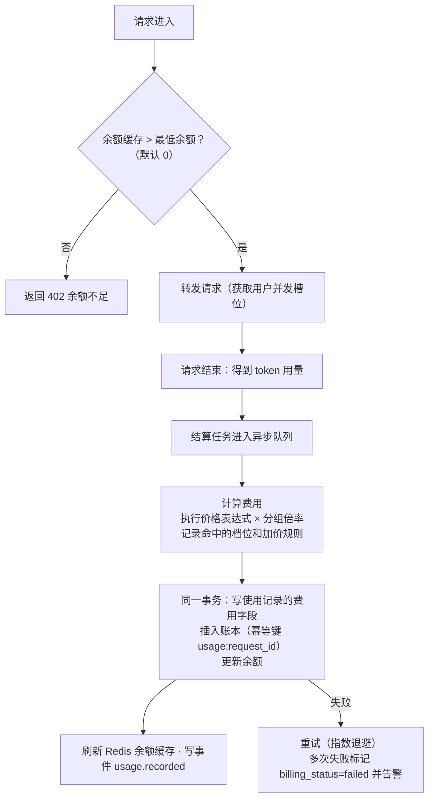

- **允许短暂透支**：余额检查在请求前，结算在请求后，同一用户的并发请求可能让余额短暂变为负数；用户并发上限控制了透支的幅度，余额为负后下一次请求会被拒绝
- 使用记录新增字段：`total_cost`、`rate_multiplier`、`price_id`、`expr_hash`、`billing_mode`、`matched_tier`、`billing_detail`（JSONB：各变量取值、分项费用、加价规则命中情况）、`billing_status`（pending / billed / failed / free）
- 被钩子拒绝、上游失败没有用量的请求，`billing_status=free`

---

## 8. 插件后台任务与事件订阅

### 8.1 事件

| 事件 | 触发时机 |
|---|---|
| `usage.recorded` | 使用记录写入并结算后（批量） |
| `account.created` / `account.updated` / `account.deleted` / `account.status_changed` | 账号变更、冷却、禁用 |
| `user.created` / `user.updated` | 用户变更 |
| `balance.changed` | 账本新增记录 |
| `plugin.enabled` / `plugin.disabled` | 插件状态变化 |

**投递机制（至少一次）**：

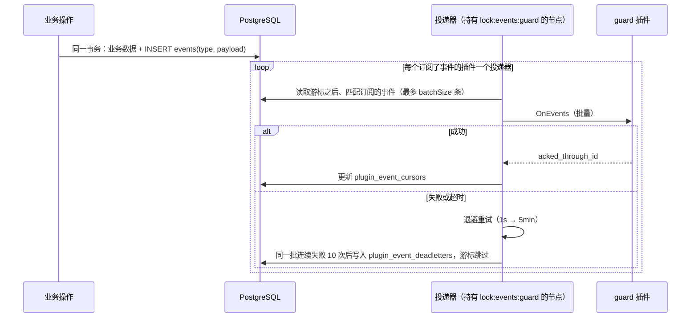

- `events(id bigserial, type, occurred_at, payload jsonb)` 是 outbox 表，与业务数据同事务写入，保证不丢
- 每个插件一个游标 `plugin_event_cursors(plugin_key, last_event_id)`；插件禁用时投递暂停、游标保留，重新启用后从断点继续
- 插件必须按事件 ID 做幂等处理
- 所有插件的游标都越过之后，事件保留 7 天后由核心清理任务删除
- 权限：订阅需要 `events` 权限，scope 限定可订阅的事件类型

### 8.2 后台任务

| 项目 | 设计 |
|---|---|
| 声明 | manifest `jobs`：`id`、`schedule`（cron 或 `@every`）、`timeoutSec` |
| 调度 | 每个节点都计算下一次触发时间；到点后抢 Redis 锁 `lock:job:<plugin>:<job>:<触发时间>`，抢到的节点调用本机插件的 `AppService.RunJob` |
| 保证 | 同一个任务的同一次触发只执行一次；错过的触发不补跑 |
| 记录 | `plugin_job_runs(id, plugin_key, job_id, node_id, scheduled_at, started_at, finished_at, status, error)`，保留最近 1000 条 |
| 手动触发 | 插件详情页"立即执行"，需要 `plugin:manage` |
| 禁用 | 插件禁用时停止调度 |

---

## 9. 插件网络：出口隧道与严格模式

### 9.1 出口隧道

```
插件进程                                            核心进程
http.Get / pgx / redis …
  → SDK 替换过的 DefaultTransport / Dialer / DefaultResolver
  → EgressService.Dial（在已有的 gRPC 连接上开一个流）══════►  确认插件身份 → 检查出口策略
                                                               → 解析 DNS → 建立连接 → 双向转发
                                                               → 记录 plugin_egress_logs
```

- SDK 在启动时替换 `http.DefaultTransport`（仍是 `*http.Transport` 类型，Clone 出来的也走隧道）、`net.DefaultResolver`，并提供 `sdk.Egress().DialContext` 给数据库、Redis、gRPC 等客户端使用
- HTTPS 在插件与目标之间端到端加密，核心只看到域名、端口和流量
- `plugin_egress_logs(id, plugin_key, node_id, host, port, started_at, duration_ms, bytes_in, bytes_out, result)`，批量写入，保留 7 天；插件详情页按域名汇总展示，出现新域名时告警
- 出口策略（每个插件单独配置）：`allow_all`（默认，只记录）或 `allowlist`（只允许批准的 `net` 域名）
- 插件访问核心的 PostgreSQL（受限 DSN）也走隧道

### 9.2 严格模式（Linux）

插件由核心二进制的隐藏子命令 `sub2api plugin-exec` 启动，它在 `execve` 插件之前：

1. `prctl(PR_SET_NO_NEW_PRIVS)`
2. 加载 seccomp 规则：拒绝 `socket(AF_INET / AF_INET6 / AF_PACKET / AF_NETLINK)`、`io_uring_setup`、`ptrace`、`mount` 等；允许 `AF_UNIX`
3. 设置 rlimit、`oom_score_adj`、nice（见第 10 章）
4. `execve` 插件二进制

效果：插件只能通过 unix socket 与核心通信，**所有对外连接只能经过出口隧道**，自己建立的 TCP/UDP 连接会被内核拒绝。不需要 root。

| 配置 | 默认值 |
|---|---|
| `plugins.sandbox.strict_network` | Linux 上为 `true` |
| `plugins.sandbox.seccomp` | Linux 上为 `true` |
| Windows / macOS | 只能运行在开发模式（`plugins.dev_mode=true`），不做严格模式 |

UDP：严格模式下禁止；插件的 DNS 查询由核心代为解析。

---

## 10. 插件资源限制

### 10.1 为什么本期不用 cgroup

目标是**防止某个插件耗尽资源、拖垮核心**。Docker 部署时，核心和所有插件进程运行在同一个容器里，共用容器的内存上限：插件内存失控时，容器触发 OOM，内核可能把核心进程杀掉，整个节点就挂了。

cgroup 可以给每个插件单独设置硬性上限，超出直接被限制，是最彻底的办法。但在容器里给子进程创建 cgroup，通常需要 `privileged` 或 systemd 委派，会降低容器本身的安全性，部署也更复杂。

下面这套不需要任何特权的组合，已经能解决主要问题，所以本期不用 cgroup，只把它作为以后运行不可信插件时的选项预留。

### 10.2 做法（都不需要特权）

| 资源 | 做法 | 效果 |
|---|---|---|
| 内存（防止拖垮核心） | 启动器把插件进程的 `oom_score_adj` 设为 1000（进程提高自己的这个值不需要特权） | 容器内存不足时，内核**优先杀插件**，核心不受影响 |
| 内存（控制用量） | 启动时设置 `GOMEMLIMIT` 为上限的 90%（Go 运行时会更积极地回收内存）；核心每 5 秒读取 `/proc/<pid>/status` 的 RSS，连续 3 次超过上限的 110% 就重启插件 | 软限制 + 超限重启 |
| CPU | 启动器把插件的 nice 值调高 10（调低优先级不需要特权） | CPU 紧张时核心优先；插件 CPU 使用率会统计展示，持续占满时告警 |
| 文件数 | `RLIMIT_NOFILE` | 硬限制 |
| 线程数 | 读取 `/proc/<pid>/status` 的 Threads | 超过申请值时告警 |
| 调用层面 | 每个插件的并发上限、每次调用的超时、钩子熔断 | 防止插件拖慢请求 |

- 插件在 manifest `resources` 中申请；管理员可以在插件设置里调整；核心有全局上限，超出的申请在安装时被拒绝
- 插件崩溃或因超限被重启时按指数退避重启（1s → 60s）；10 分钟内重启超过 5 次，就标记插件在该节点不可用并告警
- 插件详情页显示每个节点上的内存、CPU、线程数、重启次数和重启原因

---

## 11. 插件签名、信任与插件市场

### 11.1 签名

```jsonc
// signature.json
{
  "publisher": "sub2api",
  "keyId": "sub2api-2026-01",
  "algorithm": "ed25519",
  "digest": "sha256:...",     // 对"manifest.json 的 sha256 + 其余所有文件按路径排序后的 sha256 列表"再做 sha256
  "signature": "base64..."
}
```

- 校验：上传时重新计算 digest，用发布者公钥验证签名；插件包内任何文件被改动都会导致校验失败
- 节点从 PG 取回插件包后，启动前再校验一次

### 11.2 信任体系

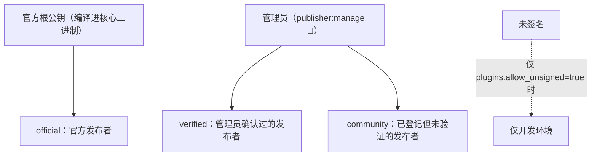

| 信任级别 | 可申请的权限 | 原生微前端 |
|---|---|---|
| official | 全部 | ✅ |
| verified | 全部（极高风险仍需逐项确认） | ✅ |
| community | 不能申请 🔴 极高风险权限 | ❌ |
| 未签名 | 同 community，且仅限开发环境 | ❌ |

- `publishers(id, name, trust_level, status)`、`publisher_keys(key_id, publisher_id, public_key, status, not_before, not_after)`
- **吊销**：发布者或密钥被吊销时，由其签名的插件立即标记为"签名已吊销"；按配置自动禁用（默认）或只告警
- 密钥轮换：同一发布者可以有多把有效密钥

### 11.3 插件市场（本期只做客户端）

- 配置一个或多个市场索引地址；索引是一个**签名的静态 JSON 文件**（可以托管在 GitHub 或任意静态存储）：插件列表、版本、下载地址、sha256、发布者
- 控制台"插件市场"页：浏览、查看详情、一键安装（下载 → 校验 sha256 和签名 → 进入授权确认）、检查已安装插件的更新
- 索引本身用市场密钥签名，防止被篡改

### 11.4 开发工具

`sub2api-plugin` 命令行：`keygen`（生成发布者密钥）、`build`（交叉编译 linux/amd64、linux/arm64，`--dev` 额外编译本机平台）、`pack`、`sign`、`verify`、`index`（生成和签名市场索引）。

---

## 12. 前端

### 12.1 控制台

Vue 3 + Vite + TypeScript + Pinia + Vue Router + Tailwind。菜单、路由权限、按钮权限全部由后端数据驱动：

- `GET /api/me`：用户信息、权限集合
- `GET /api/me/menus`：核心菜单 + 已启用插件的菜单（已按权限过滤）
- `GET /api/ui/plugins`：已启用插件的前端扩展声明（页面、插槽、原生入口地址）

### 12.2 插件界面的三种方式

| 方式 | 适用 | 安全 | 说明 |
|---|---|---|---|
| **schema** | 表单、表格类页面 | 无代码执行 | 插件提供 JSON Schema / 表格定义，核心渲染；风格完全统一 |
| **iframe** | 复杂但不受信的界面 | 沙箱隔离，拿不到登录态 | `sandbox="allow-scripts"`；通过 Bridge 调用插件接口（核心代为携带会话）、同步主题和语言、路由、提示框 |
| **原生微前端** | 受信插件的复杂界面、嵌入核心页面 | **无隔离**，只允许 official / verified 且获批 `ui.native` | 插件的 Vue 组件直接挂进控制台 |

### 12.3 原生微前端

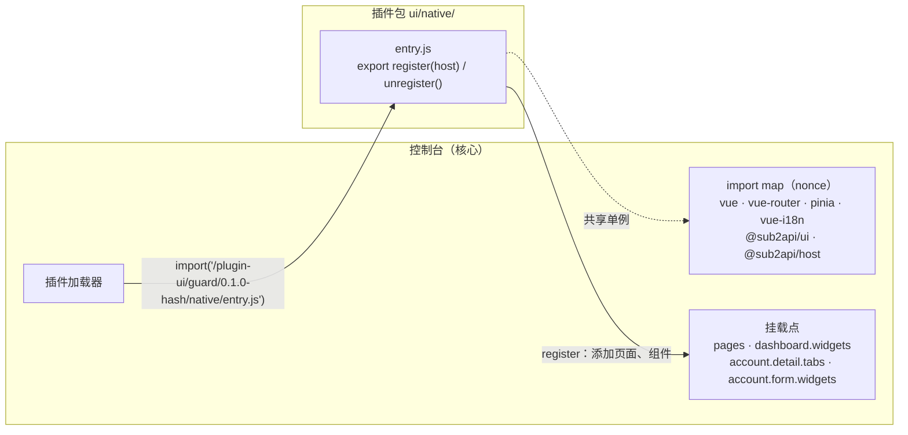

- 核心构建时把 Vue 等公共依赖和 `@sub2api/ui`（组件库）、`@sub2api/host`（宿主 API：带会话的请求、路由、i18n、权限、提示框）输出为独立的 ES 模块，用 import map 暴露；**核心自己也从这些模块导入**，保证单例
- 插件用官方 Vite 预设构建（这些依赖设为 external），体积小
- URL 带版本号和 hash，升级后自动加载新文件
- 禁用插件时调用 `unregister()`、移除路由和挂载点上的组件；已加载的模块在刷新页面后释放
- `hostUICompat` 不兼容的插件拒绝加载
- CSP 不需要放宽（插件脚本与控制台同源）

---

## 13. 用户 / 角色 / 权限

### 13.1 模型

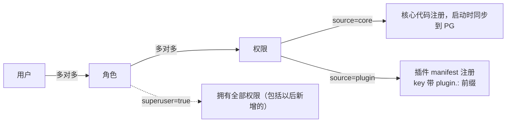

### 13.2 鉴权判断

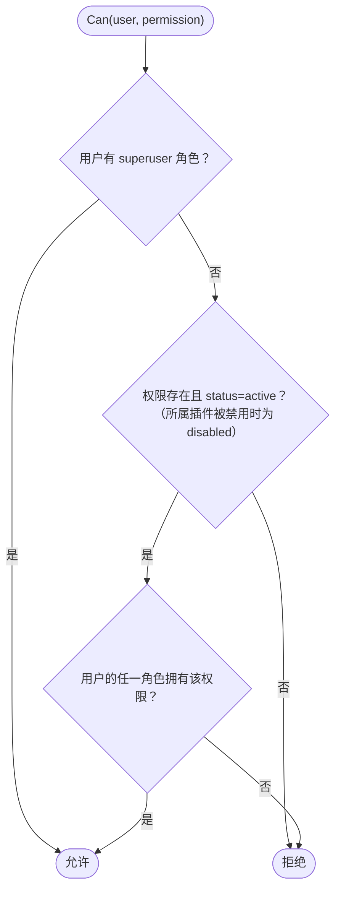

- 权限集合缓存在节点内存，带全局版本号；变更时广播 `authz:changed`，**收回立即生效**
- JWT 只放用户 ID
- `sensitive` 权限需要再次输入密码（本期），以后换成 TOTP

### 13.3 内置角色与核心权限

| 角色 | 说明 |
|---|---|
| `super_admin` | superuser，至少保留一个用户，不能删除 |
| `admin` | 默认拥有全部核心权限，可修改 |
| `user` | 管理自己的 API Key、查看自己的用量和余额流水、调用网关 |

| 模块 | 权限 |
|---|---|
| 用户 | `user:read` `user:create` `user:update` `user:delete` |
| 角色 | `role:read` `role:manage` |
| API Key | `apikey:self:manage` `apikey:all:read` `apikey:all:manage` |
| 分组 | `group:read` `group:manage` |
| 账号 | `account:read` `account:create` `account:update` `account:delete` `account:test` `account:credential:view`🔐 |
| 代理 | `proxy:read` `proxy:manage` |
| 价格 | `price:read` `price:manage` |
| 余额 | `balance:self:read` `balance:all:read` `balance:adjust`🔐 |
| 使用记录 | `usage:self:read` `usage:all:read` |
| 插件 | `plugin:read` `plugin:install`🔐 `plugin:manage` `plugin:uninstall`🔐 `plugin:grant:high` `plugin:grant:critical`🔐 `plugin:egress:read` `plugin:market:read` |
| 发布者 | `publisher:read` `publisher:manage`🔐 |
| 集群 | `node:read` |
| 网关 | `gateway:use` |

🔐 = 敏感权限，操作时需要再次输入密码。

### 13.4 插件权限的生命周期

| 操作 | 权限定义 | 角色上的授权 |
|---|---|---|
| 安装 | 插入，status=active | 默认不授予；安装确认时可选择授予哪些角色 |
| 升级 | 新增的插入，删除的连同授权删除，保留的不变 | 保留的不变 |
| 禁用 | status=disabled，**不删除** | 保留，但判断时视为没有 |
| 重新启用 | status=active | 立即恢复 |
| 卸载 | **删除**（外键级联） | 随之删除 |

---

## 14. 其他关键流程

### 14.1 账号录入

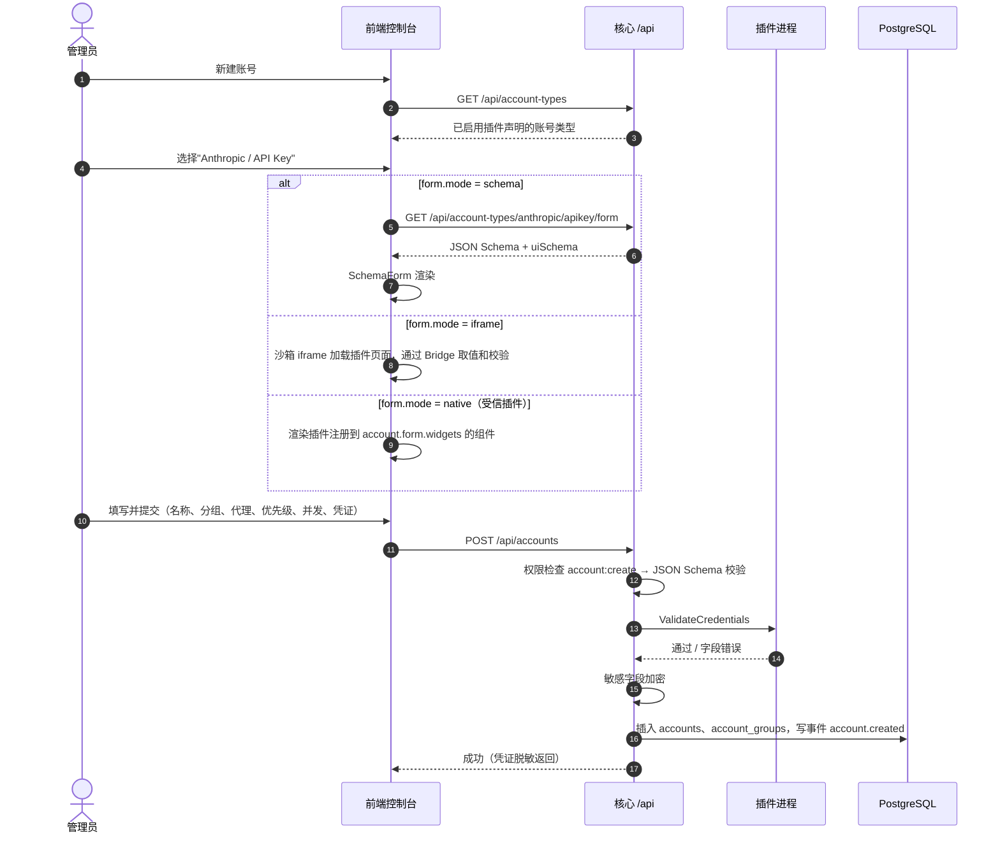

### 14.2 插件安装

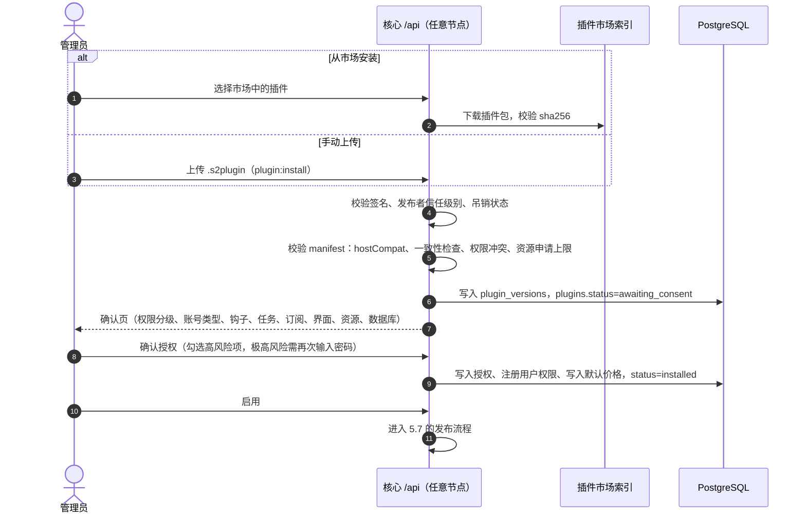

---

## 15. 两个演示插件

### 15.1 anthropic（账号类型插件，内置）

anthropic 平台及其端点、用量规则、默认粘性规则由**核心内置**（`server/internal/platforms/anthropic.json`，见 6.6）；插件本身随镜像内置、只能禁用不能卸载。

| 能力 | 内容 |
|---|---|
| 账号类型 | `apikey`：支持平台 `anthropic`；字段 `api_key`（敏感）、`base_url`（默认 `https://api.anthropic.com`）、`model_mapping` |
| 构造请求 | 按 `meta.protocol` 选上游路径：`base_url + /v1/messages` 或 `/v1/messages/count_tokens`；请求头 `x-api-key`、`anthropic-version`（透传，默认 `2023-06-01`）、`anthropic-beta`（透传）；命中模型映射时修改 `model` |
| 错误分类 | 400 直接返回；401/403 切换并禁用账号；429 切换并冷却到 `retry-after`（默认 60 秒）；529 切换并冷却 30 秒；5xx 切换并冷却 10 秒 |
| 模型目录 | 自己的 schema `plg_anthropic.model_catalog` + 迁移 `0001_init.sql`；接口 `GET /models`；声明式表格页面；用户权限 `model_catalog:read` |
| 升级演示 | 测试用 `0.2.0` 增加 `0002_add_family.sql`（加字段并回填），验证升级迁移和旧数据迁移 |
| 权限 | `platform.register`、`accounts.credentials`（`{"types":"own"}`）、`db.schema`、`kv`、`routes.admin`、`ui.menu` |

另有市场插件 **relay（Claude 中转）**：只声明账号类型 `relay_key`（支持平台 `anthropic`，按平台覆盖 requestFields/passHeaders），演示多个插件的账号类型在同一分组中共同服务 `/v1/messages`。

### 15.2 guard（钩子与应用插件）

| 能力 | 内容 |
|---|---|
| 网关钩子 | `gateway.request`：从 `prompt_text` 中匹配拦截规则（关键词、正则），命中返回 403；`failure=open`、超时 300ms |
| 规则管理 | 规则存在 `plg_guard.rules`；接口 `GET/PUT /rules`；插件在内存中缓存规则，规则更新后立即生效 |
| 事件订阅 | `usage.recorded`：按分钟统计各分组、模型的请求量，写入 `plg_guard.stats_minutely` |
| 后台任务 | `rollup` 每 5 分钟把分钟统计汇总为小时统计；`cleanup` 每天清理 30 天前的数据 |
| 出口访问 | 命中规则时向配置的 webhook 地址发送告警（`http.Post`，经出口隧道，能在"外部访问"页看到） |
| 原生界面 | "请求守卫"大盘页面（拦截趋势图、规则命中排行）+ 首页的"今日拦截"卡片 |
| 设置 | schema 表单：webhook 地址、是否记录命中的文本片段 |
| 资源 | 申请 128MB 内存、0.25 核 |
| 用户权限 | `rules:read`、`rules:manage`、`stats:read` |
| 测试用途 | 另有一个测试构建，会尝试直接 `net.Dial` 外部地址和申请超量内存，用来验证严格模式和资源限制 |

---

## 16. 代码仓库与技术选型

### 16.1 旧代码备份与新代码位置

- 备份：打 tag `legacy/v0.2.8`，创建分支 `legacy/main`，旧代码原样保留
- 新代码：新分支 `feat/next-platform`，新建 `next/` 目录，与旧代码并存

### 16.2 目录结构

```
next/
├── go.work                        # Go 工作区：server、sdk、plugins、tools
├── server/                        # 核心服务（独立 Go module）
│   ├── cmd/sub2api/main.go        # 含隐藏子命令 plugin-exec（启动器）
│   ├── internal/
│   │   ├── app/  config/  store/  migrations/  cluster/
│   │   ├── iam/  authz/  apikey/  group/  proxy/  account/
│   │   ├── billing/  usage/  event/  job/
│   │   ├── gateway/               # 流水线、调度、钩子执行、用量提取
│   │   ├── plugin/                # 包、签名与信任、manifest、授权、迁移、注册表、发布、市场
│   │   │   ├── grpcruntime/       # 唯一允许引用 go-plugin 的包；HostService、EgressService
│   │   │   └── sandbox/           # seccomp、rlimit、oom_score_adj、nice、看门狗（//go:build linux）
│   │   └── httpapi/               # gin 路由、handler、中间件
│   └── web/                       # 嵌入前端构建产物
├── sdk/                           # 插件 SDK（独立 Go module，插件只依赖它）
│   ├── proto/sub2api/plugin/v1/*.proto
│   ├── gen/
│   └── pluginsdk/                 # Serve()、Host 客户端、出口隧道 Transport/Dialer/Resolver、测试工具
├── plugins/
│   ├── anthropic/                 # 独立 Go module
│   └── guard/                     # 独立 Go module，含 ui/native 前端工程
├── tools/
│   └── sub2api-plugin/            # keygen / build / pack / sign / verify / index
├── web/                           # 控制台（Vue 3）
│   ├── src/
│   └── packages/
│       ├── ui/                    # @sub2api/ui 组件库（共享给原生插件）
│       ├── host/                  # @sub2api/host 宿主 API
│       └── vite-preset/           # 插件前端构建预设
├── deploy/                        # docker-compose、Caddyfile
└── docs/
```

### 16.3 技术选型

| 项目 | 选择 |
|---|---|
| 语言 | Go 1.27 |
| HTTP | gin |
| 数据库 | PostgreSQL 16 + pgx v5，手写 SQL |
| 迁移 | 嵌入式 SQL + 自研执行器（核心和插件共用，参考旧项目 `migrations_runner.go`） |
| 缓存 / 实时状态 | Redis 7 + go-redis v9 |
| 插件 | hashicorp/go-plugin + gRPC + protobuf |
| seccomp | elastic/go-seccomp-bpf（纯 Go，不需要 cgo） |
| 签名 | crypto/ed25519 |
| JSON | gjson / sjson；santhosh-tekuri/jsonschema 做 schema 校验 |
| 金额 | numeric(20,8) + shopspring/decimal |
| 计费表达式 | expr-lang/expr（MIT）；设计参考 new-api 的 billingexpr，代码自行实现（new-api 是 AGPL-3.0，不能直接复制） |
| 定时任务 | robfig/cron v3（只负责计算触发时间） |
| 日志 | log/slog |
| 前端 | Vue 3 + Vite + TypeScript + Pinia + Vue Router + Tailwind；图表用 ECharts |
| 依赖注入 | 手写组装 |
| 运行平台 | 生产仅 Linux（含 Docker）；Windows/macOS 仅插件开发模式 |

---

## 17. 实施计划与 Agent 团队

### 17.1 阶段

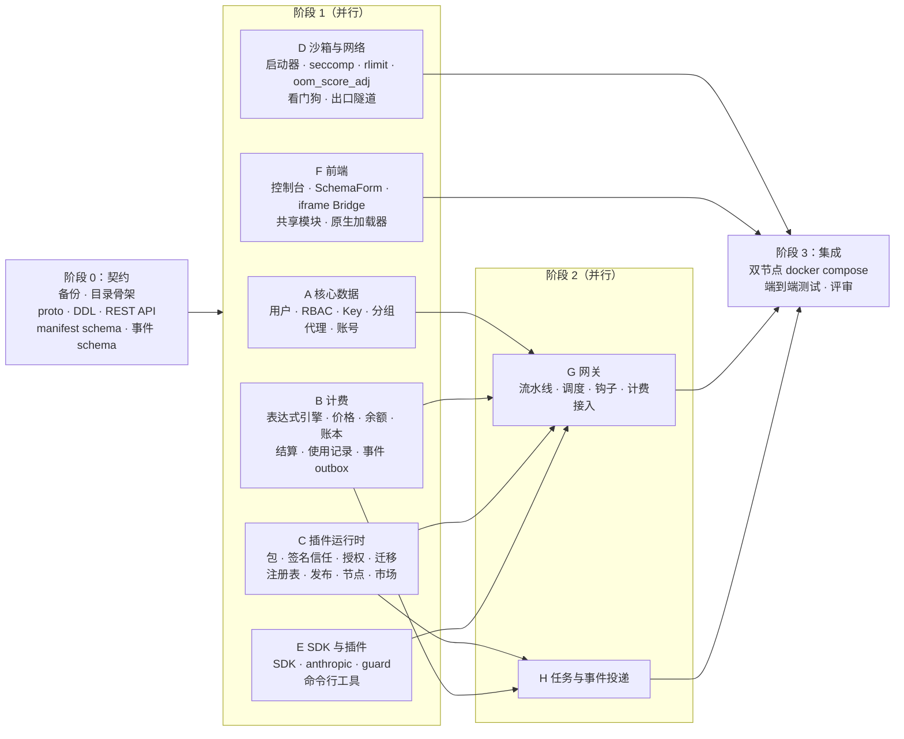

阶段 0 的契约是所有 agent 共同依赖的，由主控先完成并冻结；契约变更必须经过主控。

### 17.2 团队分工

| Agent | 负责 | 交付物 |
|---|---|---|
| 主控 | 阶段 0 契约、任务拆分、合并、跨模块评审 | proto、DDL、OpenAPI、manifest / 事件 schema |
| A core-data | `iam` `authz` `apikey` `group` `proxy` `account` | 模块、接口、单元测试 |
| B billing | `billing`（含计费表达式引擎）`usage` `event`（outbox 写入端） | 模块、表达式引擎与冒烟测试、结算与幂等测试 |
| C plugin-runtime | `plugin`、`grpcruntime`、`cluster` | 模块、生命周期与发布测试 |
| D sandbox-network | `sandbox`、EgressService、SDK 网络部分 | 启动器、隧道、限制测试 |
| E sdk-plugins | `sdk`、`plugins/anthropic`、`plugins/guard`（后端）、`tools/sub2api-plugin` | SDK、两个插件及测试构建 |
| F frontend | 控制台全部页面、`@sub2api/ui`、`@sub2api/host`、原生加载器、guard 原生界面 | 前端工程 |
| G gateway | `gateway` | 流水线、钩子、计费接入、压测 |
| H events-jobs | `event`（投递端）、`job` | 投递器、调度器、测试 |
| QA | docker compose、端到端测试、多节点测试 | 测试脚本与报告 |

### 17.3 验收标准

**基础**
1. `docker compose up` 启动 PG、Redis、两个节点和 Caddy
2. 超级管理员创建角色"运营"（只有账号、代理权限）并分配给新用户，该用户只能看到对应菜单，调用其他接口返回 403

**插件与平台**
3. 从市场索引安装 anthropic（签名为 official）→ 确认授权 → 启用 → 两个节点均为 active；"模型目录"菜单出现，数据来自插件 schema
4. 新建账号：选择"Anthropic / API Key"→ 插件提供的录入界面 → 保存成功、凭证脱敏
5. 升级到 anthropic 0.2.0：迁移执行一次、旧数据已回填、两个节点切换期间请求不中断
6. 禁用插件：账号保留、插件权限变灰、其端点消失（404）；重新启用恢复；内置插件不能卸载

**分组与计费**
7. 用户在自己可用的分组下创建 Key，调用 `/v1/messages`（流式和非流式）成功，只调度到该分组的账号
8. 分别配置按次、按 token、两档表达式（含一条请求头加价规则）三种价格：使用记录中的费用、命中档位、加价规则与价格试算结果一致；账本有对应记录；同一请求重复结算不会重复扣款
9. 余额不足返回 402；管理员调整余额后可以继续使用，账本记录操作人

**钩子、事件、任务**
10. guard 规则命中时返回 403 且不调用上游；guard 进程被杀死时按 `failure=open` 放行，并触发熔断
11. guard 通过事件订阅统计到的请求数与使用记录一致；禁用后重新启用，事件从断点继续投递
12. guard 的 `rollup` 任务在两个节点的环境下每个周期只执行一次

**网络、资源、签名、界面**
13. guard 发出的 webhook 告警出现在"外部访问"页；测试构建直接 `net.Dial` 失败
14. 测试构建超量申请内存被重启，插件详情页显示重启原因；容器内存不足时被杀的是插件而不是核心；超过全局上限的资源申请在安装时被拒绝
15. 篡改插件包中任一文件后安装失败；吊销发布者后其插件被自动禁用；community 发布者申请 `ui.native` 被拒绝
16. guard 的原生大盘页面和首页卡片正常显示；禁用 guard 后页面和卡片消失

**多节点**
17. 停掉一个节点：15 秒内从节点列表消失，它留下的并发槽位被清理，另一个节点正常服务

---

## 18. 决策记录与待确认事项

### 18.1 已确认

| # | 问题 | 决定 |
|---|---|---|
| 1 | 新代码位置 | 当前仓库的 `next/` 目录 |
| 2 | 模型价格 | 独立页面，支持按次、按 token、按表达式；参考 new-api 的设计自行实现 |
| 3 | 充值方式 | 本期只支持管理员调整余额 |
| 4 | cgroup | 本期不用；采用不需要特权的组合（第 10 章），cgroup 预留 |
| 5 | 签名密钥 | 官方根密钥由你们保管，开发环境生成测试密钥；市场索引先放 GitHub Releases |

### 18.2 采用默认建议（如有不同意见请指出）

| # | 问题 | 默认做法 |
|---|---|---|
| 6 | 计费币种和精度 | USD，`numeric(20,8)` |
| 7 | 找不到模型价格 | 拒绝请求（可配置为免费放行） |
| 8 | 最低余额和透支 | 最低余额 0，允许短暂透支（受用户并发上限约束） |
| 9 | 旧系统数据 | 本期不导入 |
| 10 | 敏感操作的二次验证 | 本期再次输入密码，以后换成 TOTP |
| 11 | 前端风格 | 沿用旧项目的 Tailwind 风格，组件重新写 |
| 12 | 计费代码的来源 | 只参考 new-api 的设计，不复制代码（许可证原因） |

---

## 附录 A：控制台界面线框图

图中用 `[核心]` 和 `[插件]` 标出内容由谁提供。

### A.1 整体布局（菜单按权限显示）

```
┌──────────────────────────────────────────────────────────────────────────┐
│ sub2api                                  余额 $12.34   admin@x.com ▾  中 │
├──────────────┬───────────────────────────────────────────────────────────┤
│ 概览         │  ┌ 今日请求 ┐ ┌ 今日费用 ┐ ┌ 可用账号 ┐ ┌ 今日拦截 [插件] ┐│
│ ── 网关 ──   │  │  12,345  │ │  $86.20  │ │   8/10   │ │   37 ▲12%        ││
│ 分组         │  └──────────┘ └──────────┘ └──────────┘ └──────────────────┘│
│ 账号         │    ↑ "今日拦截"是 guard 插件注册到 dashboard.widgets 的原生组件
│ 代理         │                                                           │
│ 模型价格     │                                                           │
│ 使用记录     │                                                           │
│ ── 财务 ──   │                                                           │
│ 余额流水     │                                                           │
│ ── 系统 ──   │                                                           │
│ 用户         │                                                           │
│ 角色与权限   │                                                           │
│ 插件         │                                                           │
│ 插件市场     │                                                           │
│ 发布者       │                                                           │
│ 集群节点     │                                                           │
│ ── 我的 ──   │                                                           │
│ API Key      │                                                           │
│ 我的用量     │                                                           │
│ ── 插件 ──   │  ← [插件] 菜单，按权限显示                                │
│ 模型目录     │                                                           │
│ 请求守卫     │                                                           │
└──────────────┴───────────────────────────────────────────────────────────┘
```

### A.2 账号列表 `[核心]`

```
账号                                                        [ + 新建账号 ]
 平台 [全部 ▾]  分组 [全部 ▾]  状态 [全部 ▾]  搜索 [____________]
┌────┬──────────────┬──────────────────┬──────────┬──────┬──────┬───────┬────────────┐
│ ID │ 名称         │ 类型              │ 分组     │ 状态 │ 优先 │ 并发  │ 操作       │
├────┼──────────────┼──────────────────┼──────────┼──────┼──────┼───────┼────────────┤
│ 12 │ claude-main  │ Anthropic·API Key │ 默认,VIP │ ● 正常│  1  │ 3/10  │ 测试 编辑 ⋯│
│ 13 │ claude-bak   │ Anthropic·API Key │ 默认     │ ◐ 冷却│  2  │ 0/10  │ 测试 编辑 ⋯│
│    │              │                  │          │ 至 14:05（429）                  │
│ 14 │ old-key      │ Anthropic·API Key │ 默认     │ ✕ 禁用（401 凭证无效）           │
└────┴──────────────┴──────────────────┴──────────┴──────┴──────┴───────┴────────────┘
```

### A.3 新建账号 第 1 步：选择账号类型 `[插件]`

```
新建账号 · 选择类型                                                    ✕
┌──────────────────────────────────────────────────────────────────────┐
│  ┌─────────────────────┐   ┌─────────────────────┐                   │
│  │ [A] Anthropic       │   │ [?] 其他平台         │  ← 每个已启用插件 │
│  │     API Key         │   │   （安装插件后出现） │    声明的账号类型 │
│  │ anthropic v0.1.0    │   │                     │                   │
│  └─────────────────────┘   └─────────────────────┘                   │
│  没有需要的平台？前往"插件市场"安装                                   │
└──────────────────────────────────────────────────────────────────────┘
```

### A.4 新建账号 第 2 步：填写信息

```
新建账号 · Anthropic / API Key                                  ← 上一步  ✕
┌──────────────────────────────────────────────────────────────────────┐
│ 基本信息                                                  [核心]     │
│   名称 [claude-main        ]   分组 [默认 ✕][VIP ✕][+]               │
│   代理 [不使用代理        ▾]                                          │
│ 调度                                                      [核心]     │
│   优先级 [1]  权重 [1]  最大并发 [10]  ☑ 参与调度                     │
│ 限流（0 = 不限）                                          [核心]     │
│   RPM [0]  TPM [0]  TPD [0]  SPM [0]                                  │
│ 模型                                                      [核心]     │
│   模型列表 [claude-sonnet-4-5 ✕][claude-opus-4-1 ✕][+]  空 = 全部    │
│   模型映射 [claude-3-5-sonnet-latest → claude-sonnet-4-5] [+] [JSON] │
├──────────────────────────────────────────────────────────────────────┤
│ 凭证                                                      [插件]     │
│   API Key * [ sk-ant-••••••••••••••••••      ] 👁                     │
│   Base URL  [ https://api.anthropic.com    ▾ ]                       │
│   （schema / iframe / 原生组件三种方式之一，由插件决定）              │
├──────────────────────────────────────────────────────────────────────┤
│                               [ 测试连接 ]  [ 取消 ]  [ 保存 ]       │
└──────────────────────────────────────────────────────────────────────┘
```

### A.5 分组 `[核心]`

```
分组                                                          [ + 新建分组 ]
┌──────┬──────────┬──────┬──────────────┬──────────┬──────────┬──────────┐
│ 名称 │ 可见性   │ 倍率 │ 模型白名单   │ 账号数   │ Key 数   │ 操作     │
├──────┼──────────┼──────┼──────────────┼──────────┼──────────┼──────────┤
│ 默认 │ 公开     │ 1.00 │ 不限         │ 8        │ 120      │ 编辑 ⋯   │
│ VIP  │ 指定用户 │ 0.80 │ claude-*     │ 3        │ 12       │ 编辑 ⋯   │
└──────┴──────────┴──────┴──────────────┴──────────┴──────────┴──────────┘
```

### A.6 模型价格 `[核心]`

**列表**

```
模型价格                   来源 [全部 ▾]  方式 [全部 ▾]  搜索 [________]   [ 同步价格 ] [ + 新增价格 ]
┌──────────┬──────────────────┬────────┬───────────────────────────────────────┬────────────┬──────┐
│ 模型              │ 方式   │ 摘要                                  │ 来源             │ 操作 │
├──────────┼──────────────────┼────────┼───────────────────────────────────────┼────────────┼──────┤
│ claude-sonnet-4-5 │ 表达式 │ 2 档：≤200K / >200K · 缓存单独计价     │ 同步 · LiteLLM   │ 编辑 │
│ claude-haiku-4-5  │ 按token│ 输入 $1 · 输出 $5 · 缓存读 $0.1 /百万  │ 同步 · LiteLLM   │ 编辑 │
│ claude-sonnet-x   │ 表达式 │ 2 档 · 1 条加价规则（fast-mode ×2）    │ 手动             │ 编辑 │
│ web-search        │ 按次   │ $0.01 / 次                             │ 手动             │ 编辑 │
└──────────┴──────────────────┴────────┴───────────────────────────────────────┴────────────┴──────┘
修改同步来的价格后它变为手动价格；"同步价格"进入同步源页面预览并选择导入
```

**编辑：按 token**

```
编辑价格 · anthropic / claude-haiku-4-5                                      ✕
 计费方式  ( ) 按次   (•) 按 token   ( ) 表达式
┌──────────────────────────────────────────────────────────────────────────┐
│ 每百万 token 价格（USD）                                                 │
│   输入 [ 1.00 ]   输出 [ 5.00 ]                                          │
│   缓存读 [ 0.10 ]   缓存写 5 分钟 [ 1.25 ]   缓存写 1 小时 [ 2.00 ]      │
│                                                                          │
│ 生成的表达式（只读）：tier("base", p*1 + c*5 + cr*0.1 + cc*1.25 + cc1h*2)│
└──────────────────────────────────────────────────────────────────────────┘
```

**编辑：表达式（可视化分档 + 加价规则）**

```
编辑价格 · anthropic / claude-sonnet-x                                       ✕
 计费方式  ( ) 按次   ( ) 按 token   (•) 表达式        [ 可视化 ]  [ 源码 ]
┌──────────────────────────────────────────────────────────────────────────┐
│ 分档（按 len = 完整上下文长度）                                [ + 分档 ] │
│  档位 standard      条件 len ≤ [ 200000 ]                                │
│    输入 [3] 输出 [15] 缓存读 [0.3] 缓存写5m [3.75] 缓存写1h [6] 固定费 [0]│
│  档位 long_context  条件 其余                                            │
│    输入 [6] 输出 [22.5] 缓存读 [0.6] 缓存写5m [7.5] 缓存写1h [12] 固定费[0]│
│                                                                          │
│ 加价规则                                                     [ + 规则 ]  │
│  当 [请求头 ▾] [anthropic-beta] [包含 ▾] [fast-mode]   倍数 [ 2 ]    ✕   │
│  当 [时段 ▾]   [Asia/Shanghai]  [0 点 ~ 8 点]           倍数 [ 0.8 ]  ✕   │
├──────────────────────────────────────────────────────────────────────────┤
│ 价格试算                                                                 │
│  输入 [100000] 输出 [2000] 缓存读 [80000] 缓存写 [0]                      │
│  请求头 anthropic-beta [fast-mode]      时间 [今天 10:00 ▾]              │
│  → 档位 standard（len = 180000）· 加价 fast-mode ×2 · 费用 $0.7080        │
│    明细：输入 $0.3000 + 输出 $0.0300 + 缓存读 $0.0240 = $0.3540 × 2      │
│    （分组"默认"倍率 1.00；时段规则未命中）                               │
├──────────────────────────────────────────────────────────────────────────┤
│ ✓ 编译通过  ✓ 冒烟测试通过（24 组样本，结果均为有限非负数）              │
│                                           [ 取消 ]   [ 保存 ]            │
└──────────────────────────────────────────────────────────────────────────┘
切到"源码"可以直接编辑表达式；无法用可视化方式表示的表达式只能在源码模式编辑
```

### A.7 余额流水 `[核心]`

```
余额流水      用户 [全部 ▾]  类型 [全部 ▾]  时间 [本月 ▾]    [ 调整余额 🔐 ]
┌──────────┬──────┬────────────┬───────────┬───────────┬─────────────────────┐
│ 时间     │ 用户 │ 类型       │ 变动      │ 余额      │ 说明                │
├──────────┼──────┼────────────┼───────────┼───────────┼─────────────────────┤
│ 14:02:15 │ 张三 │ 使用扣费   │ -0.0158   │ 12.3400   │ req_8f2a…           │
│ 13:00:00 │ 张三 │ 管理员调整 │ +20.0000  │ 12.3558   │ admin：充值         │
└──────────┴──────┴────────────┴───────────┴───────────┴─────────────────────┘
```

### A.8 插件市场

```
插件市场   来源 [官方市场 ▾]   搜索 [________]
┌──────────────────────────────────────────────────────────────────────────┐
│ [A] Anthropic       v0.2.0   official ✓   平台适配   已安装 v0.1.0 [升级]│
│ [G] Guard           v0.1.0   official ✓   请求拦截                 [安装]│
│ [X] Foo Platform    v1.0.0   community    平台适配                 [安装]│
└──────────────────────────────────────────────────────────────────────────┘
```

### A.9 授权确认页

```
┌─ 安装插件：Guard v0.1.0 ─────────────────────────────────────────────────┐
│ 发布者：sub2api   ✓ official 签名有效     兼容核心 >=0.1.0 <0.2.0 ✓      │
│                                                                          │
│ 插件提供                                                                 │
│   · 网关钩子：检查请求（anthropic.messages，所有模型和分组）             │
│     读取字段：model、提示词文本（最多 32KB）   失败时：放行               │
│   · 订阅事件：usage.recorded    · 后台任务：rollup（每 5 分钟）、cleanup │
│   · 菜单：请求守卫（原生界面）   · 首页卡片：今日拦截                    │
│   · 用户权限：查看规则 / 管理规则 / 查看统计   授予角色：☑ admin ☐ user  │
│   · 数据库：schema plg_guard，迁移 2 个                                  │
│   · 资源：内存 128MB、CPU 0.25 核                                        │
│                                                                          │
│ 插件申请的核心能力                                                       │
│   🟢 KV 存储                                                 （自动）    │
│   🟡 管理接口、订阅事件、后台任务                             ☑          │
│   🟠 网关钩子 —— 检查请求内容                                 ☑          │
│   🟠 独立数据库 schema —— 保存规则和统计                      ☑          │
│   🔴 原生界面 —— 插件代码将以你的登录身份在控制台中运行       ☑          │
│   🟠 外部访问 hooks.example.com（可选，白名单模式下生效）     ☐          │
│                                                                          │
│ 需要再次输入密码：[••••••••]              [ 取消 ]   [ 确认并安装 ]      │
└──────────────────────────────────────────────────────────────────────────┘
```

### A.10 插件详情

```
Guard v0.1.0   ● 已启用   official ✓                      [ 禁用 ] [ ⋯ ]
[概览] [授权] [节点] [钩子] [任务] [事件] [外部访问] [资源] [设置]
┌──────────────────────────────────────────────────────────────────────────┐
│ 节点   node-1 ● v0.1.0  内存 42/128MB  CPU 3%   重启 0                   │
│        node-2 ● v0.1.0  内存 39/128MB  CPU 2%   重启 0                   │
│ 钩子   gateway.request  调用 12,345  拒绝 37  超时 2  P99 4ms  熔断 否   │
│ 任务   rollup   上次 14:05 node-2 ✓ 0.8s   下次 14:10      [立即执行]    │
│        cleanup  上次 03:00 node-1 ✓ 3.2s   下次 明天 03:00               │
│ 事件   usage.recorded  游标 #884,201  积压 12  死信 0                    │
│ 外部访问  hooks.example.com:443  今日 37 次  ↑4KB ↓9KB  全部成功         │
└──────────────────────────────────────────────────────────────────────────┘
```

### A.11 发布进度

```
Anthropic  ·  升级 v0.1.0 → v0.2.0                       阶段：准备中
┌──────────────────────────────────────────────────────────────────────┐
│ ① 数据库迁移   ✓ 0002_add_family.sql（node-2 执行，120ms）           │
│ ② 各节点准备   node-1 ✓ 就绪    node-2 ✓ 就绪（协调者）              │
│ ③ 激活         ⏳ 等待全部就绪                                        │
│ 当前线上版本：v0.1.0（所有节点）                  [ 取消发布 ]        │
└──────────────────────────────────────────────────────────────────────┘
```

### A.12 角色与权限

```
角色与权限                                                [ + 新建角色 ]
┌────────────────┬─────────────────────────────────────────────────────┐
│ super_admin 🔒 │ 运营                                     [ 保存 ]   │
│ admin          │ ▾ 账号        ☑ 查看 ☑ 新建 ☑ 编辑 ☐ 删除           │
│ user           │               ☑ 测试 ☐ 查看凭证 🔐                   │
│ ▶ 运营         │ ▾ 分组        ☑ 查看 ☐ 管理                         │
│                │ ▾ 代理        ☑ 查看 ☑ 管理                         │
│                │ ▾ 余额        ☐ 查看全部 ☐ 调整 🔐                   │
│                │ ▸ 用户 · 插件管理 · 发布者 ...                       │
│                │ ── 插件注册的权限 ──                                 │
│                │ ▾ Anthropic   ☑ 查看模型目录                         │
│                │ ▾ Guard       ☑ 查看统计 ☐ 管理规则                   │
│                │ 成员：张三、李四                       [ 管理成员 ]  │
└────────────────┴─────────────────────────────────────────────────────┘
```

### A.13 guard 原生大盘 `[插件]`

```
请求守卫                                               今日 ▾   [ 管理规则 ]
┌──────────────────────────────────────────────────────────────────────┐
│ 拦截趋势（ECharts，使用 @sub2api/ui 的图表组件）                     │
│  40 ┤          ╭╮                                                    │
│  20 ┤   ╭──╮  ╭╯╰╮   ╭─╮                                              │
│   0 ┼───╯  ╰──╯  ╰───╯ ╰──                                            │
├──────────────────────────────────────────────────────────────────────┤
│ 命中排行   1. 关键词 "xxx"  21 次   2. 正则 /\d{18}/  9 次             │
└──────────────────────────────────────────────────────────────────────┘
这个页面是插件自己的 Vue 组件，和控制台共享 Vue、组件库和登录态
```

### A.14 使用记录 `[核心]`

```
使用记录      时间 [今天 ▾]  用户 [全部 ▾]  分组 [全部 ▾]  账号 [全部 ▾]
┌──────────┬──────┬──────┬─────────────┬─────────────────┬──────┬──────┬────────┬──────┐
│ 时间     │ 用户 │ 分组 │ 账号        │ 模型            │ 输入 │ 输出 │ 费用   │ 状态 │
├──────────┼──────┼──────┼─────────────┼─────────────────┼──────┼──────┼────────┼──────┤
│ 14:02:11 │ 张三 │ 默认 │ claude-main │ claude-sonnet-x │1,204 │  812 │ $0.0158│ ✓ 流 │
│ 14:01:57 │ 张三 │ 默认 │ —           │ claude-sonnet-x │  —   │  —   │ 免费   │ ✕ 拦截│
│          │      │      │  └ 被 guard 拦截：命中规则"xxx"                           │
└──────────┴──────┴──────┴─────────────┴─────────────────┴──────┴──────┴────────┴──────┘

点开一条记录的计费详情：
  价格规则  anthropic / claude-sonnet-x（管理员）  表达式 v1 · hash 3fa9c1…  [查看表达式]
  档位      standard（len = 1,204 + 0 + 0 ≤ 200000）
  加价规则  anthropic-beta 包含 fast-mode ×2  ✗ 未命中
  明细      输入 1,204 × $3/M = $0.003612 · 输出 812 × $15/M = $0.012180
            小计 $0.015792 × 分组倍率 1.00 = $0.015792     账本 #88231 ✓ 已结算
```

### A.15 集群节点

```
集群节点
┌─────────┬─────────────────┬────────┬──────────┬────────────────────────────────┐
│ 节点    │ 地址            │ 版本   │ 最近心跳 │ 插件                           │
├─────────┼─────────────────┼────────┼──────────┼────────────────────────────────┤
│ node-1  │ 10.0.0.11:8080  │ 0.1.0  │ 2 秒前   │ anthropic 0.1.0 ●  guard 0.1.0 ●│
│ node-2  │ 10.0.0.12:8080  │ 0.1.0  │ 1 秒前   │ anthropic 0.1.0 ●  guard 0.1.0 ●│
└─────────┴─────────────────┴────────┴──────────┴────────────────────────────────┘
```
