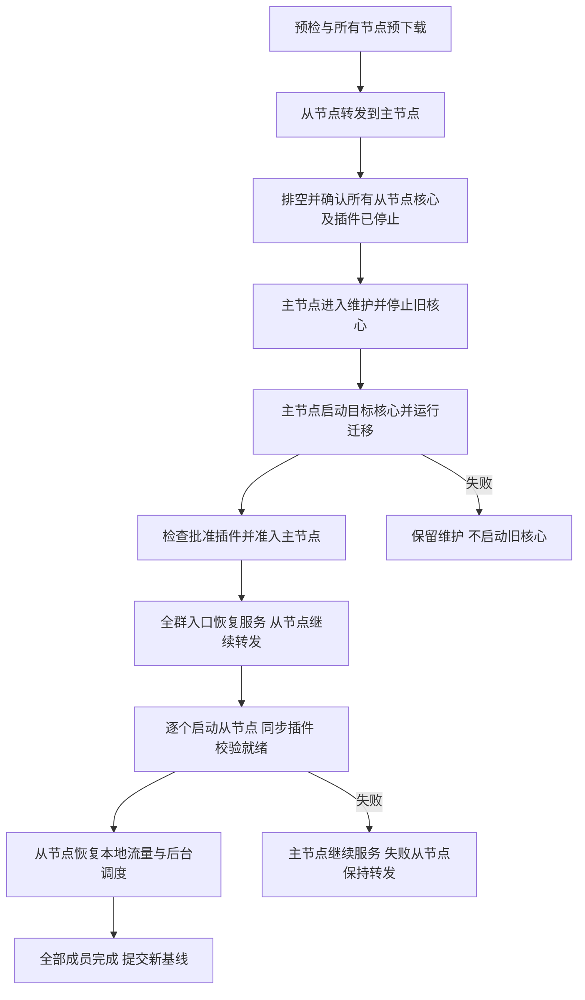

# 多节点同步与节点鉴权规约

日期：2026-10-02。状态：已在工作区实现，并于同日在隔离环境完成真实 PG/Redis 与真实三节点验收，见 [验证记录](audits/2026-10-02/MULTINODE-VALIDATION.md)。代码在 `7ad11483c` 提交，并随 `single/` 业务栈（:3130/:3131）部署；该栈不经外壳托管，外壳托管部署尚未上线。验证记录第 5 节列出尚未覆盖的场景。

本规约替代 `SHELL-MANAGED-UPDATES.md` 中原先的兼容滚动升级策略。已完成的旧版测试记录保留为历史证据，不作为本规约的通过结果。实现顺序是先完成本文及审阅，再改动代码。

## 1. 目标和决定

集群使用一个明确指定的主节点。主节点承担更新组织和核心制品分发；平时所有就绪节点都可以处理业务和领取后台工作。主节点并非数据库写入主库，也不独占异步任务。

核心升级允许短暂停机：先让所有从节点转发到主节点并完全停止旧核心，随后主节点停止、迁移和启动新版。主节点就绪后恢复全群入口的服务，再异步逐个更新从节点。每个从节点只有在核心、批准的插件和本地资源全部就绪后才接回流量、领取任务。

节点间继续采用 HTTPS 请求，复用 Go `net/http`、`httputil.ReverseProxy`、现有流式代理和签名制品下载器。新增统一的 `peer` 鉴权层，使用Redis中每节点一份的可复用鉴权密钥，支持配置指定或自动生成。暂不引入服务网格、额外的 RPC 框架、消息队列或第二套任务调度器。

基本职责：

- PG：节点登记、指定主节点、批准版本、升级计划与步骤、核心准入、插件状态、配置和任务账本等持久事实。
- Redis：节点登记及可复用鉴权密钥、现有分布式锁、共享并发限制和缓存失效通知。
- Shell：节点间传输鉴权、入口代理、下载与验签、核心进程管理、升级步骤执行。
- Core：数据库迁移、用户鉴权、业务调度、插件加载、用量结算和异步任务监控。
- Plugin：本地执行一次请求或一次进度查询，通过 SDK 调用核心能力。不接触节点凭证，不决定由哪个节点轮询。

## 2. 身份和信任边界

`cluster_id` 标识一个部署；`node_id` 是节点的稳定身份；`shell_boot_id` 在每次外壳启动时随机生成；`core_boot_id` 在每次启动核心时重新生成。三种标识不得混用，进程重启不能沿用旧启动身份或旧停止确认；配置指定的鉴权密钥可以保持不变。

初始加入凭据是部署配置中的 PG/Redis 连接权限和集群 ID。外部 HTTP 请求不能登记节点、申请节点权限或取得临时凭证。第一版采用持有正确部署凭据即可加入的受信集群模式，不另设用户手工审批每个节点的流程；PG 登记仍须检查节点 ID 冲突、禁用状态、协议能力和目标集群。

所有拥有同级 PG/Redis 写权限的节点属于同一信任域。Redis登记中的密钥用于验证节点身份，当前boot与服务端授权规则限制旧实例及不允许的操作；它不能隔离一个已经持有共享数据库写凭据的恶意宿主。插件不持有这些部署凭据，继续使用既有沙箱和宿主通道。

HTTPS 仍必须验证目标服务器证书和主机名；不能因为有临时凭证而关闭验证。现有服务器证书、CA 配置可以复用，节点身份授权不再依赖每个客户端手配证书及 `allowed_peers` 列表。若启用 mTLS，只作为额外限制，不能代替 Redis 鉴权或作为失败时的免鉴权后门。生产 Redis 位于受控网络，跨不可信网络使用 `rediss://`。

## 3. 节点登记和临时会话

外壳启动时默认维护状态，不启动核心、不开放业务。它通过现有Locker获取短时节点登记锁，检查 PG 登记以及 Redis 中同 `node_id` 的活跃实例，再登记本次 `shell_boot_id`。登记、重新登记和禁用使用同一登记锁，并在锁内复核PG状态；这把短锁不用于持有整个升级步骤。同 ID 的活实例尚未退出时拒绝第二个实例，不通过覆盖心跳抢占。

Redis 会话键采用集群命名空间，示意：

```text
s2a:peer:{cluster-id}:node:<node-id>
```

值至少包含 `shell_boot_id`、节点间协议版本和启用状态。默认 TTL 30 秒，每 10 秒续期；续期和注销必须使用 Lua 比较当前 boot 后再修改。会话过期后不能只凭旧内存对象续期，必须重新读取 PG 与集群计划并重新登记。

续期只能更新已存在且身份匹配的会话，不能创建不存在的键。因此禁用与删除完成后，旧的延迟续期不能重新创建会话；延迟登记则必须通过同一登记锁并重新核对禁用状态。

会话过期只表示失去新工作的资格，不表示旧进程已退出。登记缺失时先自动重新登记，期间不发起新的节点间调用或领取升级操作；普通缓存过期不直接触发核心重启或排空。Redis整体不可用时仍遵守现有锁、并发限制和准入故障规则。新实例接管前仍须满足进程停止与状态卷独占约束。

PG 保留被禁用节点的记录，不能删除后让它以相同配置自动复活。禁用操作先持久标记、再删除其 Redis 会话；后续会话刷新须检查持久禁用状态。API 只有在 Redis 失效确认后才报告“节点访问已撤销”；部分失败显示“撤销待完成”。首次设计不承诺 PG 与 Redis 的跨存储原子事务。

## 4. 每节点可复用鉴权密钥

### 4.1 密钥来源与优先级

每个节点拥有自己的一份鉴权密钥，多次请求复用，不按请求生成、不定时更换。支持两种来源：

- 配置模式：在Shell配置文件中指定`peer_auth_key`，也可通过`SUB2API_PEER_AUTH_KEY`环境变量覆盖。该值保持不变，重启或Redis记录丢失后仍登记同一个配置值；不能在配置错误时偷偷切换为随机密钥。
- 自动模式：未配置时使用`crypto/rand`生成32字节随机值并base64url编码。当前登记有效期间保持不变；记录过期、丢失或Shell重新启动时生成新值并重新登记，不要求持久化到磁盘。

配置密钥应为至少32字节的随机秘密，各节点使用独立值。它不是用户API Key、Redis密码或发布签名私钥。不把真实密钥写入示例、URL、日志、错误响应、PG业务表或发布包。

### 4.2 Redis登记与缓存恢复

节点会话和鉴权登记使用第3节的同一个Redis键，不另建请求票据表。值包含`cluster_id`、`node_id`、`shell_boot_id`、`peer_protocol`、`auth_key`和启用状态。`auth_key`保存可被其他受信节点读取的实际密钥，使用Redis访问控制及链路加密保护。

默认登记TTL 30秒，每10秒续期，正常心跳只延长TTL，不改变`auth_key`。这里过期的是Redis登记记录，不是配置文件中的密钥。

所属节点发现记录丢失时自动获取节点登记锁，复核PG中仍启用、本次boot仍获准且没有其他活实例后重建：配置模式使用原配置值，自动模式生成新值。不因普通缓存失效要求人工操作、创建升级计划或重启核心。

只有所属节点负责发布和更新自己的登记，其他节点读取校验，不替它生成密钥。重新登记需原子写入，续期和注销需比较当前`node_id/shell_boot_id/auth_key`，防止迟到的旧实例续期、删除或覆盖新记录。所有Lua操作的键显式通过`KEYS`传入。

记录不存在时，新节点间请求暂时拒绝，等待所属节点完成自动重建。其他节点每次从Redis读取当前登记，不长期缓存旧密钥，因此重新登记后无需逐节点通知或人工同步。

更换配置密钥通过更新配置并重启该节点Shell生效；重新登记完成后新调用只接受新密钥和当前boot。配置密钥不会因Redis记录丢失被自动替换，自动模式则允许失效后重新生成。

### 4.3 请求鉴权与授权

发送端从批准目录选择目标，通过HTTPS发送自己的`X-Sub2api-Peer-Node`、`X-Sub2api-Peer-Boot`和`X-Sub2api-Peer-Key`。发送方只发送自己的密钥，不把目标节点的密钥作为自身身份使用。业务`Authorization`原样保留。

接收端最外层`PeerAuth`限制头长度、数量和节点ID格式，按本集群及源节点ID读取Redis登记，检查当前boot与启用状态，并使用常量时间比较密钥。通过后构建`PeerIdentity`上下文，再由handler检查方向、操作类型、目标路由与批准制品。

密钥只证明节点身份，不绑定某个请求、URL、用途或目标节点，也不提供一次性防重放保证。业务转发仅允许从节点到指定主节点（CPU 保护转移的例外见 5.1），制品下载仅允许批准摘要；这些限制来自服务端授权规则，不能由客户端自报角色绕过。核心启动、计划变更、结算仍遵守原有准入和幂等规则。

同一密钥可用于多次并发请求，不建立消费记录、每请求签发流程或已使用摘要缓存。Redis无法访问时拒绝新的节点间鉴权；配置模式也不绕过Redis直接信任请求头，不退回仅IP或仅mTLS鉴权。

### 4.4 流式请求和错误处理

鉴权只处理请求头，不读取完整body或缓存整条SSE。已经通过鉴权的SSE、WebSocket和下载不因Redis登记过期或密钥更新被截断，继续服从现有超时、断连和排空规则。

业务请求交给网络层后，不因密钥变更、鉴权响应丢失或连接断开自动重发。密钥恢复只影响后续请求；只读制品GET可显式重新读取当前节点状态后重试，并完整校验签名和摘要。共享PG中的业务幂等与任务结算检查继续保留，节点密钥不负责保证业务恰好执行一次。

节点内部错误：密钥缺失/不匹配或源登记过期为401，已认证但操作不允许为403，目标启动或路由改变为409，Redis/PG不可验证或目标维护为503。内部错误由保留的`X-Sub2api-Peer-Error`标识，源Shell映射为公网503并移除该标志；真实业务核心返回的401/403保持原样。私有代理清除核心响应伪造的同名保留头，任何情况都不自动重试业务。

## 5. 节点间网络规约

业务转发复用 `/internal/forward/<原始业务路径>`，下载复用 `/internal/blobs/<sha256>`。两者只监听私有节点入口，不暴露在公共入口上；公共入口继续拒绝 `/internal/`，并先删除客户端传入的所有 `X-Sub2api-*` 内部头。

业务 `Authorization` 和 API Key 保持原语义，不被节点凭证占用；原用户仍由目标核心鉴权。`PeerAuth`校验后删除节点密钥等内部鉴权头，不能传给业务核心、插件或外部上游。

节点认证发生在最外层；节点密钥不绑定RequestURI，代理仍须保留原始路径和query，不先decode/re-encode。认证后forward按固定前缀直接分发给反向代理，不经过`ServeMux`对`//`、`.`等路径的规范化重定向；原始业务路径仍交给业务核心解释。私有PeerClient禁止自动跟随任何3xx，编码斜线、重复query、空query分隔符和特殊字符纳入测试。

仅允许从节点向指定主节点进行业务转发（例外见 5.1 的 CPU 保护）。主节点平时不把业务转发给从节点；接收的 forward 请求只能进入本地就绪核心，不能再次转发。目标 `core_boot_id` 和路由 revision 不匹配时拒绝，源节点重新读取状态供后续新请求使用，不重放刚才的请求。

转发继续复用既有 `httputil.ReverseProxy` 和无业务自动重放的 transport；不为这项改动顺便调整连接重试、压缩、请求体缓冲等行为。访问发布源的客户端与节点客户端必须分开，避免把节点 token 发往外部下载站或重定向地址。

### 5.1 CPU 保护（2026-10-02）

管理员在系统设置的“CPU 保护”页开启，并设定阈值（默认关闭，阈值 80，取值 50–95）。设置是集群级的，存于 `updater.clusters`，由核心转给本机外壳读写。

- 测量：外壳每秒采样一次，取本节点 cgroup（外壳、核心和插件进程，相对 cgroup 可用的 CPU）与整机 CPU 中较高者，按最近 10 秒平均，随心跳写入 `updater.nodes.cpu_percent`。测不到时为 NULL，这样的节点不接收转移的流量；非 Linux 节点不测量。
- 何时转移：本地服务的节点平均值达到阈值时开始，降到阈值减 10 以下才停止，避免来回切换。
- 转给谁：其他启用、本地服务就绪、同一核心版本、20 秒内有心跳、自身未在转移且 CPU 低于阈值减 10 的节点，按请求轮流分配。没有这样的节点就全部留在本地处理，不拒绝请求。
- 只转新请求：已开始的请求（含 SSE/WebSocket）留在原节点。转移的请求走原有 `/internal/forward`，接收端只交给本地核心，不再转发，所以不会成环；目标路由变化时这次请求得到 503，不在源节点重放。
- 授权：节点在 PG 写入 `offloading=true` 后才开始转移，停止转移后才清除。接收端只对带这个标记的来源放行 `forward`（其他范围不变），所以主节点也可以把请求转给从节点。发送端只在自己正在转移时，才把节点密钥发给主节点以外的本地服务节点。路由表 10 秒没有心跳续期就失效，回到本地处理。
- 同一台机器上的多个节点共用 CPU，彼此转移不增加算力；只有节点在不同机器上，或各自有 CPU 配额（如 compose `cpus:`）时才有意义。

## 6. 同步哪些内容

### 6.1 核心程序

管理员在主节点导入签名清单，PG 保存不可变 manifest 与批准 release digest。所有节点执行相同验签流程。主节点从配置的发布源取得压缩包并缓存；从节点通过携带本节点鉴权密钥的HTTPS从主节点下载，主节点按制品读取权限校验。普通节点身份不允许读取任意本机文件或任意缓存摘要。

下载器使用临时目录、大小上限、逐文件校验、安全解包和原子目录切换。网络认证证明下载对象来自当前主节点；发布签名证明代码得到发布者授权，二者不可相互替代。从节点独立验证签名和摘要，不只相信主节点已验过。

首版同步范围是当前基线、已批准计划目标和明确批准的恢复目标。下载失败可退避重试；重试不改变批准版本，不自行改走其他节点或未知源。

### 6.2 插件

插件继续独立于核心发布。版本的批准状态、授权、配置、rollout 状态以 PG 数据为准；每个核心节点自行从批准包加载本地插件进程。无需在 Shell 中重复建立插件 RPC 服务。

插件包本身不存 PG（2026-10-02 起，核心迁移 0022 删除 `plugin_versions.package`）。PG 只记录 `package_sha256` 和市场版本的 `package_url`，字节按来源分发：

- 市场安装：每个节点的核心按 `package_url` 自己从市场下载，校验 sha256。下载失败或内容不符时才改从主节点取。
- 上传与随核心包附带的首装插件：由主节点外壳保存（`<root>/plugin-blobs`）。核心经本机管理 socket `PUT/GET /system/plugin-blobs/<sha256>` 存取；从节点外壳把上传推到主节点（`PUT /internal/plugin-blobs/`，从节点→主节点方向），主节点确认保存后上传才返回；从节点缺包时经节点网络从主节点拉取（`GET /internal/plugin-blobs/`，只允许被某个版本引用的摘要）。市场包安装时同样在主节点留一份，作上面的兜底。
- 每次写入都校验 sha256 与大小；各节点核心还在本地插件目录缓存已用的包。主节点离线时，已有缓存的节点照常重启和运行；没有缓存的节点要等主节点回来。
- 外壳每 10 分钟清理不再被任何版本引用、且超过 1 小时的包（宽限期覆盖上传在行提交之前的窗口）。
- 没有外壳的核心使用本机目录，只支持单节点；多节点部署必须使用外壳。

核心包中的 builtin 插件随核心一起升级（2026-10-03，CONTRACTS §37）：核心计划完成后，新核心把集群中比包内旧的内置插件升级到包内版本，按 §36 各节点独立切换；从不降级，不启用被禁用的插件，不覆盖管理员装的更新版本。插件迁移继续由既有插件安装/rollout机制协调，核心更新后的本地就绪检查必须等待批准插件准备好。

核心升级计划与改变插件运行版本/schema的操作互斥：复用一个短时集群变更 Redis 锁来提交这些操作，锁内检查 PG 是否已有冲突计划。多阶段操作进度仍保存在 PG；不能只在发布瞬间取锁后忽略正在执行的插件 rollout。核心升级期间新的插件安装、升级、卸载等变更明确拒绝并提示稍后重试；查看状态不受限。权限紧急撤销立即阻止新调用，并使准备/准入重新检查，不强行维持旧就绪结论。

这项协调由核心提供，插件作者无需自己处理节点版本同步。平时插件可独立替换，最终按既有 rollout 状态收敛。

互斥直到持久计划进入终态才释放业务资格：核心计划处于running或paused都阻止新的插件版本变更；插件rollout仍在准备/激活或失败后尚未完成清理，也阻止新核心计划。必须先完成、取消并清理相应操作。准备期的`CoordinatePlugins`只允许加载、收敛已批准状态，不能借此批准新版本。明确首装的builtin安装是独立授权例外。

### 6.3 配置、静态资源和缓存

配置和权限使用 PG 权威数据，更新保留行锁/事务语义；Redis 通知加速本地缓存失效，周期复核兜底。通知不是唯一事实来源，不把 Redis Pub/Sub 当成可靠任务日志。

插件静态资源和控制台构建资源沿用现有按摘要共享存储及保留策略。版本相同、插件包下载完成不等于节点已就绪，还须检查当前批准 revision、实际加载实例和资源可用性。

### 6.4 异步任务

任务、提交账号、进度、下次轮询时间和预扣账本保存在 PG。所有就绪核心继续通过统一调度器和 Redis 锁执行，插件只处理一次查询并上报结果。主节点恢复后独自接续到期任务；从节点就绪后才重新参加领取。

升级排空取消的轮询不累计上游失败、不退款、不标记任务不存在。已接受的异步任务不会因核心停机自动重新提交上游；恢复的是查询和结算。长时间停机后既有任务业务截止时间仍生效，不在本次设计中偷偷延长。

凭证和节点角色不授予结算权。原有任务归属、锁所有权、版本约束和账本幂等检查仍然必须执行。

## 7. 主节点优先升级状态机

策略持久名称为 `primary-first-v1`，新计划不得被旧滚动执行器读取，旧计划也不得按新步骤序号重新解释。



预检验证发布签名、CPU/OS/ABI、Shell/Core控制协议、实际核心能力、迁移起点、插件兼容性以及成员状态。不能因为停机就跳过数据格式检查。当前新控制接口为 protocol 2；旧 protocol 1 核心不能被误认为支持新增准备许可。

预检还必须确认所有登记Shell声明支持`primary-first-v1`与当前peer鉴权协议，并核对核心集群登记中没有未被这些Shell托管的活跃旧节点。没有能力声明的旧执行器不能参与新计划。首次切换需要先停止旧Shell执行器、人工更新Shell并重新登记能力；仅新增strategy字段无法约束旧程序。

当前核心实际集群/任务协议均为1，SDK Host API为4；持久任务没有格式版本列和按版本领取机制。未来协议变化需要先落实实际读取/迁移代码及验收，不能通过扩大清单范围直接宣称支持。

核心的数据库迁移许可与 Bootstrap 独立。只有主节点的指定升级步骤持有 `AllowMigration`，并携带 `ExpectedSchemaBefore/After`。准备阶段可允许插件协调，但 HTTP、业务任务领取和结算后台程序尚不开放。普通从节点只检查目标迁移已完成，不执行核心迁移，不创建管理员，不导入 builtin。

迁移前须重新确认所有已登记从节点的当前 Shell 实例都报告真实停止，且没有操作在途。停止确认包含计划、步骤和 boot 身份；失联、Redis 会话消失、健康检查失败都不能替代停止确认。存在无法联系且未确认停止的旧节点时，暂停升级，需运维恢复连接或明确完成隔离与停止。

核心必须在既有迁移锁内复核合法迁移前缀和 checksum；每个迁移事务可重入，部分成功后重试继续剩余步骤。未知未来迁移、已应用文件被改动、迁移跳洞或错误起点都拒绝。发布方仍须提供任务与数据格式所需迁移代码，不能仅修改 manifest 中的版本号宣称兼容。

升级锁继续使用现有 Redis 互斥与续期，失锁取消并停止推进；不添加 PG 兜底锁、不用节点凭证代替操作锁。数据库迁移本身保留原有 PG 串行锁。

新节点在升级期间只能登记、鉴权、下载和上报，不按旧基线自动启动。停止过的从节点外壳重启后也先读取持久计划，保持 forward/maintenance。主节点达到目标版本且通过准入后，才允许从节点加入该目标版本。

新登记节点先进入`joining`隔离状态，关联当前计划ID和自己的Shell boot，确认本机无核心/插件后提交独立的隔离确认；它不伪造原计划中不存在的step ACK。主迁移检查把这些新节点的隔离确认也纳入屏障。其加入业务服务的批准与创建升级计划通过同一短时集群变更锁串行，避免刚检查完成就漏进一个旧核心。

## 8. 故障与恢复规则

- 主节点停止前失败：停止推进，尚在运行的主节点继续服务；不假称所有节点已完成。
- 主节点迁移或启动失败：全群保持维护。修复后重试当前目标；没有自动重选主节点，也没有自动回起旧从节点。
- 主节点已就绪、某从节点失败：主节点继续承载，失败从节点保持转发，其他已就绪节点可本地服务。计划暂停，修复后继续，不假报整群完成。
- Redis 不可用：新的节点鉴权、密钥登记、操作锁和任务领取拒绝；已有已认证流在其原生命周期内收尾，不因Redis登记TTL到期截断。本地核心仍服从实际 Redis 限额、锁和就绪规则，不能宣称 Redis 故障时业务一定正常。
- PG 不可用：不变更版本、准入或同步状态；已在内存中的“曾就绪”不能批准新核心。
- 密钥登记过期或丢失：所属节点自动重建，配置模式复用原值，自动模式生成新值；接收端读取新登记后恢复鉴权。密钥允许复用，不保证请求不可重放，业务不能依赖密钥去重。
- Shell 崩溃：重新生成 boot 身份，校验本地日志和存活进程，先读取 PG 计划；不能只看 `current` 软链接决定启动。
- 核心崩溃：按当前批准目标恢复，先确认旧核心和插件进程组退出，再发新 `core_boot_id`。不能同时启动两个写入者。
- 跨 schema 或协议不兼容的升级失败：禁止自动回退旧二进制；走修复迁移或数据库备份恢复流程。
- 同 schema 且协议/插件仍兼容：可创建新的主节点优先恢复计划回到最近完成基线；也可能有停机窗口。取得全部节点操作锁后再替代旧计划，旧 worker 的迟到结果不能污染新计划。

计划暂停时，只有已经完成本地准入的节点可以恢复相同已批准目标；尚未完成启动或准入的节点保持维护/转发，等待显式恢复计划。重新执行主节点迁移或首次准入前仍须复核停止屏障，不能把“崩溃恢复”作为绕过暂停的入口。

## 9. 可观测性与管理入口

2026-10-03 新增实现：节点页和升级页展示“外壳 → 核心 → 插件”嵌套拓扑，通过 `node_id` 和当前 `core_boot_id` 合并外壳与核心报告，避免旧进程的插件状态混入新核心。CPU 虚线仅表示当前心跳、同版本、就绪状态、路由版本及阈值减 10 条件下的候选接收节点，不表示实际请求流量；信息过期或读取失败时不画推算连线。

插件事件持久化至 `plugin_history`（核心迁移 0024）：发布创建、阶段变化与协调者交接由数据库触发器在同一事务记录，节点状态由本节点按变化写入；重复错误文本不单独生成事件。事件保留 30 天，卸载不删除历史。发布终态的节点结果仍由 `plugin_rollout_nodes` 保存。`GET /plugins/:key/rollouts`、`/plugins/:key/history` 与 `/plugins/rollouts?since=` 要求 `plugin:read`，分页上限 200；历史事件支持 `rollout_id` 过滤。

升级页展示总步骤进度和节点泳道；耗时由相应 step/done 事件推算，缺失起止事件时显示未知。核心计划后续的插件发布按时间列出，可能包含手动操作，不宣称它们都由核心计划触发。暂时断线保留快照并自动重试。审计页 `/system/audit` 及 `GET /audit-logs` 要求独立权限 `audit:read`。

管理页面明确展示：当前主节点、各节点版本/启动实例、forward/local/maintenance、插件同步进度、升级阶段和失败原因。点击更新前说明主节点更新期间全群不可用；主节点停机时页面可以断开，恢复后重新读取持久状态。

日志保留 `cluster_id/node_id/shell_boot_id/core_boot_id/upgrade_id/step_id/request_id`，凭证只记录不可用于鉴权的随机诊断 ID 或短摘要。计数区分登记缺失、密钥不匹配、错误启动实例、错误目标、权限不足、Redis 故障与目标未就绪。任何日志都不得输出 token、业务 Authorization、Redis 密码或签名私钥。

核心管理仍经用户 RBAC/二次验证，再访问本机 Unix socket。节点间网络不新增远程 shell、任意升级管理或任意 SQL 执行端点。

## 10. 实施顺序和验收

1. 实现统一 `peer` 包：Redis会话/凭证、接收中间件与发送端transport；先测配置优先级、密钥复用、TTL续期、登记重建、boot校验和拒绝降级。业务代码不散落自行管理密钥。
2. 接入现有 forward 和 core-artifact 通道。删去必须客户端证书才能鉴权的条件，保留服务器证书校验；凭证不得流向发布源或上游。
3. 收尾主节点优先停机状态机、迁移许可、重启恢复以及插件变更互斥；旧协议/旧计划明确阻止。
4. 更新配置、CLI、管理页面和部署文档，迁移旧外壳部署。外壳协议变化需要一次人工更新外壳，不把外壳自更新混入核心升级。
5. 在隔离环境完成真实 PG/Redis 和三节点验证，最后记录准确测试范围，再考虑部署。

必须验收的场景：

- 同一节点密钥支持多次并发调用，心跳不换值；未配置时自动生成，配置时固定使用配置值。Redis登记丢失后自动模式生成新值、配置模式恢复原值。旧boot不能覆盖新登记；错误密钥、禁用节点、错误操作与Redis不可用均被拒绝。
- 业务Authorization原样进入核心；公网伪造内部头无效；token不进入核心、插件、发布源和日志。
- SSE/WebSocket开始后跨过登记TTL或密钥更新仍能正常收尾；网络错误不会重放业务；制品GET可以显式重试并独立验签。
- 路径编码与query、HTTP重定向、认证中间件顺序、超长重复头都有回归覆盖。
- 真实三节点：所有从进程停止→主停机503→真实新增迁移只由主执行→主就绪→从节点仍转发→插件就绪后各自local。
- 升级期间重启一个已停止的从外壳、加入新节点、主迁移中断、Redis短暂断连，均不能拉起旧核心。
- 存在未结束的视频任务：更新不重复提交、不因排空退款，主恢复后继续一次轮询并保持原账号和幂等结算。
- 插件独立升级与核心更新同时提交时只有不冲突操作进入；核心版本更新不会替换批准插件。
- 同schema恢复成功；跨schema旧版回退被拒绝；迁移前缀与checksum异常被拒绝。

## 11. 当前实现盘点

已存在并复用：HTTP反向代理、签名制品下载、PG升级日志、Redis操作锁、插件rollout、统一异步监控和计费。

2026-10-02 已实现：`shell/internal/peer` 的每节点 Redis 登记与配置/自动两种可复用密钥、入站鉴权与出站 Transport；forward 与核心制品通道改用节点密钥，不再依赖客户端证书或 `allowed_peers`；`primary-first-v1` 状态机、持久停止确认、迁移许可与前缀/校验和检查；核心升级与插件变更共用 `system:cluster-change` 提交锁；节点禁用/启用及管理入口。验收结果与范围见 [验证记录](audits/2026-10-02/MULTINODE-VALIDATION.md)。

实现补充（验收中确定）：

- 准入事务内按计划行、集群行顺序加共享锁复核计划，避免暂停或新建计划与首次准入交错。
- 从节点因主节点不可用退回维护后，由心跳在主节点就绪时恢复转发，不等待自己的后续步骤，也不启动核心。
- 外壳启动时登记失败（禁用、同 ID 冲突、Redis 不可用）不退出，保持维护态并重试；引擎在登记成功前拒绝工作。
- `SUB2API_PEER_AUTH_KEY` 为空值时视为未设置。
- rollout 进入终态后，旧实例清理屏障记录在独立表 `plugin_rollout_cleanup`（核心迁移 0021），`plugin_rollout_nodes` 保留节点结果。

尚未完成的验收项见验证记录第 5 节。

## 12. 参考依据

这里参考成熟框架的处理顺序，具体存储键与节点规约是本项目设计，不声称第三方已经实现本协议。

- [Go httputil.ReverseProxy](https://pkg.go.dev/net/http/httputil)：复用代理、Rewrite和流式传输机制。
- [Envoy External Authorization](https://www.envoyproxy.io/docs/envoy/latest/intro/arch_overview/security/ext_authz_filter)：参考在其他handler之前认证及鉴权服务不可用时默认拒绝的处理方式，不要求部署Envoy。
- [Redis SET](https://redis.io/docs/latest/commands/set/) 与 [EVAL](https://redis.io/docs/latest/commands/eval/)：使用Redis 7已有的TTL、条件写入和Lua原子操作，不依赖新版本的扩展条件参数。
- [Redis security](https://redis.io/docs/latest/operate/oss_and_stack/management/security/)：凭据鉴权与TLS加密分开，Redis访问权限属于受控信任边界。
