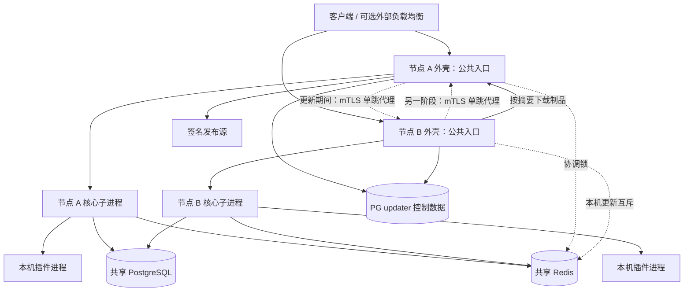

# 外壳托管的多节点在线更新架构

> 2026-10-02：已由允许停机的主节点优先流程与 Redis 节点密钥鉴权取代，依据为 [多节点同步与节点鉴权规约](MULTINODE-SYNC-PROTOCOL.md)，验收见 [验证记录](audits/2026-10-02/MULTINODE-VALIDATION.md)。本文以下保留10月1日的滚动方案与 mTLS 实现历史，不是当前行为。

状态：兼容滚动升级 v1 已实现，完整设计中的维护迁移与跨协议转换尚未实现。日期：2026-10-01。

本设计基于当前 `feat/next-platform` 工作树，包括尚未提交的 Execute/Monitor、多节点治理及双节点验收改动。本文保留完整目标设计；当前实现边界见下文与 CONTRACTS §33，部署入口见 [`deploy/shell`](../deploy/shell/README.md)。此前相同核心版本的双节点验收不构成本方案的跨版本验证结果。

当前落地：签名不可变发布包、独立外壳、mTLS 单跳流式转发、核心启动准入与排空、Redis 互斥续期、PG 持久步骤与恢复、插件兼容预检及本机收敛检查、控制台与本机恢复命令、发布打包工具及 Docker 部署入口。

当前明确拒绝：数据库契约变化、Cluster/Task/Host API 转换、破坏性迁移、未经兼容验证的强制回滚；这些不能因设计文档描述了目标流程就视为支持。暂停计划可通过全节点操作锁屏障，创建回到最近已完成基线的受限恢复计划。外壳自身仍由运维更新；不自动选主。发现旧进程或不确定的启动日志时停止并等待核对，不以 Redis 锁过期作为进程已退出的证据。控制表目前使用受信数据库连接，尚未实现本文后续设计的节点级 SQL 函数权限隔离。

## 1. 目标与核心决策

管理员在控制台选定核心版本并创建一次升级任务。主节点负责组织核心发布，从节点仅需预装外壳和基础运行环境，即可从主节点同步核心。核心启动后通过现有插件机制同步集群当前批准的插件。更新期间保持外壳入口在线，逐个替换业务进程。浏览器断开、核心重启不丢失升级进度。

采用三个独立概念：

- **外壳 Shell**：长期运行的轻量进程，负责入口反向代理、核心子进程管理、制品下载校验、本机版本切换和更新状态上报。
- **核心 Core**：可替换的业务进程，负责认证、账号调度、上游代理、用量、计费、后台任务及插件运行。提供启动准入与排空协议。
- **核心发布包 Release**：不可变、带签名的核心及配套运行组件集合。包含核心内嵌前端、插件工具及兼容声明，可以附带一些内建插件作为安装来源。包内插件版本不是集群运行版本的约束，业务数据、密钥、管理员授权不放入发布包。

**插件是独立发布单元，具有独立版本和生命周期。** 无论内建还是第三方插件，都可在兼容条件满足时独立安装、替换、升级和回退，不要求更新外壳或重启核心。内建只描述随核心附送的来源；实际运行版本以 PG 中插件系统的已批准发布状态为准。核心升级不捆绑插件升级，核心回退也不回退插件。

指定一个**更新主节点**。协调循环运行在该节点外壳中，不运行在会被重启的核心里。主节点拿到 Redis 协调锁后推进更新；配置成主节点不等于跳过锁检查。初版不自动选举新主节点，主节点外壳故障时暂停升级，正常业务按已批准规则继续；人工迁移主节点身份后可恢复同一任务。

核心节点继续对等承载业务。更新主节点不垄断视频轮询、定时任务或记账。现有核心调度与幂等保护继续负责这些工作。

**不做运行中 Go 代码热替换，不把 `git pull` 当发布，不在业务外壳里安装编译器，不给外壳 Docker socket。** 正常更新替换已构建的发布包；基础镜像、系统库及外壳自身另走基础设施升级。

## 2. 进程、网络与存储



图中的双向虚线属于不同升级阶段；实际每个阶段只批准无环的代理目标。

建议默认端口与边界：

- 公共入口 `:8080` 由外壳长期持有；外部 TLS 可保持由现有反向代理终止。
- 节点间 `:7443` 为独立 mTLS 监听器，只允许已登记的集群节点；承载单跳业务转发和制品读取。公共入口不能访问管理及制品路径。
- 核心业务监听 `127.0.0.1:18080`，不映射宿主机端口。外壳与核心的控制接口使用权限受限的 Unix socket。
- 外壳独立的 Unix socket 提供本机 CLI 运维接口；不暴露公网的无认证更新端点。
- 同一节点初版只允许一个业务核心进程存活。插件预热属于该核心的 generation，不额外运行一套能够写业务库的候选核心。

每个节点都有自己的持久化目录，不使用跨节点共享可写程序目录：

```text
/var/lib/sub2api/
  supervisor/identity/        # 节点证书、信任根；不通过发布包覆盖
  supervisor/state.json       # 原子写入的本机切换日志
  blobs/sha256/<digest>        # 已验证的内容寻址制品
  releases/<release-digest>/   # 完整、验证后不可变的发布目录
  current -> releases/<digest>
  previous -> releases/<digest>
  staging/<operation-id>/     # 下载与解包临时空间
  runtime/                    # Unix socket、进程锁；重启重建
  data/                       # 核心/插件运行数据，不随发布切换
```

发布目录包括 `bin/sub2api`、`bin/sub2api-plugin`、可选的 `builtin/*.s2plugin`、发布清单和运行资源。核心及工具使用已解析的绝对版本路径。插件先进入独立包存储，再由插件注册表选择运行版本，不从当前核心发布目录直接决定插件进程版本。插件缓存与运行数据位于核心 release 目录外，切换 current 不覆盖它们。

Docker 形态改为：基础镜像内只有外壳、所需系统运行库及可选首次离线安装包；外壳作为 PID 1 管理核心进程组、转发停止信号、回收插件子进程。程序目录和数据目录均挂持久卷。普通更新不重建容器，因此重新创建同一外壳容器后仍使用已确认的本地版本。缺少卷或首次安装时才 bootstrap，不能静默降回镜像附带旧包。

外壳与核心属于可信宿主软件，插件仍必须使用当前沙箱、网络出口控制及数据库角色隔离，不能访问外壳 socket、身份目录或写发布目录。实现时核实进程 UID 与目录权限的真实效果；同 UID、同文件权限不能被描述为核心与外壳之间的安全隔离。若要求核心被攻陷后仍不能改发布文件，应另设 supervisor 用户/受限启动器，此项区别于本方案的进程生命周期隔离。

发布清单必须声明平台及 `runtime_abi`。需要不同 libc、系统工具、沙箱能力或新外壳协议的版本，在下载后、停业务前拒绝，并显示“先升级外壳/基础镜像”。外壳长期稳定不等于永远不升级。

## 3. 复用现有机制及明确的改造点

现有源码依据：

- `backend/internal/service/update_service.go`：Release 发现、平台匹配、下载、校验、备份及替换思路。旧实现允许缺失 checksum，正式发布改为必须有可信签名和摘要；两次 rename 中间存在程序路径缺口，不能原样作为外壳切换协议。
- `backend/internal/handler/admin/system_handler.go`：更新与 HTTP 取消解耦及操作幂等。旧接口仍等待完成，不等于可跨进程重启恢复的异步状态机。
- `backend/internal/pkg/sysutil/restart.go`：直接 `os.Exit(0)` 不运行 defer。新方案改用核心显式排空与外壳监督退出，不能复制此重启方式。
- `next/server/internal/app/lifecycle.go`：已有请求准入闸门和 handler 完成屏障，可扩展为可查询的排空接口。
- `next/server/internal/app/app.go`：当前启动立即执行迁移，随后启动 reconcile、插件发布控制器、内置插件收敛、jobs 和事件投递。必须拆分为初始化、检查、获准迁移、插件准备、业务准入几个阶段。
- `next/server/internal/background/executor.go`：已有并发边界和工作组关闭屏障，但需要覆盖领取前的统一准入；不能只禁止执行器 Run，却提前在 PG 领取了任务。
- `next/server/internal/usage/task_reconcile.go`：已有 PG 任务租约、原账号、条件终态写入。保持现有保护，新增协议兼容筛选与升级时停止新领取的开关。
- `next/server/internal/plugin/rollout`：复用两阶段 generation 发布、PG fencing、心跳对账；新增参与者资格，而不是把所有存活外壳都作为插件发布参与者。
- `next/server/internal/plugin/install/builtin_ready.go`：现有就绪要求镜像内置最低版本。需要改为验证集群当前批准插件的本机收敛状态及能力兼容性，不能拿随包插件版本当最低运行版本。新核心随包附带较新插件，不应自动覆盖独立安装版本或阻止兼容旧插件运行。
- `next/deploy/single/deploy.sh`：当前整体 compose build/up 不是滚动升级协调器。以后负责安装/更新外壳基础设施，普通核心升级走外壳协议。

本文只新增设计文件；以上代码行为均未因本文改变。

## 4. 发布清单与首次同步

### 4.1 不可变发布与集群计划

区分发布者签名的 **ReleaseManifest** 和管理员批准的 **UpgradePlan**。

ReleaseManifest 至少包含：

```text
manifest_version, release_id, source_commit, build_id, created_at
platforms[{os, arch, runtime_abi, bundle_digest, bundle_bytes}]
files[{path, sha256, size, mode}]
shell_protocol_range, core_control_protocol_range, host_api_version
cluster_protocol_read_range, cluster_protocol_write_range
task_protocol_read_range, task_protocol_write_version
schema_contract_before, schema_contract_after, migration_ids_and_checksums
upgrade_from_ranges, strategy: rolling | maintenance
plugin_host_capabilities, plugin_compat_constraints
bundled_plugins[{key, version, package_digest, bootstrap_policy}]
rollback_requirements, signing_key_id, signature
```

摘要及签名覆盖清单的确定性编码；相同 release_id 不能覆盖为不同内容。TLS 下载不能替代发布签名，主节点也不能把自己下载到的任意文件宣称为可信发布。下载使用固定发布源，不接受管理员输入任意脚本或任意本机路径。

信任根来自安装配置，密钥轮换由旧信任链批准；不能因为包里携带公钥就自动信任。集群记录最低允许发布/协议，旧签名包也不能绕过防降级门槛；合法回退必须有单独批准的回退计划。发布清单只声明软件能力，不自带管理员的集群执行授权。

UpgradePlan 在创建时固定以下内容：

- 发布清单摘要、目标平台制品摘要、目标核心构建、发起者与审批时间。
- 节点清单、更新主节点、临时服务节点、更新顺序、最少服务节点数、容量和排空策略。
- 预检时观察的插件发布 revision、实际插件清单及授权修订号；这是兼容性校验依据，不是本次核心升级要强制安装的插件清单。
- 当前/目标协议、数据库契约、兼容证明、是否需要维护窗口及恢复方案。
- `expected_cluster_revision` 与提交幂等键；提交时重查，状态已变化则重新生成预检结果。

插件系统的每个发布快照记录 key、版本、包摘要、启用状态、授权修订号、所需 Host API 与可读取的历史任务协议。第三方插件也必须参与预检；不能只检查七个内置插件。同一核心版本可以运行不同的兼容插件版本，插件快照不属于核心 release 身份。已禁用插件不会因为核心更新包包含它而自动启用。

独立插件升级新增/扩大权限时，由插件发布流程列出差异并走现有同意机制；必须权限未批准则不激活该插件版本，可选权限未授予按插件声明运行。外壳同步文件不授予权限。运行依赖闭包（包含当前第三方插件包）须已在 PG 的现有插件包存储或验证缓存中可读取；从节点空盘恢复不能依赖某个已经关机节点独有的文件。

核心更新期间插件仍可独立发布。提交插件激活、节点服务准入或协议切换时，使用共同的短事务兼容性屏障，校验当前插件 revision 与核心能力；不得以一个持续整个核心升级的全局冻结替代。插件变化使旧预检证据失效，核心升级在下一安全步骤重新校验；兼容则继续，不兼容则等待或暂停，不覆盖插件当前状态。新增插件版本不满足仍在服务的核心能力时，可先上传准备，但不得激活到这些节点；需先升级或排空不兼容核心。涉及同一插件的 schema/代际切换按现有发布机制串行。

紧急权限撤销立即生效，并使受影响就绪证据失效。插件独立回退仍需满足当前数据库和历史任务兼容性；“随时替换”指不依赖核心发版，不意味着跳过已有签名、授权、迁移和排空约束。

### 4.2 内建插件的来源语义

全新集群首次 bootstrap 时，可按明确安装策略导入随核心携带的插件，并走授权和插件发布流程。已有集群更新核心时，随包文件最多成为可选安装来源：不自动改变 active/desired，不覆盖管理员安装的更新版本，不启用已禁用项，不恢复已移除项。为此保留安装来源和显式移除/禁用状态，不能仅凭“PG 没有这行”反复重装。

核心升级接口只指定核心 release；插件接口继续指定 plugin_key/version。若某核心要求某项插件能力，应明确报兼容性依赖，由管理员先独立更新插件或选择兼容过渡核心；不能默默把随包插件升级当核心启动副作用。是否允许卸载某个系统必需插件属于另一个产品策略，不由内建来源标记推导。

### 4.3 主节点引导与从节点加入

主节点首次安装由宿主机 CLI 提供数据库地址、预置信任根、节点证书和发布源，建立 updater 控制 schema，再准备第一份发布包。首次核心业务库初始化是显式 bootstrap 步骤，不通过“暂时绕过版本检查”完成。

从节点预装外壳、兼容基础镜像、集群 CA/服务端证书校验信息，并使用一次性、短有效期加入凭据取得独立节点身份与有限控制库凭据。禁止 trust-on-first-use 自动信任从发布包带来的公钥。

从节点读取 PG 已批准的服务基线，向主节点按摘要下载并验证，启动本地核心，通过准入检查后才接流量。升级期间新加入节点先进入 `joining`，按当前阶段获取旧基线或目标基线，不能自行选择 latest，也不自动成为当前升级的必须完成成员。

主节点离线时，已有节点可从本地验证过的 current 恢复；冷节点不能凭空完成首次同步。初版仅主节点作为制品源；后续可配置同一签名体系下的对象存储镜像，不能未经许可从不明节点下载执行。

### 4.4 文件替换与崩溃恢复

下载可以重试并断点续传，最终仍检查完整摘要、签名、大小及平台。安全解包拒绝绝对路径、路径穿越、设备文件及越界链接；拒绝发布包提供任意安装脚本。

先把完整目录写入 staging，校验、同步文件和目录，再 rename 到不可变 release 目录。切换前将 `{operation, step, old_digest, target_digest, phase}` 原子写入本地 journal 并 fsync。核心退出且进程组清空后，通过临时符号链接加同文件系统 rename 更新 current，并同步父目录；再启动目标绝对路径。

本机 journal 不是集群批准凭证。外壳重启先对账 PG 计划、磁盘指针、已执行步骤和实际进程；身份采用 PID 加启动标识，避免 PID 复用。无法确定是否已经切换时检查实际构建并停在待验证状态，不能重复启动第二个核心。PG 不可达时允许准备文件，不执行新的版本切换。

current、previous、活动计划、运行进程和历史任务需要的插件包都属于 GC 引用。空间不足时在排空前失败，不删除仍被引用的旧版本。

## 5. 更新控制平面与持久状态

### 5.1 职责与 Redis 锁

更新主节点外壳执行协调循环；所有外壳执行自己的本机更新步骤。核心控制台负责权限校验、预检、提交和查询。

统一采用已有 Redis 锁机制：拿到锁才执行，未拿到则跳过或稍后重试；执行期间自动续期，发现失锁就取消本轮工作；完成后按 owner token 释放，避免误删其他节点的锁。执行有明确总预算，Redis 不可用时不开始新工作，不回退到 PG 锁。

主协调锁使用稳定键 `system:upgrade:<cluster>`，本机更新锁使用 `system:upgrade-node:<cluster>:<node>`。节点还用本机进程锁避免重复启动两个 supervisor。主协调者停止时不再派发步骤，恢复后重新拿锁并读取 PG 当前进度，不从内存里的旧步骤直接继续。

PG 只保存发布计划、节点进度、服务模式、步骤结果和事件，不为通用执行另加计时租约、执行凭证或提交包装。命令固定为 `cluster_id, upgrade_id, node_id, step_id, target_digest` 等业务字段，不允许自由 shell 命令。本机执行器串行运行；已完成的相同步骤返回现有结果，重启后核对实际版本、进程和 journal 再继续。

### 5.2 复用现有通用锁

不新增 WithGuard、Guard.Commit、PG guard 表或执行代际分配器。核心和外壳复用现有 redsync/KeepLock 逻辑；插件继续使用现有 `Host.Locks().WithLock`，锁名由宿主自动隔离，不新加一套 SDK。

通用流程：

```text
拿 Redis 锁
  ├─ 没拿到：本轮不执行
  └─ 拿到：执行任务 + 自动续期
             ├─ 失锁/超时：取消本轮，后续重新拿锁再读状态
             └─ 完成：保存业务进度，释放自己的锁
```

核心模块只提供锁名、TTL、总超时和业务回调；业务回调遵守传入 context 的取消信号。更新步骤在替换文件、停止/启动进程前检查取消状态，异常恢复沿用已有步骤记录和本机 journal。

现有任务领取、计费幂等、账务事务和插件 rollout 的保护继续保留，本设计不借简化通用锁的机会删除它们。视频轮询和普通 jobs 仍由核心调度，插件不自行增加调度循环。Redis 锁本身不承诺任意外部操作恰好执行一次。

### 5.3 PG 模型草案

新增独立 `updater` schema，初期不与业务 migration 版本绑定，防止主节点核心正在更新时外壳无法读取计划。外壳 schema 自身采用向后兼容迁移，破坏性变更属于外壳升级。

- `cluster_state`：cluster_id、主节点身份、当前 revision、服务协议 epoch、已批准核心发布、观察的插件 revision、维护标记。插件 active/desired 权威仍在现有插件表，不在 updater 再存一套可写目标。不增加通用执行凭证表。
- `releases`：签名原文、manifest_digest、信任状态、发布元数据；同 release_id 唯一且不可变。
- `upgrades`：计划原文及摘要、操作者、幂等键、阶段、期望成员、失败原因、回滚边界、创建/完成时间。同集群最多一个未结束计划。
- `upgrade_nodes`：每节点的旧/目标 release、步骤、desired/observed 状态、shell/core boot_id、local journal revision、就绪证据摘要与错误。
- `steps`：步骤 ID、目标节点、命令类型、前置条件、执行状态与结果。`(upgrade_id,node_id,step_id)` 唯一。
- `node_admissions`：node_id、shell/core boot_id、release_digest、plugin_revision_observed、插件兼容证据、允许的协议与服务模式。常规兼容插件 rollout 可保留服务准入，旧/新插件 generation 的短暂共存由插件发布协议控制，不能因 revision 瞬时不同就摘掉所有节点。
- `events`：按升级 ID 的单调序号、阶段变更、脱敏错误及操作者；支持 SSE 断点重连和普通分页。

外壳使用受限数据库角色，只能读取授权计划/节点目录、更新自身观测与调用受控协调函数，不能修改余额、API Key、插件授权。初始 installer 由更高权限角色建表；运行时不持有建库凭据。协调函数固定 search_path 并检查调用者身份，禁止客户端伪造 node_id 越权。核心计划提交/预检结果也使用明确授权接口，不能允许任意插件写 updater 表。

控制库中的节点活跃与服务模式分开记录。主协调者故障只暂停更新，其他健康节点按当前已批准模式继续服务，不依赖主节点持续签发执行凭证。节点失联或恢复时先核对升级阶段、实际版本和插件状态，再决定是否恢复本地服务。

### 5.4 状态机

集群计划正常路径：

```text
draft → prechecking → preparing → updating_primary
      → primary_transition_ready → handover
      → activating_core_protocol_if_needed → updating_followers → verifying → completed
```

异常进入 `paused`、`failed` 或 `rollback_required`。`cancelled` 仅表示已停止并完成安全收尾，不表示数据库被恢复。取消请求也写为 durable intent，不直接杀死正在迁移或记账的进程。

节点正常路径：

```text
serving_old → prepared → redirecting → draining → stopped
            → switched → starting_candidate → transition_ready
            → serving_target → verified
```

节点状态与业务角色分离：`local-serving`、`forward-only`、`candidate`、`maintenance`。核心/插件版本“看起来一样”不授予 serving 权限；必须完成针对本次 boot_id 的就绪检查并进入已批准服务模式。外壳存活也不意味着核心可用。

每个步骤明确记录“准备执行/已执行待验证/已验证”而不是单个成功布尔值。pause 在安全边界停止新增步骤，resume 使用原计划重新检查前置条件；取消不能抹去已发生的 schema/协议变化。终态保存最后一个有效服务基线和待人工处理节点，便于下一次计划接续。

## 6. 完整滚动升级时序

假设 A 为更新主节点，B 为临时服务节点，当前发布 R1，目标 R2。所有节点已经运行支持本协议的外壳和过渡核心。初版同一时刻只更新一个业务核心。

### 6.1 预检与准备

1. 核心检查管理员权限，生成计划。检查所有目标平台、运行环境、外壳协议、插件/权限、历史未完成任务协议、旧基线运行能力和迁移兼容声明。
2. 读取一致的插件发布快照；已有 rollout 时检查其旧/目标版本与迁移兼容性，必要时等待当前插件切换安全点，但不冻结整个核心升级期间的插件发布。检查 B 有实际可承载能力和资源余量，而不只检查 `/healthz`。容量不足则不开始排空；容量阈值由部署者设定，不能承诺无条件单节点承载。
3. 主节点锁定并缓存签名制品；从节点可预下载。确认磁盘空间、旧版本可恢复、本地卷持久化、发布源可达。普通更新只能存在一个计划。
4. 核心新二进制运行受限的 `--check-release`，只检查版本和兼容元数据，不执行 Init、迁移或业务写入；真实可运行性由后面的候选启动验证。

### 6.2 更新 A，B 继续服务 R1

1. 确认 B 核心有 R1 服务准入。A 外壳先切新请求到 B；所有进入 B 私有转发口的请求只允许本地执行，不能再次转发。
2. A 核心停止新后台领取和业务准入，保留已进入 handler 的生命周期，执行排空协议。外壳仍承担公共入口。
3. A 排空确认后停止核心及全部插件进程组，切换到 R2 并以 `candidate` 模式启动。
4. 候选模式不自动抢迁移、不自动更新内置插件、不启动后台业务。获独立迁移 permit 后，仅执行已批准且向 R1 兼容的扩展迁移；B 仍在运行，DDL 锁超时应失败/暂停，不能无限阻塞业务。
5. A 根据 PG 插件系统加载**当前已批准的插件发布快照 P**。R2 必须能用这些插件提供当前协议服务，且保持旧格式写入。就绪提交时重查插件 revision；有独立插件发布则跟进其合法 generation 并重验兼容性，不加载核心包自带版本覆盖 P。通过检查后，上报 `transition_ready`。

如果 R2 不能运行当前插件，先独立发布同时兼容 R1/R2 的插件版本，或选择过渡核心；迁移不兼容 R1 时需维护升级。不能用“只读健康检查通过”替代兼容性条件。

### 6.3 把服务交给 A，必要时切换核心协议

1. 授予 A 过渡服务准入。A 外壳确认本地能够接请求后，先停止自己向 B 的新转发。
2. 逐个让其他外壳改为单跳转发到 A；等待路由 revision ACK。B 保留处理已进入请求的能力，直到所有入口完成确认。这个次序避免 A→B→A 环。
3. 停止所有旧核心的新后台领取；排空并停止旧核心。A 继续按旧业务协议服务。此时 B 外壳仍在线代理，但 B 核心可以完全退出。
4. 核心升级没有“自动激活 P2”这一步。插件继续按自己的发布流程运行；forward-only 外壳和已停止的旧核心不属于插件 rollout 的执行参与者。若这时独立发布新插件，验证仍在服务的核心能力、迁移和历史任务兼容性后，由核心热切换插件，无需重启核心。
5. 如切换新任务格式/计费语义要求排除旧处理器，在提升服务 epoch 前对 A 也执行短暂准入关闭和 generation 排空屏障；此时入口返回明确的 503 与 Retry-After。初版不缓存付费 POST 来伪装零停机。若需要较长中断，预检必须标成维护升级。
6. 若本次核心发布需要新协议，确认当前插件满足新协议、所有旧业务代际已退出且数据库条件成立，事务性提升协议 epoch，并授予 A 目标服务准入；否则保留原 epoch。插件发布 revision 与核心协议 epoch 独立递增，普通插件替换不自动提升核心协议。

未完成的外部视频任务不需要等生成结束：需要结束的是旧 worker 当前这一次 Monitor、持有租约的工作及其记账。任务继续保存在 PG，新 worker 读取兼容的旧任务记录并接管。独立替换插件时，新插件若无法读取尚未终态的旧任务，阻止其激活；先补兼容处理器、等待任务清空，或采用专门的数据转换，不能把任务直接退款视作升级手段。

### 6.4 更新 B 及其他节点

1. B 外壳从 A 验证/获取同一发布摘要，停止状态的旧核心切换到 R2。
2. B 核心以 candidate 启动，只按已提交数据库契约检查，不再次决定全局迁移；通过插件系统同步当前已批准插件。即使插件在 A 更新后已独立升级，B 也跟随当前插件状态，而非本次核心发布的旧快照。保持管理员禁用/授权状态。
3. release_digest、当前插件 revision 的兼容证据、协议、依赖和本次 boot_id 检查通过后，给予 B 服务准入；恢复本地业务和后台领取，再更新下一节点。就绪和插件激活提交使用短事务校验，避免检查后立刻变更的竞态。
4. 所有计划成员验证通过并经过配置的观测窗口，标记核心升级 completed；独立插件 rollout 有自己的完成状态。离线计划成员只能显式移出计划并撤销准入，不能伪报全部成功；它以后上线需同步后才能重新接流量。

### 6.5 维护升级

维护升级先准备核心文件，再让全部入口停止新业务、所有核心排空并退出，确认所有旧执行代际失效，然后执行核心迁移并加载当前兼容插件。若确实需要配套插件变更，引用单独批准的插件发布任务，明确依赖顺序，不从核心附送包自动激活。外壳持续提供维护状态及受限本机诊断。主节点恢复后再逐个恢复从节点。

破坏性数据库变更需预检可用备份/恢复方案，但正常回滚不能直接覆盖整个在线数据库，避免丢失新产生的账务。首次接入本架构也属于一次明确的部署切换：旧版本没有 admission/epoch 协议，不会自动遵守新规则，必须在启用集群升级前全部完成过渡版本部署。

## 7. 流量代理及路由屏障

### 7.1 正常和更新流量

正常每个外壳优先转发到本地合格核心；forward-only 时按 PG 批准的目标集选择节点。目标必须为当前允许协议下的 local-serving 核心。外部 LB 可继续平均分配给外壳，不要求每次升级修改 LB 配置。

节点间转发连接 mTLS 私有入口，携带 upgrade/route epoch、目标 core boot_id、原始请求 ID 和一跳标记。接收端校验节点身份、epoch 与本地 admission，只执行本地核心；不合格即拒绝，绝不继续代理。公共入口清除客户端伪造的内部头。

原始 Authorization、业务 body、路由和 Host 语义保持；可信客户端 IP 仅由外壳依据已配置入口代理规则生成，经 mTLS 传递，核心只信任本机外壳。升级不能导致客户端 IP 被替换成节点 IP，也不能接受客户端自填 X-Forwarded-For 越权。

外壳不解析账户、不调用插件、不记账、不重新提交生成任务。SSE 按块 flush、取消向下传播；WebSocket/CONNECT 等长连接明确登记并参与排空。非流式大响应不在外壳无界缓存，限制仅用于保护内存，不截断已批准的业务体大小。

**初版所有业务请求均禁用应用层自动重试，包括 GET**，因为历史插件 GET 也可能查询上游或触发副作用。传输层同样应使用单次发送策略，不能仅关闭一层重试；注入半写、连接复用故障验证实际行为。网络结果不确定时不凭 shell 请求 ID 推断可重放。制品下载和幂等控制查询可单独重试。

### 7.2 路由 ACK 与分区

PG 写入 desired route revision，外壳应用本地新请求路由后写 observed ACK。连接级 keepalive 不能固定整个连接的旧路由：每个新 HTTP 请求/HTTP2 stream 都重查当前快照，既有流不搬迁。

协议切换等待参与节点确认新路由并完成旧核心排空。节点失联且无法确认已停止时，暂停需要排除旧核心的步骤，先由运维停止或隔离该节点；不能仅凭 Redis 锁过期认定旧进程已退出。外壳恢复连接后先读取当前服务模式，再恢复新请求。

涉及破坏性插件迁移时，必须取得旧插件进程组已停止的证据；失联时还需通过宿主隔离或撤销对应数据库身份并终止旧连接形成实际隔离。做不到就暂停，不能仅等一次 Redis 心跳超时便认为所有旧 SQL 已停止。

稳定阶段无需全局唯一“服务节点”；一个不可达目标可改选同一批准目标集内的另一个节点，但只对尚未发送的请求选择。目标都不可用时返回 503，不回退到不兼容旧核心。

### 7.3 健康端点

- 外壳 `/livez`：仅表示外壳事件循环/监听器存活。
- 外壳 `/readyz`：本机核心已获准服务，或拥有可用且获准的单跳代理目标；维护、无目标或无法确认当前服务状态时为 503。
- 核心 `status`：版本、插件、数据库检查、模式、各排空计数与错误；candidate 健康不等于业务 ready。
- 外部原 `/healthz` 可在迁移期映射外壳 `/readyz`，核心原接口保留内部诊断语义，避免监控把“代理可用”误认为“本机业务可用”。

## 8. 核心生命周期与后台准入

### 8.1 candidate 初始化

必须先与外壳握手校验控制协议和 boot token，再按批准顺序初始化。普通 candidate 不执行自动建表、默认管理员引导、market seed、内置插件升级、业务事件发布、jobs 或 reconcile。首次 bootstrap、migration 和 plugin-prepare 各有单独 permit，不由一个环境变量绕过全部限制。

旧版插件 Init 不保证只读，因此“启动插件做健康检查”不能被当作零副作用。过渡插件需满足 Init 幂等且不自行调度的契约；预检列出无法证明兼容的第三方插件并要求维护路径。检查阶段不赋予生成/扣费/后台任务调用权限；数据库可能的 Init 写入也必须在兼容声明与测试范围内。

### 8.2 统一准入

新增核心 `NodeAdmission`，角色包含 `serve_http`、`claim_background`、`coordinate_plugins` 和受限的 `migration`。candidate 默认全部关闭。准入绑定 node_id/core boot_id/release/plugin baseline/protocol epoch，不能从旧进程继承。

准入门必须覆盖：网关新请求、插件管理路由中的业务操作、手动触发 jobs、定时 jobs、视频 Monitor、旧 pending settlement 对账、事件投递、清理任务及插件发布协调。仅暂停 jobs 或仅把健康检查设为 503 不够。

检查放在 PG 领取之前并与领取事务校验相容；后台任务按 task_protocol 在 SQL 里筛选，不能先抢到不懂的任务再报错消耗 attempts。缺少兼容 worker 时展示 blocked-compatible-worker，保留账务状态；升级暂停不能被视为上游失败。

关键持久写入沿用现有任务 claim_token、条件更新、幂等回执和账务事务。升级只负责停止新领取并等待在途工作完成，不新增通用 PG 执行凭证或事务包装。

### 8.3 排空协议

外壳先切走新请求，再要求核心 `Drain`，核心原子关闭 HTTP 新准入和所有新后台领取，并报告进度：

```text
active_http, active_streams, active_background, active_plugin_calls
pending_usage_writes, pending_terminal_receipts, active_migration
drain_revision, core_boot_id, drain_complete, blockers[]
```

执行顺序为：停止生产新工作 → 完成或取消本次在途调用 → 等待网关异步提取等生产者 → 用量/回执持久化 → 安全释放/到期交还租约 → 排空插件 → 确认核心退出。HTTP handler 结束不等于它产生的异步记账已经完成。

外壳只有在 drain_complete 且实际进程退出后才能切 current。超过预算默认暂停升级并显示 blocker，不自动 SIGKILL。部署的 `stop_grace_period` 必须大于明确配置的总停止预算；现有 HTTP 30 秒、内部关闭 90 秒和容器 180 秒需统一计算，不能把当前常数当成永不超时的保证。

可恢复排空与最终关闭需要独立实现：现有 `requestGate.stop()` 及 Executor Group 的关闭是单向操作，不能直接宣称可 Resume。新生命周期管理器在真正 Shutdown 前保留可重新申请准入的能力，或明确通过重建核心恢复；取消升级不能简单反转一个 draining 布尔值便重新启动已关闭的服务。

对上游还在生成的视频任务，只等待当前轮询调用结束，不等待视频最终生成。取消调用时不能提前释放仍有机会写终态的租约；确认 worker 停止再释放，否则等待现有租约到期。deadline 不因暂停自动延长，预检需留出余量；若需要延长观察期限，必须是显式持久化策略，不能把升级造成的超时静默当正常上游结算。

若强制退出或宿主机崩溃，保留 uncertain 状态并先对账，不能宣称用量已全部落库。当前存在的内存队列风险不因新增外壳自动消失；本方案保证可控排空，强杀下无丢账还需另行证明所有路径的持久化保障。

## 9. 核心与外壳接口草案

### 9.1 控制台 API（由核心认证）

- `GET /api/v1/system/releases`：可用发布及兼容概要。
- `POST /api/v1/system/upgrades/preflight`：输入 release_digest，返回固定计划摘要、阻塞项和模式；不执行更新。
- `POST /api/v1/system/upgrades`：输入计划摘要、expected revision、幂等键，权限验证并重查后创建任务，立即返回 `202 {upgrade_id,status_url}`。
- `GET /api/v1/system/upgrades/:id`、`.../:id/events`：节点阶段、原因及持久事件；SSE 使用 Last-Event-ID 恢复，轮询作为回退。
- `POST .../:id/pause`、`resume`、`cancel`、`rollback`：提交操作意图，按阶段验证是否允许，不直接修改进程。

建议新权限 `system:update:read`、`system:update:execute`、`system:update:recover`。日常执行不是插件的宿主权限，任何插件都不得通过 SDK 更新核心或取得外壳凭据。

### 9.2 外壳 → 核心（Unix socket）

- `Hello`：shell/control protocol、目标发布、core boot token；双方返回实际支持范围。
- `GetStatus`：实际 build/release、schema、plugin lock、模式及计数。
- `PrepareTransition` / `PrepareTarget`：加载目标核心及插件系统当前批准的兼容插件，返回包含观察 revision 的证据；不自行提高全局协议或修改插件发布目标。
- `ApplyAdmission`：引用 PG permit/revision，核心必须验证而不是盲信参数。
- `Drain` / `DrainStatus`：幂等操作 ID、截止策略与进度。
- `Shutdown`：仅在排空屏障后请求正常退出；外壳监督真实退出。

迁移通过固定子命令或核心受控模式执行，绑定专用 permit 和迁移清单摘要；不接收 SQL 文本。核心崩溃后，本机 socket 失效，外壳根据实际退出状态和 PG 计划上报错误。

### 9.3 节点间接口（mTLS）

- `GET /internal/releases/:manifest_digest`、`GET /internal/blobs/:digest`：流式制品服务，支持 Range，摘要决定内容，禁止 path 参数访问任意文件。
- `/internal/forward/*`：单跳业务代理专用入口，保留原始业务路径，验证目标准入与内部头；与控制接口分开处理。
- 计划推进通过 PG 对账完成，节点间 HTTP 消息只负责唤醒/取文件，不作为“执行任意更新”的第二套权威控制平面。

核心暂不可用时，外壳不提供复制一套用户登录逻辑的公开管理站。初版通过本机受权限保护的 CLI 查看/暂停/恢复已批准计划，或通过其他仍运行的核心访问控制台；维护阶段公共页面仅给通用状态，不泄露日志、版本机密或凭据。

前端 HTML 不使用长期不可变缓存，JS/CSS 和插件 UI 使用带内容摘要的 URL，并保留发布切换及回滚窗口内的旧资源。现有共享静态资源机制继续复用；不能让用户打开的旧页面在切节点后立刻取不到 chunk。升级状态查询协议至少兼容上一版控制台，新 UI 不提前调用旧核心没有的更新接口。

## 10. 失败恢复与回滚边界

- **下载/签名/空间检查失败**：保持旧核心服务，清理未引用 staging，任务失败或等待重试。
- **A 排空失败**：A 外壳仍代理 B；未执行数据切换时可撤销 Drain 并重新验证后恢复 A。若核心已开始退出，则按 journal 重新启动旧版，不能强行把半停核心设 ready。
- **A 候选启动失败、尚未提升协议**：B 继续 R1。仅在迁移仍符合 R1 数据契约时自动恢复 A 的旧发布，任务暂停。
- **已经提升协议或新语义写入**：不允许单节点私自启动 R1；优先修复/重启 R2，必要时创建经过预检的反向升级计划。previous 文件存在不等于可以回退。
- **B 更新失败**：B 外壳继续代理 A，暂停后续节点。新版本业务可以继续，状态为部分完成，不自动降级 A。
- **A 核心崩溃**：A 外壳独立存活，按当前准入集代理或重启获准版本；不得转到已不兼容的 B 旧核心。
- **A 外壳或整机失联**：升级暂停。仍有兼容本地核心的节点继续服务；如果只有 A 可以处理新协议，则暂时不可用，不能承诺高可用。生产建议在激活新协议前准备第二个兼容节点，或接受双节点方案的单节点风险窗口。
- **PG 不可达**：停止新的升级步骤；核心业务仍按现有数据库故障处理策略执行。Redis 不可达时不领取新的锁，现有工作按失锁取消规则处理，不回退到另一套锁。
- **进程长暂停/网络分区后恢复**：先停止本轮工作并重新核对当前阶段；重新拿到所需 Redis 锁、完成就绪检查后再恢复，不能靠“本地 current 已存在”直接恢复 serving。
- **手动指定新主节点**：先停止旧协调者，经本机受控恢复 CLI 修改 PG 中的主节点配置，等待原 Redis 锁释放或到期，再由新主节点拿锁并核对在途步骤。新主节点必须具备已验证制品，不能启动空白计划覆盖旧任务。
- **外壳自身更新**：通过宿主机/systemd 或镜像部署执行，先把业务和入口流量迁走；外壳协议至少支持声明的过渡范围。不能把外壳可执行文件也放进普通核心发布自动覆盖。

删除字段、删插件 schema、改账务含义等收缩操作应作为独立后续发布，在旧代码/旧任务/回滚引用清空后执行。schema contract 是显式语义契约，不等价于“最大 migration 编号相同”。

## 11. 控制台、观测及运维

控制台分别展示核心升级 ID/摘要/源码提交和独立插件发布状态，展示当前承载节点、每节点阶段、实际版本、插件兼容性、排空阻塞项和失败原因。插件变更后标明重新预检结果，不显示为被核心升级覆盖。进度按已完成阶段显示，不伪造时间百分比。

显示按钮需结合允许动作：准备阶段可取消；排空阶段可安全暂停；切换和迁移中只记录暂停意图；越过兼容边界后禁用直接回退并给出原因。无论浏览器连到哪个节点，查询都来自同一 PG 任务。

指标包括：本地/转发请求数及错误、当前目标及 route epoch、活动长连接、排空耗时和阻塞计数、各阶段耗时、制品下载校验错误、节点服务模式、Redis 续期失败、blocked-compatible-worker 数量。日志统一携带 upgrade_id/step_id/node_id/shell_boot_id/core_boot_id，业务日志保留原 request_id，禁止记录 Authorization、签名私钥、数据库密码或完整付费请求体。

双节点情况下，A 或 B 单节点承载期间都会降低容错与容量；外壳只能提高更新可控性，不能让两台机器在失去唯一兼容执行节点时仍保持业务。长时间视频观察也需要至少一个兼容 worker 才能持续。

## 12. 实施切分

建议新增独立 Go 模块 `next/shell/`：

```text
cmd/sub2api-shell/       # 守护进程及本机 CLI
internal/supervisor/     # 子进程、进程组、journal、恢复
internal/proxy/          # 公共入口、mTLS 单跳转发、流式生命周期
internal/release/        # 清单、签名、下载、安全解包、版本引用
internal/control/        # PG 状态机、租约、步骤对账、节点准入
internal/localapi/       # 与核心的 Unix socket 协议
```

控制协议及发布清单定义放在独立轻量模块 `next/runtime-contract/`，由 shell 和 server 使用，不让外壳依赖 `server/internal`，也不把更新特权加入插件 SDK。版本能力检查必须跨版本测试，不能指望共享 Go 类型自动兼容未来版本。

仅将现有 Redis 锁与 KeepLock 中需要共用的代码抽取为轻量包，供核心和外壳使用；不为更新功能新增完整的 coordination 模块。插件继续经现有 HostService 锁接口使用宿主能力。

实施里程碑与交付边界：

1. **M1：发布格式与本机外壳**。产出带签名完整包，完成透明代理、核心启动、进程组回收、原子版本目录和本地恢复；仍人工指令更新，不宣称集群升级完成。
2. **M2：通用 Redis 锁、核心生命周期与准入**。复用现有锁与续期并验证失锁取消；拆分启动、禁自动迁移/内置升级、全后台准入和排空证据。过渡版本部署到全部节点。
3. **M3：持久升级协调**。PG 模型、指定主节点租约、异步 API、文件分发、逐节点流程、路由屏障、节点首次加入。
4. **M4：独立插件发布兼容**。内建安装来源语义、插件 revision 重检、热替换与核心更新并行、参与者资格、历史任务兼容、协议激活屏障、维护路径及独立回滚。
5. **M5：运维交付**。控制台、恢复 CLI、签名发布 CI、基础镜像/Compose 配置、双节点和三节点故障验收。只有 M1–M5 验收完成才对用户提供一键集群更新。

本文的默认选择：Linux 首发；固定更新主节点；PG 为唯一升级控制权威；业务请求不自动重试；逐节点替换；本地至少保留一个可回退版本；不支持任意脚本；正常升级保持协议兼容，必要屏障允许明确的短暂 503；破坏性升级走维护模式。默认超时和容量参数在实现压测后定稿，不把示例租约值当性能结论。

## 13. 验收标准

必须构建两个真正不同的核心版本 R1/R2 及 P1/P2 插件，另造一个故意不兼容版本。不能用同一二进制只修改版本号来证明兼容，也不能把同版本 E2E 结果当作混合版本升级证据。

- 从节点只有空持久卷与外壳，能完成受信加入、下载、启动、同步插件并进入 serving；主节点断开后本地正确重启；错误证书/签名/平台/摘要不得执行。
- 请求经任一外壳返回一致 API 语义；大 POST、SSE、WebSocket、断开取消及原始 IP 正确；故障注入证实任何已发送付费请求不会被自动重放。
- A→B 服务、A 更新、B→A 服务、B 更新完整通过；故意延迟 ACK 和构造过期路由不能形成循环；每个新 HTTP2 stream 正确按新规则路由。
- 已提交视频任务跨升级保持原账号；旧 worker 当前调用安全结束，新兼容 worker 接管；上游提交次数、usage、ledger、余额断言与既有 AC24 同等严格。
- 旧版不懂新任务时不能领取，也不增加 attempts、不退款；P2 不兼容历史任务时预检或激活明确阻止。
- 核心排空覆盖 handler 后的异步用量与插件调用；通过类似 AC25 的真实长连接证明最终账务已持久化，不能仅看活动 HTTP 为零。
- 插件仅下载不自动授权；停用状态不变；紧急权限撤销立即生效并暂停旧计划；第三方插件缺失/不兼容阻止恢复 serving。
- 同一核心版本独立完成 P1→P2→兼容回退，核心 PID/boot_id 不变；常规插件 rollout 的临时 revision 差异不导致整集群摘流。
- 核心 R1→R2 全程可保持同一插件版本；R2 附送较新/较旧插件均不覆盖已批准版本。核心回退重新检查当前插件兼容性，不回退插件；重启不重装已明确移除的内建插件。
- 核心更新期间独立插件发布改变 revision，候选节点重新同步和校验；兼容变更继续推进，不兼容插件只阻止自身激活或使相关核心步骤等待，不能使不兼容节点获准服务。
- 在 journal 写入、目录提交、指针切换、fork、Hello、插件激活、协议提交和状态 ACK 的各间隙杀死核心/外壳，恢复后不重复启动、不执行旧命令、不误报成功。
- 两个节点都配置 primary，实际只允许一位协调者；续租丢失、旧协调者恢复及旧命令迟到不能驱动重复/逆向切换。
- Redis 锁验证：未拿锁不执行、续期贯穿工作、失锁取消、超时结束、旧持有者释放不删除新锁；重启后按 PG 步骤和本机实际状态恢复。
- 模拟 PG/Redis 分区和节点长暂停：停止新增升级步骤，恢复后重新拿锁并核对状态；现有任务和计费保护仍通过原有故障验收。
- 扩展迁移期间 R1 正常服务；DDL 超时可观察；收缩迁移不能走滚动路径；跨越数据兼容边界后自动回退被阻止。
- 外壳容器重建保留已确认版本和身份；GC 不删 current、previous、在途计划、运行进程和历史任务仍需的插件资源。
- 主节点外壳失联暂停计划，人工接管从正确阶段继续；只有唯一新版本节点失效时准确报告不可用，不回退旧版制造账务风险。
- 完整验收包含真实 PG/Redis、真实签名包、不同构建、`-race`、两节点与三节点场景；所有关键断言必须执行，不以 skip 代替。

## 14. 设计结论

采用“外壳常驻 + 签名核心发布包 + 独立插件热替换 + 核心显式准入/排空 + PG 持久状态机”。主节点组织核心更新、从节点自动同步核心；插件由核心插件系统独立发布和收敛，内建插件只是随包安装来源。新核心先按当前协议和当前兼容插件接过服务，排除旧执行者后按需切换核心协议，最后恢复从节点本地服务。核心与插件可以分别升级和回退，安全边界由兼容性校验、短事务切换屏障及既有账务约束保证。
