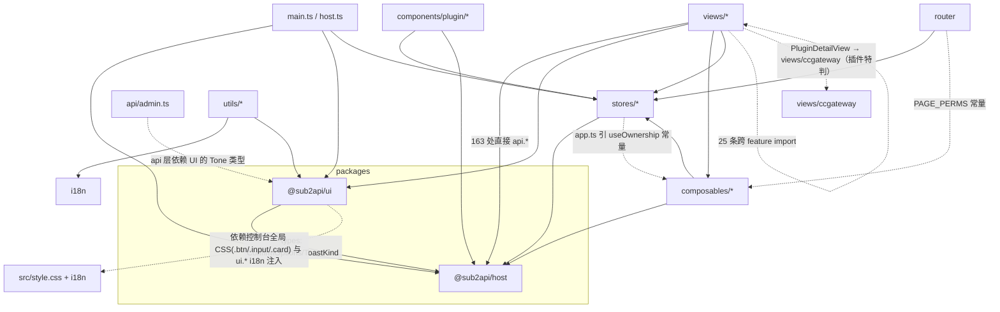

# 02 前端代码质量与架构审计（next/web）

- 日期：2026-10-04；分支 `feat/next-platform`（HEAD `d61dd3e5a`）
- 范围：`next/web`（`src/`、`packages/{ui,host,vite-preset}`、构建/嵌入流程）。只读审计，未改源码。
- 参照：`next/docs/CONTRACTS.md` §3、§15.8、§23；原版 `frontend/`；new-api `web/default/src`（`features/*`、`components/data-table`、`hooks/*`）。
- 视觉问题由 UI 视觉审计负责，这里只在影响代码结构时提一句。

---

## 0. 总评

**底子不错，问题集中在"页面层"。** 基础设施做得比较认真：`@sub2api/host` 的 HTTP 客户端（多标签页串行刷新、step-up 重试、信封解析，`packages/host/src/http.ts`）、import map 共享单例（`vite.config.ts`）、插件作用域 `PluginHost`（`packages/host/src/index.ts`）、JSON Schema 表单（`packages/ui/src/schema`）都抽象清楚，也和 CONTRACTS §23 对得上。`vue-tsc -b --force` **0 错误**；i18n zh/en **1629 个 key 完全对齐**，模板里**没有硬编码中文**。

**主要短板在视图层：抽象停在了"组件库 + 一个 useList"。**

| 指标 | 数值 |
|---|---|
| 视图里直接调用 `api.*` | 163 处，分布在 50 个文件；没有按功能划分的 api 模块 |
| 手写 `try { … } catch (e) { notifyError(e) }` | 128 处，分布在 40 个文件 |
| 手写 `loading/busy/saving = ref(false)` | 39 处，分布在 33 个文件 |
| 已有 `useAction()`（`src/composables/useList.ts:22`）的使用次数 | **0** |
| `statusLabel()` 复制粘贴 | 5 份 |
| `statusTone()` 实现 | 4 份 |
| `toLocalInput/fromLocalInput`、`startOfToday/daysAgo`、`localizedText` | 各 2–3 份 |
| 手写轮询（`setInterval` + inflight/disposed/visibility 标志） | 8 处 |
| 手写"序号守卫防竞态" | 6 处；没有任何地方用 AbortController 做取消 |
| 视图之间的跨功能 import | 25 条（accounts ↔ platforms ↔ plugins ↔ usage ↔ prices） |
| 超过 450 行的 SFC | 6 个；`AccountEditor.vue` 981 行 |

**工程化缺口最大：** 没有 ESLint/Prettier，没有 vitest。原版 `frontend/` 两者都有。现有的 4 个 `scripts/*-test.mjs` 没有接进 npm scripts。开发阶段要"大胆重构"，第一步得先把护栏补上。

**两个正确性问题：**
- `page_size` 被服务端截到 200（`server/internal/httpapi/respond.go:62`），前端多处静默截断：
  - `page_size: 500` 实际只拿到 200；
  - Dashboard 的"可用账号数"只统计前 200 个账号；
  - groups/proxies/roles 的 lookup 超过 200 条时会丢数据。
- `UsersView` 的 4 个弹窗共用同一个 `saving`。

**插件解耦有一处"破窗"：** ccgateway 的设置页写在核心（`src/views/ccgateway/*`），`PluginDetailView` 里按 `key === 'ccgateway'` 特判。

结论：不需要推倒重来。要做的是：
1. 补护栏；
2. 引入 6 个左右的通用 composable，加 2–3 个组合组件（`SDataTable`、`SFormModal`）；
3. 按 feature 目录重组；
4. 拆巨型 SFC；
5. 把 ccgateway 迁回插件。

---

## 1. 现状架构

### 1.1 目录与职责

```
next/web/
├─ packages/
│  ├─ host/    @sub2api/host  http.ts(496) 会话/刷新/step-up/ApiClient；useList.ts；routes.ts；bridge-protocol.ts；index.ts(HostContext/PluginHost/satisfiesRange)
│  ├─ ui/      @sub2api/ui    29 个 S* 组件 + schema/(SchemaForm/SchemaField/schema.ts) + feedback.ts(toast/confirm) + timeRange.ts + messages.ts(ui.* 文案)
│  └─ vite-preset/            插件构建预设（index.js，无类型检查）
├─ src/
│  ├─ main.ts / App.vue / host.ts      启动；host.ts 配置 http 并 provideHost
│  ├─ shared/                          ⚠ 只是 import map 的再导出入口（vue/pinia/vue-router/vue-i18n），和"共享层"不是一回事，名字容易误导
│  ├─ api/  types.ts(781, 64 个 DTO) / admin.ts(statusTone、时间转换、正则…不是 API) / observability.ts
│  ├─ stores/  auth / app(主题+菜单+CORE_MENU 兜底) / plugins(插件 UI 注册表) / updates
│  ├─ composables/  useList(薄封装 + 未使用的 useAction) / lookups(groups/proxies 缓存) / platforms / useOwnership
│  ├─ utils/   errors / format(依赖 i18n，还再导出 copyText) / clipboard / proxyUrl
│  ├─ components/  StepUpDialog / ChangePasswordDialog / GroupPicker / ProxyPicker / VersionBadge / plugin/(Declarative*, PluginIframe, PluginSlot) / schema/widgets.ts
│  ├─ directives/permission.ts
│  ├─ layouts/  AppLayout / AppSidebar / AppTopbar
│  ├─ router/index.ts  手写路由表 + 守卫
│  ├─ i18n/  index.ts + locales/{zh,en}/<ns>.ts(25 个命名空间)
│  └─ views/<feature>/  20 个功能目录，页面、弹窗、纯逻辑(priceExpr.ts / pluginUtil.ts)混放
├─ mock/  4571 行 dev mock（vite --mode mock）
└─ scripts/  4 个手写 node 测试脚本 + icons-json.ts
```

### 1.2 依赖关系（实线 = 合理，虚线 = 越层或横向耦合）



**结论：**

- **没有循环依赖。**`stores/app → stores/plugins`、`composables/platforms → stores/auth` 都是单向的。
- **越层：**
  - `api/admin.ts` 依赖 `@sub2api/ui` 的 `Tone`，内容其实是 UI helper。
  - `utils/format.ts` 再导出 `copyText`（format 和 clipboard 职责混在一起）。
  - `router` 和 `stores/app` 从 `composables/useOwnership` 取权限常量。权限常量应该是一个独立的 `permissions.ts`。
- **横向耦合：** 视图之间 25 条跨功能 import。几处典型：

  | 被引用方 | 引用方 |
  |---|---|
  | `views/platforms/PlatformBadges.vue` | 6 处 |
  | `views/plugins/parts/{PluginAvatar,TrustBadge}.vue` | accounts |
  | `views/accounts/accountTypes.ts` | 5 处 |
  | `views/usage/timeRange.ts` | ledger |
  | `views/accounts/ModelMappingEditor.vue` | ccgateway |
  | `views/ledger/MyLedgerTab.vue` | `MyUsageView` |
  | `views/prices/*` | `UsageDetail` |

  这些本质上是"领域共享组件/逻辑"，却放在某个 feature 下面。

---

## 2. 问题清单

工作量：S ≤ 半天，M 1–3 天，L > 3 天。

### P0（先做；影响重构安全或是正确性问题）

| # | 位置 | 问题 | 改法 | 量 |
|---|---|---|---|---|
| P0-1 | `next/web/package.json`（无 lint/test 脚本）；`scripts/*-test.mjs` | 没有 ESLint/Prettier/vitest。4 个手写测试脚本不在 npm scripts 里（只在审计文档里手动跑过）。原版 `frontend/` 有 `lint`、`test`、`test:coverage`。大规模重构没有护栏。 | 1. 加 `eslint`、`eslint-plugin-vue`、`typescript-eslint`、`@intlify/eslint-plugin-vue-i18n`、`prettier`，再加 `vitest`、`@vue/test-utils`、`happy-dom`。<br>2. 把 4 个 mjs 脚本迁成 `*.spec.ts`。<br>3. 先给纯逻辑补单测：`priceExpr.ts`、`proxyUrl.ts`、`http.ts` 刷新与 step-up、`useList`、`satisfiesRange`、`schema.ts validate`。<br>4. 新增 `npm run lint`、`npm test`；`build-ui.sh` 或 CI 跑 `typecheck && lint && test`。 | M |
| P0-2 | `views/accounts/AccountEditor.vue:226`（`page_size: 500`）；`views/dashboard/DashboardView.vue:55-60`；`composables/lookups.ts:16,30`；`views/users/UsersView.vue:48`、`views/roles/RolesView.vue:25`、`views/plugins/ConsentView.vue:212`、`views/plugins/MarketView.vue:113,128`、`views/plugins/PluginsView.vue:51`、`views/sticky/StickyView.vue:28`、`views/nodes/NodesView.vue:31` | 服务端 `page_size` 上限 200（`respond.go:62`）。前端有 16 处"取全量"写法，都默默只拿第一页：<br>• 模型建议只有 200 个；<br>• Dashboard 的 `available` 只统计前 200 个账号，而 `total` 用的是 `page.total`，两个数口径不一致；<br>• GroupPicker/ProxyPicker 超过 200 条后选不到；<br>• 角色列表同理。<br>只有 `GroupAccountsEditor.vue:30` 自己写了翻页循环。 | 1. 在 host 包加 `fetchAll<T>(client, path, query, {max})`，按 `page.total` 翻页。<br>2. 在 lookup 层统一使用它。<br>3. Dashboard 改用服务端计数，或者用 `fetchAll`。<br>4. 去掉 500 这种无效值。 | S |
| P0-3 | 全部视图（163 处 `api.*`，50 个文件） | **缺少数据访问层**：<br>• URL 字符串散落在 SFC 里，例如 `/account-types/${encodeURIComponent(..)}/${..}/models/fetch` 出现 2 次；<br>• 请求体在组件里拼；<br>• DTO 一部分在 781 行的 `types.ts`，另有 42 个本地 interface/type 散在 SFC 中；<br>• `pluginUtil.pick(o, 'memoryMB', 'memory_mb', 'maxProcs'…)` 有 86 次"多别名兜底"取值，说明契约类型没有落地。<br>改接口时只能全文搜索。 | 每个 feature 建 `api.ts` + `types.ts`，导出 `usersApi.list/create/update/remove/assignRoles…`，视图只调这些函数。`types.ts` 按 feature 拆开。服务端字段命名统一后删掉 `pick` 的别名（后端配合）。 | L |
| P0-4 | `views/users/UsersView.vue:172,226,253,295` | `saving` 被 edit/roles/groups/balance 4 个弹窗**共用**：一个弹窗提交时，其他弹窗按钮也会显示 loading；并发时还会互相提前把状态复位。 | 这是"弹窗表单状态手写"的直接后果，用 `useFormDialog`（§4.2）每个弹窗各自持有 `busy`。 | S |

### P1（结构性问题；按迁移批次处理）

| # | 位置 | 问题 | 改法 | 量 |
|---|---|---|---|---|
| P1-1 | `composables/useList.ts:22`（`useAction` 0 次使用）；128 处 try/catch；39 处 loading ref | 异步动作没有统一抽象，loading、toast、字段错误、成功提示、重载列表各写一遍。成功提示 `toast(t('common.xxx'),'success')` 就写了 32 次。 | 用 `useAsyncAction`（§4.2）替代；删掉 `useAction`。 | M |
| P1-2 | `views/users/UsersView.vue:42-49,95-121`；`GroupsView.vue:185`；`ProxiesView.vue:213`；`PublishersView.vue:89-100` | 行操作都是"`rowActions()` 生成 MenuAction 再加 `onAction` 里一串 if/else"。权限判断写在 `hidden` 里，和执行逻辑分开。 | 用 `useRowActions`（§4.2）声明式定义 `{key,label,perm,hidden(row),danger,run(row)}`。 | S |
| P1-3 | `UsersView` 5 个 SModal；`AccountsView` 4 个；`PublishersView`/`GroupsView`/`MyApiKeysView` 各 2 个 | 每个弹窗都要手写 `xOpen/xTarget/xForm/xErrors/saving/openX/submitX` 七件套，页面因此变长。`UsersView` 的余额调整还和 `views/ledger/AdjustBalanceModal.vue` 是**两份实现**（`UsersView.vue:285-313` 与 `AdjustBalanceModal.vue:94`）。 | `useFormDialog` 加 `SFormModal`；余额调整统一用 `AdjustBalanceModal`；用户的"编辑/角色/分组"拆成独立弹窗组件。 | M |
| P1-4 | `api/admin.ts:14`；`views/plugins/pluginUtil.ts:65`；`components/plugin/declarative.ts:26`（badgeTone）；`views/groups/GroupAccountsEditor.vue:135` | `statusTone` 有 4 套映射，而且互相不一致：`ok` 在一套里是 success，在另一套里落到 primary。`statusLabel(s)` 的"`t(k)===k` 就回退原值"技巧在 `GroupsView:60`、`AllApiKeysView:53`、`MyApiKeysView:60`、`PublishersView:52`、`ProxiesView:67` 复制了 5 份。 | 新建 `shared/status.ts`，导出 `statusTone`、`statusLabel(t, s, ns?)`；再加一个 `SStatusBadge`（领域无关，放 ui，参数为 tone 映射 + label）。 | S |
| P1-5 | `api/admin.ts:47-62` 与 `packages/ui/src/timeRange.ts:39-52`；`utils/format.ts:73-83` 与 `timeRange.ts:3-13`；`DashboardView.vue:48` `dayKey`；`views/usage/timeRange.ts`（只是再导出） | 时间工具有 2–3 份，签名还不一致：`fromLocalInput` 一份返回 `null`，另一份返回 `''`。 | 只保留 `@sub2api/ui/timeRange`（或新建 `shared/time.ts`）一份，删掉其余。 | S |
| P1-6 | `packages/host/src/http.ts:46`；`packages/ui/src/schema/schema.ts:31`；`src/i18n/index.ts:51`（`lt`）；类型 `LText`（`api/types.ts:5`）与 `LocalizedText`（`host/index.ts:18`） | "取本地化文本"有 3 份实现、2 个类型名。 | host 包导出 `localizedText(v, locale)` 和 `LocalizedText`，ui 与 src 都引用它。 | S |
| P1-7 | `views/accounts/AccountEditor.vue`（981 行，script 632 行，51 个响应式量，25 个函数） | 一个组件包了 7 件事：<br>1. 基本信息；<br>2. 代理双模式；<br>3. 凭据（schema/iframe/native 三种模式）；<br>4. 模型标签编辑器（含文本模式、校验、datalist）；<br>5. 拉取上游模型弹窗；<br>6. 映射 JSON/表格双模式；<br>7. 调度限流。<br>`addModels`（237）和 `syncModelsText`（277）的校验循环几乎一样。凭据字段错误拆分写了两次（345-357 与 613-620）。模板里手写了分段控件（698）、单选卡（739）、标签输入（846）。 | 见 §3 拆分方案。 | L |
| P1-8 | `views/ccgateway/*`（6 个文件，约 400 行）；`views/plugins/PluginDetailView.vue:33-34,291`；`router/index.ts:44`；`AccountRuntimes.vue:47` | **核心 UI 里写死了某个插件**，违背"插件执行、核心记录"和 §23 的原生 UI 机制。插件升级或卸载时，核心代码也得跟着发版。 | 迁到 `plugins/ccgateway/ui/native`（moderation 有现成样例），由 `registerComponent('settings', …)` 加 manifest `ui.settings.mode=native` 接入。`ModelMappingEditor` 和模型标签编辑器先提到 `@sub2api/ui`（或一个 domain 包），插件就能复用。 | M |
| P1-9 | `views/ccgateway/CCGatewayView.vue:23-33,90-98` 与 `AccountEditor.vue:154-213` | "预设模型、合并模型、填入预设映射"在两处各写一遍，行为还不一样：CCGateway 用 `STagInput`，不校验模型 id；AccountEditor 校验 `MODEL_RE`。 | 抽 `useModelList({validate})` 和 `ModelListEditor`（STagInput 增加 `validate` prop），两处共用。 | M |
| P1-10 | 8 处轮询：`AccountsView.vue:134-141`、`NodesView.vue:22-55`、`TopologyGraph.vue:18,78`、`ReleaseHistory.vue:16,44`、`UpgradesView.vue:26,87`、`OffloadSettingsCard.vue:27,84`、`AccountRuntimes.vue:15,52`、`LoginView.vue:27-42` | 每处都自己处理 inflight、disposed、visibility、失败只提示一次（`NodesView:40`）。`OffloadSettingsCard` 不判断页面是否可见，后台标签页也每 5 秒请求一次。 | 加 `usePolling(fn, {interval, pauseWhenHidden, pauseWhen, toastFirstFailure})`。 | S |
| P1-11 | `useList`（序号守卫）、`DeclarativeTable.vue:57`、`AccountEditor.vue:444`（formRequest）、`stores/updates.ts:356`（generation）、`ReleaseHistory`/`TopologyGraph`/`UpgradesView`（serial/disposed） | 竞态处理靠 6 份手写序号守卫；没有 AbortController，路由切换后旧请求照样跑完。`RequestOptions.signal` 已经支持，只是没人用。 | `useQuery`/`useAsyncAction` 内置 latest-wins 和 `AbortController`，并在 `onScopeDispose` 时 abort。`useList` 同步改造。 | M |
| P1-12 | `UsersView.vue:161,203,307`、`GroupsView.vue:177`、`ProxiesView.vue:205`、`PublishersView.vue:130,183`、`MyApiKeysView.vue:112`、`ResourcesTab.vue:90`、`SettingsTab.vue:44` 与 `DeclarativeForm.vue:66`、`AccountEditor.vue:627` | 字段错误策略不一致：<br>• 前一组**同时**显示字段错误和 toast（重复提示）；<br>• 后一组只在没有字段错误时才 toast。 | 在 `useAsyncAction({fieldErrors})` 里统一：有字段错误时只显示字段错误。 | S |
| P1-13 | `components/plugin/DeclarativeTable.vue:24-99` | 自己重新实现了 useList（序号守卫、250ms 防抖、翻页回第 1 页），另外多一个"客户端分页"模式。 | `useList` 增加 `clientPaging:'auto'`（用 `ListResult.paged` 判断），`DeclarativeTable` 改为 30 行左右的薄组件。 | S |
| P1-14 | `DeclarativeForm.vue:27-53`、`views/plugins/detail/SettingsTab.vue`、`AccountEditor.vue:489-503`；`views/settings/GatewaySettingsCard.vue:15-60` 与 `api/types.ts:518`（`GATEWAY_SETTINGS_RANGES`） | 有 3 条加载 schema 的代码路径（取 schema 和 uiSchema、错误、loading、序号）。核心设置页手写字段、默认值、范围，前端还复制了一份服务端的范围常量。SchemaForm 能力已经够用（ui:widget/ui:section/visibleWhen），却没有复用到核心页面。 | 加 `useSchemaForm({load, submit})`。核心设置类页面（gateway/offload/sticky settings/update source）改成"前端内置 JSON Schema 加 SchemaForm"，范围以 schema 为准，最好由服务端下发。 | M |
| P1-15 | 25 条跨 feature import（§1.2） | 领域共享组件放在某个 feature 目录下面。 | 移到 `src/entities/{platform,plugin,account}/`（见 §4.1）。 | S |
| P1-16 | `stores/app.ts:36-72,128-147`（CORE_MENU、CLIENT_ITEMS）与 `router/index.ts:17-62` | 路由表、菜单兜底、"服务端菜单缺项时补齐"三处各维护一份路径和权限，新增页面要改 3 处。 | 建单一 `routes.ts` 注册表 `{path, component, perm, title, menu:{section, icon, order}}`，路由和兜底菜单都从它生成。 | M |
| P1-17 | `packages/host/src/http.ts:467-474`（`get<T = any>` 等）；`VersionBadge.vue:19`、`DashboardView.vue:65` | `ApiClient` 的泛型默认是 `any`，不写类型也能通过检查。 | 默认改成 `unknown`，强制调用方声明类型；配合 P0-3 的 feature api 模块，会自然收敛。 | S |
| P1-18 | `src/shared/*.ts` | 目录名叫 `shared`，内容却只是 import map 的再导出入口。真正的"共享层"放进来以后会混淆。 | 改名为 `src/importmap/`（同步改 `vite.config.ts` 的 `SHARED`）。 | S |
| P1-19 | `next/server/web/dist/index.html`（被 git 跟踪，当前工作区已被构建覆盖成脏文件） | 构建产物覆盖了被跟踪的占位文件，每次 build 都会产生 diff，容易被误提交。旧后端已有做法：`.gitignore` 忽略 `dist/*` 并保留 `.keep`（根 `.gitignore:101-106`）。 | 改为 `dist/.keep` 加忽略规则；占位页由 Go 侧在 `index.html` 缺失时兜底渲染，或者 `embed` 一个单独的 `placeholder.html`。 | S |

### P2（顺手改）

| # | 位置 | 问题 | 改法 | 量 |
|---|---|---|---|---|
| P2-1 | `packages/host/src/useList.ts:46-79` | 防抖 timer 没有在 `onScopeDispose` 里清理，组件卸载后仍可能触发 reload。`filters: Record<string, any>` 没有类型。不支持 URL 同步（刷新页面后筛选丢失；`UsersView:40` 只手工读了一次 `route.query.role`）。 | 加 `onScopeDispose`；`useList<T, F extends Record<string, unknown>>`；增加 `urlSync` 选项（参考 new-api `hooks/use-table-url-state.ts`）。 | S |
| P2-2 | `stores/plugins.ts:42,44,59`；`DeclarativeForm.vue:32,34`；`PluginIframe.vue:48,53,153` | 面向用户的错误原因是硬编码英文，会直接显示在页面上（`pluginHost.nativeFailed` 的 `{reason}`）。 | 改为错误码加 i18n key（`pluginHost.reasons.untrusted` 等）。 | S |
| P2-3 | `stores/plugins.ts:90-104` | `refresh()` 没有并发保护，`AppLayout` 挂载和 `PluginDetailView`/`RolloutView` 的 `refreshShell` 可能同时触发。`refreshShell` 本身也写了两份（`PluginDetailView.vue:129`、`RolloutView.vue:107`）。 | `refresh` 共享同一个 in-flight Promise；`refreshShell` 移到 `stores/app` 作为 `reloadShell()`。 | S |
| P2-4 | `components/plugin/PluginSlot.vue:84-88` | 出错时靠 `instance.$el.closest('[data-plugin-slot]')` 找是哪个插件，Fragment 根或 Teleport 时会失效。 | 每个 entry 包一层 `PluginBoundary` 组件，自己做 `onErrorCaptured`；`PluginPageView` 也用它。 | S |
| P2-5 | `stores/plugins.ts:19` 与 `packages/host/src/index.ts:106` | `assetURL` 和 `PluginHost.asset` 是同一个拼接逻辑，写了两份。 | 在 host 包导出 `joinAsset(base, path)`。 | S |
| P2-6 | `host.ts:33,46`（`as any`）；`i18n/index.ts:35,71` | 为了满足 `Ref<string>` 用了 `as any`。全仓 `any` 共 81 处，集中在 schema(20)、bridge(5)、PluginIframe(7)、priceExpr(5)；量不大，但 schema 那部分可以收紧。 | `HostI18n.locale` 改成 `Readonly<Ref<string>>`（ComputedRef 可以赋值过去）；`JSONSchema` 换成 `json-schema` 类型的子集。 | S |
| P2-7 | `tsconfig.app.json` | 已开 `strict`、`noUnusedLocals`；没开 `noUncheckedIndexedAccess`（大量 `Record<string,string>` 索引）、`noImplicitOverride`；`noUnusedParameters:false`。`packages/vite-preset/index.js` 是 JS，不做类型检查。`tsconfig.node.json` 里掺了 `packages/ui/src/icons.ts`。 | 新代码先开 `noUncheckedIndexedAccess`（或在 lint 里分目录启用）；vite-preset 改成 `index.ts`，或加 `// @ts-check` + JSDoc。 | S |
| P2-8 | 12 个文件有超过 180 字符的行：`RemoteSettings.vue` 21 行、`NodeTopology.vue` 18 行、`UpgradesView.vue` 17 行、`TopologyGraph.vue` 15 行、`CCGatewayView.vue` 13 行、`AccountEditor.vue` 12 行 | 多语句写在一行（例如 `UpgradesView.vue:87`、`AccountRuntimes.vue:52`），可读性差，diff 也难看。 | 接入 Prettier（printWidth 140）。 | S |
| P2-9 | 模板最深嵌套：`RolesView` 12 层、`PriceSyncView` 11 层、`AccountEditor`/`AccountsView`/`ConsentView`/`PublishersView`/`PlatformsView` 各 10 层 | 深层 `div`、`template v-if` 嵌套。 | 拆小组件（`PermissionModule.vue`、`SyncDiffRow.vue` …），加 `vue/max-depth`（lint 自定义）或在 review 时控制。 | M |
| P2-10 | `packages/ui`（依赖控制台全局类 `.btn/.input/.card/.badge`，用 tailwind safelist 保留 `badge-*`） | ui 包自己不带样式，必须由宿主提供 `style.css` 才能渲染；tailwind 的 `content` 也必须扫描 ui 源码。（视觉层面交给 UI 审计。） | 把 `@layer components` 部分搬到 `packages/ui/src/styles.css`，由 ui 包导出、控制台引入；组件内部只用这些语义类。 | M |
| P2-11 | `views/plugins/MarketView.vue:128-130` | 为了读 `host_version` 退回到 `requestRaw`，还要兼容 `data`、`data.items`、`data.plugins` 三种形状。 | 服务端固定一种响应形状（`{data:[…], meta:{host_version}}`），前端用 `api.list` 加 `onSuccessHeaders` 或 meta 读取。 | S |
| P2-12 | `utils/format.ts:90` | `format` 再导出 `copyText`，职责不清。 | 删除再导出，直接从 `utils/clipboard` 引入；或者提供 `useClipboard()`（带成功/失败 toast，目前散落 6 处）。 | S |

---

## 3. 行数前 15 的源码文件（不含 locales）

| # | 文件 | 行 | 为什么大 | 怎么拆 |
|---|---|---|---|---|
| 1 | `views/accounts/AccountEditor.vue` | 981 | 7 个子域写在一个文件（见 P1-7）；51 个响应式量；凭据错误拆分写了 2 遍；手写 3 个 UI 控件 | 1. `useAccountForm(account, accountType)`：basic、提交、错误分区；<br>2. `ProxyField.vue`：双模式代理；<br>3. `CredentialsSection.vue`：schema/iframe/native 统一成 `collect()` 接口；<br>4. `ModelsSection.vue` 加 `useModelList`（与 CCGateway 共用）；<br>5. `MappingSection.vue`；<br>6. `FetchModelsModal.vue`；<br>7. `SchedulingSection.vue`（`limitFields` 声明式）；<br>8. `EditorNav.vue`。<br>拆完主文件应在 150 行以内。 |
| 2 | `api/types.ts` | 781 | 64 个 DTO 全在一个文件 | 按 feature 拆到 `features/*/types.ts`，公共类型（LText、Money、PageInfo）放 `shared/types.ts` |
| 3 | `views/accounts/AccountsView.vue` | 624 | 列表、筛选、自动刷新、4 个弹窗（编辑器宿主、测试连接、凭据揭示、详情加插件 tabs） | `AccountFilters.vue`、`AccountTestModal.vue`、`RevealCredentialModal.vue`、`AccountDetailModal.vue`、`accountStatus.ts`（statusOf/limitsOf/abbrev）；轮询改用 `usePolling` |
| 4 | `views/plugins/ConsentView.vue` | 588 | 权限审查表、"provides"格式化（约 10 个 `xxxText` 函数）、角色授予、提交 | `consentFormat.ts`（纯函数，可测）、`HostPermissionTable.vue`、`ProvidesList.vue`、`RoleGrantPicker.vue` |
| 5 | `views/prices/priceExpr.ts` | 575 | 价格表达式的生成与解析（纯逻辑） | 大小合理，但**必须补单测**；可再拆成 `visual.ts`（配置到表达式）和 `parse.ts`（表达式到配置） |
| 6 | `views/users/UsersView.vue` | 498 | 列表加 5 个弹窗，每个都是七件套 | `useFormDialog` 后拆出 `UserCreateModal`、`UserEditModal`、`UserRolesModal`、`UserGroupsModal`，复用 `AdjustBalanceModal`；主文件约 120 行 |
| 7 | `packages/host/src/http.ts` | 496 | 会话、跨标签锁、刷新、step-up、信封解析 | 职责其实内聚，可以拆成 `session.ts`、`refresh-lock.ts`、`client.ts`，便于单测；不急 |
| 8 | `views/prices/PriceEditView.vue` | 493 | 加载、派生 payload、可视化与源码切换、校验、保存 | `usePriceForm()`，加 `PriceModeSection`/`TierTable` 组件 |
| 9 | `views/roles/RolesView.vue` | 459 | 角色列表、权限树（模块全选/半选/折叠）、成员、创建删除；模板 12 层 | `PermissionTree.vue`（含 `usePermissionTree`）、`RoleMembers.vue`、`RoleCreateModal.vue` |
| 10 | `views/sticky/StickyRuleModal.vue` | 429 | 协议、来源、正则校验、排序 | `KeySourceList.vue`、`ProtocolPicker.vue`、`stickyRuleForm.ts`（`body()`/校验，纯函数） |
| 11 | `packages/ui/src/schema/SchemaField.vue` | 425 | 14 种内置 widget 用 `v-if` 链分发 | 改成 `widgetRegistry: Record<string, Component>`，每个 widget 一个文件；内置 widget 和宿主 `widgets` 走同一张表 |
| 12 | `views/prices/PriceSyncView.vue` | 407 | 预览、过滤、选择、统计、应用结果弹窗；11 层嵌套 | `useSelection()`（通用，可复用到 fetched models 等场景）、`SyncDiffTable.vue`、`SyncResultModal.vue` |
| 13 | `views/proxies/ProxiesView.vue` | 376 | 列表、测试、编辑弹窗、粘贴 URL 解析 | `ProxyFormModal.vue`（含 `applyPastedUrl`）；行操作改用 `useRowActions` |
| 14 | `views/plugins/PublishersView.vue` | 348 | 发布者、密钥两级，2 个弹窗，各种 label/tone | `PublisherKeyList.vue`、`AddKeyModal.vue`；tone/label 统一走 `shared/status.ts` |
| 15 | `views/groups/GroupsView.vue` / `views/plugins/pluginUtil.ts` | 346 / 346 | Groups：列表、编辑弹窗、详情弹窗。pluginUtil：风险表、tone、`pick` 别名兜底、14 个插件 DTO 类型 | Groups：`GroupFormModal`、`GroupDetailModal`。pluginUtil：类型移到 `features/plugins/types.ts`，tone 合并进 `shared/status.ts`，`pick` 在契约稳定后删除 |

---

## 4. 目标架构与通用抽象

### 4.1 目录（借鉴 new-api `features/*`，按 Vue 习惯调整）

```
next/web/
├─ packages/
│  ├─ host/   @sub2api/host     http(client/session/refresh)、useList→usePagedQuery、useQuery、useAsyncAction、usePolling、fetchAll、localizedText、bridge、PluginHost
│  ├─ ui/     @sub2api/ui       纯展示 + 交互组件（含 styles.css）、SchemaForm（widget 注册表）、SDataTable、SFormModal、SStatusBadge、SSegmented、SRadioCards、STagInput(validate)
│  └─ vite-preset/  (TS 化)
└─ src/
   ├─ app/          main.ts、App.vue、host.ts、router/(由 routes 注册表生成)、layouts/、providers
   ├─ importmap/    (原 src/shared) vue/pinia/vue-router/vue-i18n 再导出
   ├─ shared/       与业务无关的控制台层
   │   ├─ composables/  useFormDialog、useRowActions、useConfirmAction、useLookup、useSelection、useClipboard、useSchemaForm、useUrlState
   │   ├─ lib/          status.ts、time.ts、format.ts、permissions.ts(所有 *_PAGE_PERMS / ACCOUNT_KEYS)、errors.ts
   │   └─ types.ts      LText、Money、PageInfo…
   ├─ entities/     跨 feature 复用的领域件（只能依赖 shared、packages）
   │   ├─ platform/   PlatformBadges、PlatformEndpointsPreview、usePlatforms
   │   ├─ plugin/     PluginAvatar、TrustBadge、PluginBoundary、PluginSlot、stores/plugins
   │   ├─ account/    accountTypes.ts、ModelListEditor、ModelMappingEditor、useModelList
   │   └─ lookup/     GroupPicker、ProxyPicker（基于 useLookup）
   ├─ features/<name>/   users、roles、accounts、groups、proxies、keys、prices、usage、ledger、plugins、nodes、upgrades、sticky、settings、dashboard、auth
   │   ├─ api.ts        该 feature 的全部请求函数（唯一调用 api.* 的地方）
   │   ├─ types.ts
   │   ├─ routes.ts     {path, component, perm, title, menu?}，汇总进 app/router
   │   ├─ composables/  useXxxForm 等
   │   ├─ components/   弹窗、分区、单元格
   │   └─ pages/        路由页面（薄，只负责组装）
   └─ i18n/  不变（locales/<locale>/<ns>.ts），en 作为类型源：type MessageSchema = typeof en
```

**依赖规则**（用 ESLint `import/no-restricted-paths` 或 `eslint-plugin-boundaries` 强制）：
- 依赖方向：`features → entities → shared → packages`。
- `features/a` 不得 import `features/b`；需要共享的东西下沉到 entities。
- `packages/*` 不得 import `src/*`。
- 只有 `features/*/api.ts`、`entities/*` 的 lookup 可以调用 `api.*`。

### 4.2 通用 composable API 草图

```ts
// ---------- @sub2api/host：数据获取 ----------
/** latest-wins + 卸载/重载时 abort；替代 6 份序号守卫。 */
export function useQuery<T>(
  fetcher: (signal: AbortSignal) => Promise<T>,
  opts?: { immediate?: boolean; watch?: WatchSource[]; initial?: T; onError?: (e: unknown) => void }
): { data: Ref<T | undefined>; loading: Ref<boolean>; error: Ref<unknown>; reload(): Promise<void> }

/** useList 的升级版（保留 useList 名字也行）。 */
export function usePagedQuery<T, F extends Record<string, unknown> = Record<string, unknown>>(
  client: ApiClient, path: string | (() => string), filters?: F,
  opts?: {
    pageSize?: number; immediate?: boolean; debounceMs?: number
    clientPaging?: 'auto' | boolean   // 非分页路由时本地切片（替代 DeclarativeTable 自写逻辑）
    urlSync?: boolean | (keyof F)[]   // 筛选/页码同步到 route.query
    onError?: (e: unknown) => void
  }
): UseListResult<T> & { filters: F; paged: Ref<boolean>; resetFilters(): void }

/** 跨页取全量，解决 page_size ≤ 200 的静默截断。 */
export function fetchAll<T>(client: ApiClient, path: string, query?: Query, opts?: { max?: number }): Promise<T[]>

/** 轮询：可见性暂停、in-flight 去重、连续失败只提示一次。 */
export function usePolling(fn: () => Promise<unknown>, opts: {
  interval: number; immediate?: boolean; pauseWhenHidden?: boolean /* true */
  pauseWhen?: Ref<boolean>; onError?: (e: unknown, streak: number) => void
}): { active: Ref<boolean>; lastAt: Ref<Date | null>; start(): void; stop(): void; trigger(): Promise<void> }

// ---------- src/shared/composables：控制台交互 ----------
/** 替代 128 处 try/catch + 39 个 loading ref。 */
export function useAsyncAction<A extends unknown[], R>(
  fn: (...args: A) => Promise<R>,
  opts?: {
    success?: string | ((r: R) => string)                // toast
    fieldErrors?: Ref<Record<string, string>>            // 有字段错误时只显示字段错误、不 toast
    stripPrefix?: string                                  // 'credentials.' 等
    onSuccess?: (r: R) => void                           // 典型：list.reload
    silentCodes?: string[]                               // 默认 unauthenticated / step_up_required / AbortError
  }
): { run: (...args: A) => Promise<R | undefined>; busy: Ref<boolean>; error: Ref<unknown> }

/** 弹窗表单七件套 → 一个对象；每个实例独立 busy（修 P0-4）。 */
export function useFormDialog<F extends object, T = void>(opts: {
  init: (target?: T) => F
  validate?: (form: F) => Record<string, string>         // 客户端校验
  submit: (form: F, target?: T) => Promise<unknown>
  success?: string; onDone?: () => void
}): { open: Ref<boolean>; target: Ref<T | undefined>; form: F; errors: Ref<Record<string, string>>;
      busy: Ref<boolean>; show(target?: T): void; submit(): Promise<void>; close(): void }

/** 行操作声明式。 */
export interface RowAction<T> { key: string; label: string | (() => string); perm?: string | string[];
  hidden?: (row: T) => boolean; disabled?: (row: T) => boolean; danger?: boolean; run: (row: T) => unknown }
export function useRowActions<T>(defs: RowAction<T>[] | (() => RowAction<T>[])):
  { actionsFor(row: T): MenuAction[]; select(row: T, key: string): void; hasAny(row: T): boolean }

/** 确认 + 执行 + toast + 刷新。 */
export function useConfirmAction<T>(opts: { message: (row: T) => string; title?: string; danger?: boolean;
  action: (row: T) => Promise<unknown>; success?: string; onDone?: () => void }): (row: T) => Promise<void>

/** 带用户作用域缓存的 lookup（groups/proxies/roles/prices/platforms），内部 fetchAll。 */
export function useLookup<T>(key: string, loader: () => Promise<T[]>, opts?: { scope?: 'user' | 'global'; ttlMs?: number }):
  { items: Ref<T[]>; ready: Promise<void>; refresh(): Promise<void> }

/** schema 驱动表单：插件声明式页、插件设置、账号凭据、核心设置页共用。 */
export function useSchemaForm(opts: {
  load: () => Promise<{ schema: JSONSchema; uiSchema?: UISchema | null; values?: Record<string, unknown> }>
  submit?: (values: Record<string, unknown>) => Promise<unknown>; fieldPrefix?: string
}): { schema; uiSchema; values; errors; loading; loadError; saving; formRef; reload(); save() }

export function useSelection<K>(all: Ref<K[]>): { picked: Ref<Set<K>>; count; toggle(k); setAll(v: boolean); isAll; isSome }
```

### 4.3 组件库边界（`@sub2api/ui`）

**应该包含**：无业务、无 API、无 store 的组件。只能依赖 `vue`、`vue-i18n`（`ui.*` 文案）、`@sub2api/host` 的**类型**。

- **现有**：S* 基础组件、`SchemaForm`、`STimeRange`、`toast`/`confirm`。
- **新增：**
  - `SDataTable`：STable + 工具栏（搜索/筛选 slot/刷新）+ SPagination，直接吃 `UseListResult`。
    `<SDataTable :list="list" :columns="cols" searchable>`，并支持 `#cell-x`、`#filters`、`#actions`。
    13 个页面里重复的"STable + SPagination"组合可以统一掉。
  - `SFormModal`：SModal + `<form @submit>` + footer（取消/提交，busy/disabled），直接吃 `useFormDialog`。
  - `SStatusBadge`：`tone` 和 `label` 由调用方提供，内部可以用 `toneMap`。
  - `SSegmented`：AccountEditor 的代理模式切换。
  - `SRadioCards`：AccountEditor 的认证方式选择、AccountTypePicker。
  - `STagInput` 增加 `validate?: (s) => string | null` 和 `suggestions` / datalist：模型编辑。
  - `SAsync`：loading / error / empty 三态边界，替代到处都有的 `v-if="loading"` 加 `SSpinner` 加 `SHint danger`。
  - `SDescriptionList`：详情弹窗的 `dl` 写法（`GroupsView:321` 等）。现有 `SKeyValue` 是键值编辑器，名字容易混淆，建议改名为 `SKeyValueEditor`。
- **样式**：组件语义类放到 `packages/ui/src/styles.css`，ui 包自带（P2-10）。

**不应该包含**（放 `src/entities`）：`GroupPicker`、`ProxyPicker`（依赖 lookup）、`PlatformBadges`、`PluginAvatar`、`TrustBadge`、`ModelMappingEditor`。其中 `ModelMappingEditor` 和 `ModelListEditor` 如果需要给 ccgateway 插件复用，可以考虑一个 `@sub2api/ui-domain` 子入口，或者让它们只依赖 ui 并通过 props 传数据，然后放进 ui。

### 4.4 插件前端挂载机制评估

| 方面 | 评价 |
|---|---|
| import map 共享单例 + `preserveEntrySignatures:'strict'` | 设计正确，dev 和 prod 一致；保持不变 |
| `HostContext` / `PluginHost` 作用域（`pluginApi`、`t`、`can`、`asset`） | 抽象合理，和 §23.2 一致；建议把 `useQuery`、`useAsyncAction`、`usePolling` 也放进 host 包导出，插件页面能直接用上同一套模式 |
| 信任与兼容判定（`stores/plugins.ts:40-47`） | 逻辑正确；错误原因要 i18n 化（P2-2）；`refresh` 要加并发保护（P2-3） |
| 页面类型分发（`PluginPageView.vue`） | 清晰。`DeclarativeTable` 要回归 useList（P1-13）；错误边界抽成 `PluginBoundary`（P2-4） |
| iframe bridge | 协议文档化良好，origin 检查到位（`PluginIframe.vue:106`）；`any` 可以收紧成按 method 区分的联合类型 |
| schema 驱动表单能否复用到核心页面 | **能，而且应该复用。**SchemaForm 已支持 `ui:section`、`visibleWhen`、自定义 widget、服务端字段错误映射。核心的 Gateway/Offload/Sticky 设置、UpdateSource 都是"读一个对象、改几个字段、PUT 回去"，正好适用：`useSchemaForm` + 前端内置 schema（以后可以由服务端下发，范围常量就不用前后端各写一份）。列表页不建议 schema 化，用 `SDataTable` 加 columns 定义就够了 |
| 插件特判 | ccgateway 必须迁出（P1-8） |

### 4.5 i18n

- **现状良好**：
  - zh/en 1629 个 key 完全对齐；
  - 静态引用的 1274 个 key 全部存在；
  - 模板和 script 里没有硬编码中文；
  - 硬编码英文文本节点只有 5 处（`sub2api`、`USD`、`schema`，都可以接受）；
  - 26 处字面量 placeholder 都是示例值（`socks5://…`、`claude-sonnet-*`），可以接受。`RolesView` 的 `placeholder="运营"` 是有意的中文示例。
- **问题：**
  1. 静态扫描下有 357 个 key 疑似未用。另有 76 个动态 key 模板（如 `` t(`accounts.${key}`) ``、`` `observe.${e.kind}` ``）让静态检查失效，所以这个数是高估的，需要先把动态 key 收敛成显式映射表（`const KIND_LABEL = {usage: 'ledger.kinds.usage', …}`），再清理。
  2. 命名不统一：`common.status_`、`publishers.trust_`、`publishers.trustHint_` 用下划线后缀表示"枚举表"；`accounts.editorUi.*` 和 `accounts.*` 是两套平行的命名；72 个叶子 key 用 snake_case，其余用 camelCase。建议约定 `<ns>.<area>.<item>`，枚举统一放 `<ns>.enum.<field>.<value>`，叶子一律 camelCase。
  3. `statusLabel` 的"`t(k)===k` 就回退"技巧依赖 `missingWarn:false`（`i18n/index.ts:36`），会掩盖缺失的 key。用 `te()` 判断，开发环境打开 missingWarn。
  4. `plugins` 命名空间 340 个 key、`prices` 221 个，可以按子页面拆文件（`plugins/consent.ts` 等）。
  5. 类型化：locales 本身就是 TS，可以 `type MessageSchema = typeof en` 并通过 `createI18n<[MessageSchema], 'zh'|'en'>`，让 `t()` 的 key 有类型检查；配合 `@intlify/eslint-plugin-vue-i18n` 的 `no-raw-text`、`no-missing-keys`、`no-unused-keys`。

### 4.6 工程化

| 项 | 现状 | 建议 |
|---|---|---|
| typecheck | `npm run typecheck`（`vue-tsc -b`）**通过，0 错误**（增量缓存下 1.3s；`--force` 12s，exit 0） | 保持；在 CI 和 `build-ui.sh` 之前执行 |
| tsconfig | `strict`、`noUnusedLocals`、`noFallthroughCasesInSwitch` 已开 | 加 `noUncheckedIndexedAccess`（先在新目录启用）、`noImplicitOverride`；`noUnusedParameters: true`（用 `_` 前缀） |
| lint / format | **无** | ESLint flat config（vue3-recommended + ts-strict + vue-i18n + boundaries）+ Prettier（printWidth 140） |
| 单测 | **无 vitest**（原版 `frontend/` 有）；4 个手写 mjs 脚本 | vitest + happy-dom；先覆盖纯逻辑和 composable；mock/ 目录里的数据可以给组件测试复用 |
| e2e | `next/e2e` 是 Go 端到端测试，不覆盖 UI | 后续可以用 Playwright 加 `vite --mode mock` 跑关键流程（登录、step-up、建账号、插件同意页） |
| 构建产物嵌入 | `vite build` 输出到 `../server/web/dist`（`emptyOutDir`），Go 侧 `//go:embed all:dist`（`server/web/embed.go`）；Docker 用 `deploy/docker/build-ui.sh` 构建 web 和各插件 native UI | 流程本身没问题；占位 `index.html` 被跟踪导致工作区变脏（P1-19） |

---

## 5. 分批迁移计划

每一批都可以单独合并；每批结束都要满足 `typecheck + lint + test + build` 通过，并用 mock 模式手动走一遍对应页面。

| 批次 | 内容 | 关联问题 | 量 |
|---|---|---|---|
| **B0 护栏** | 1. ESLint、Prettier、vitest 接入；<br>2. 4 个 mjs 脚本迁成 spec；<br>3. 给 `http.ts`（刷新/step-up）、`useList`、`satisfiesRange`、`priceExpr`、`proxyUrl`、`schema.validate` 补单测；<br>4. `ApiClient` 泛型默认改 `unknown`；<br>5. dist 占位改为 `.keep` 加 ignore；<br>6. Prettier 一次性格式化（单独提交，方便 blame 跳过）。 | P0-1、P1-17、P1-19、P2-7、P2-8 | M |
| **B1 正确性与去重** | 1. `fetchAll` 和 `useLookup`，修所有 `page_size: 200/500`；<br>2. `shared/lib/{status,time,permissions}.ts` 合并 4 份 statusTone、5 份 statusLabel、时间与本地化工具；<br>3. 删除 `api/admin.ts`（工具函数移到 lib，`RoleRow` 移到 roles/types）；<br>4. `src/shared` 改名 `src/importmap`。 | P0-2、P1-4、P1-5、P1-6、P1-18、P2-5、P2-12 | S–M |
| **B2 通用 composable** | 1. host 包加 `useQuery`、`usePolling`；`useList` 升级（abort、clientPaging、URL 同步、dispose）；<br>2. src 加 `useAsyncAction`、`useFormDialog`、`useRowActions`、`useConfirmAction`、`useSelection`、`useSchemaForm`；<br>3. ui 包加 `SDataTable`、`SFormModal`、`SStatusBadge`、`SAsync`；<br>4. **以 `UsersView` 为样板页**迁移（顺带修 P0-4、复用 `AdjustBalanceModal`），定型后写进 CONTRACTS §23 或单独的前端约定文档。 | P0-4、P1-1、P1-2、P1-3、P1-10、P1-11、P1-12、P1-13、P2-1 | M |
| **B3 目录重组** | 1. 建 `features/*`（每个带 `api.ts`、`types.ts`、`routes.ts`、`pages/`、`components/`），拆分 `api/types.ts`；<br>2. 25 条跨 feature 依赖下沉到 `entities/*`；<br>3. 路由与菜单兜底统一用注册表生成；<br>4. 加 boundaries lint 规则。<br>建议按 feature 逐个迁移（git mv 加改 import），一次一个 PR。 | P0-3、P1-15、P1-16 | L |
| **B4 拆巨型 SFC** | 顺序：AccountEditor（含 `useModelList`，与 CCGateway 共用）、AccountsView、ConsentView、RolesView、PriceEditView、PriceSyncView、StickyRuleModal、Proxies/Groups/Publishers。<br>目标：单个 SFC 不超过 300 行、script 不超过 150 行、模板嵌套不超过 7 层（lint：`vue/max-lines-per-block`）。 | P1-7、P1-9、P2-9、§3 | L |
| **B5 插件解耦与 schema 复用** | 1. ccgateway UI 迁到 `plugins/ccgateway/ui/native`，删掉核心特判和 `views/ccgateway`；<br>2. `DeclarativeForm`、`SettingsTab`、`AccountEditor` 凭据、核心设置页改用 `useSchemaForm`；<br>3. `PluginBoundary`、插件错误 i18n、`refresh` 并发保护；<br>4. `SchemaField` 改为 widget 注册表；<br>5. ui 包自带 `styles.css`。 | P1-8、P1-14、P2-2、P2-3、P2-4、P2-10 | M–L |
| **B6 i18n 收尾** | 1. 动态 key 改显式映射表；<br>2. 清理未用 key；<br>3. 统一命名约定；<br>4. `MessageSchema` 类型化；<br>5. 开发环境开 missingWarn；<br>6. 拆分 plugins/prices 两个大命名空间。 | §4.5 | M |

建议顺序：B0 → B1 → B2（样板页定型）→ B3、B4 交替推进（按 feature：先迁目录，再拆该 feature 的大文件）→ B5 → B6。按"一模块一写者"原则，B3、B4 期间同一个 feature 只派一个 agent 改。
