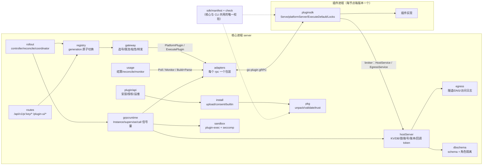

# 审计 05：插件系统、SDK 与各插件实现（2026-10-04）

> 范围：`next/server/internal/plugin/**`、`next/sdk/**`、`next/runtime-contract`、`next/plugins/{anthropic,openai,gemini,volcengine,relay,ccgateway,guard,moderation}`。
> 只读审计，未改源码。行号以 `feat/next-platform` 工作区（HEAD d61dd3e5a）为准。

## 0. 总评

| 维度 | 评分 | 一句话 |
|---|---|---|
| 安装 / 签名 / 解包 | 好 | Ed25519 覆盖全部文件摘要、节点加载时复验、吊销链完整、zip 解包防穿越 / 炸弹 / 大小写重名，没有发现签名绕过 |
| 契约设计 | 偏重 | 「插件执行、核心记录」原则落实得彻底，但 `PlatformService` 已有 **16 个 rpc**，同一件事有 2~3 套并存路径（执行、提交、轮询），开发期没有收敛 |
| 运行时健壮性 | 有硬伤 | Execute 路径**整条流式响应都占着插件调用信号量（默认 64）**，插件升级 30 秒后会**掐断在途长流**；Failed 实例同一 epoch 内永不重试 |
| 隔离与安全 | 有硬伤 | egress 默认 `allow_all` 且**不拦内网和回环地址**；沙箱与核心**同 UID、没有文件系统隔离**；没有 CREATEROLE 时 `db.schema` 下发的是**核心自己的 DSN**；optional 结构性权限在运行时不强制 |
| SDK 易用性 | 中上 | `Serve` 一行启动、`apikey.Spec`、`ExecuteDefault`、`Locks`、`pluginsdktest` 都好用；缺少错误分类、厂商常识、批量写入器等公共件，导致插件之间大量复制 |
| 插件间复用 | 差 | `relay`、`ccgateway` 的 `classify.go` 与 `anthropic` **逐字相同**（各 189~191 行）；`anthropic`、`relay` 没用 SDK 的 `apikey`，各自复制了约 160 行 |
| 代码复杂度 | 中 | 6 个函数超过 120 行（最长 192 行、嵌套 6 层）；`check/validate.go` 一个文件 1334 行 |

构建与测试（Windows，go1.27.0 windows/amd64）：

| 命令 | 结果 |
|---|---|
| `go build ./...`、`go vet ./...`：sdk、runtime-contract、8 个插件 | 全部通过，无输出 |
| `go build` / `go vet ./internal/plugin/...`（server） | 通过 |
| `go test -short -count=1 ./...`：sdk、8 个插件 | 全部 ok |
| `go test -short -count=1 ./internal/plugin/...` | 14 个包全部 ok（含工作区里有未提交改动的 `routes`） |
| `gofmt -l` | `plugins/ccgateway/main.go` 未格式化；`server/internal/plugin/routes/routes_test.go`（未提交改动，按要求没动）未格式化 |

`//go:build linux` 的 sandbox / seccomp 用例在本机没有跑（CONTRACTS §26.7 记录 Linux CI 上会跑）。

---

## 1. 插件系统结构图



一次网关请求在 Execute 路径上的往返：

```
core.gateway ──Execute(token)──▶ plugin.ExecuteDefault
                                   ├─ BuildUpstreamRequest（插件本地）
                                   ├─ ForwardUpstream ──▶ core 转发上游并把字节流给客户端（整个流期间都在这次 RPC 里）
                                   ├─ ClassifyError / ExtractUsage / ParseTaskSubmission（插件本地）
                                   └─ RecordUsage 或 ReserveAndWatch ──▶ core 落账
core ◀── ExecuteResponse ──┘   （整个过程占着 Instance.sem 的一个槽）
```

---

## 2. 问题清单

工作量：S ≤ 半天，M 1~3 天，L > 3 天。

### P0

| # | 位置 | 问题 | 改法 | 量 |
|---|---|---|---|---|
| P0-1 | `server/internal/plugin/grpcruntime/execute.go:193`（`a.i.call(ctx, 0, …)`）、`grpcruntime/runtime.go:41-67`（`i.sem`）、`runtime.go:89-91`（默认 64）、`server/internal/app/app.go:226-232`（没有设置 `MaxConcurrency`）、`server/internal/gateway/execute.go:78`（6h） | **Execute 路径在整条上游响应期间都占着插件实例的调用信号量**。`ForwardUpstream` 回调在 Execute RPC 内部同步把 SSE 转发给客户端，所以每个节点每个平台插件**最多同时 64 个在途请求**。第 65 个请求等 `PrepareTimeout`（约 2s）拿不到槽，就按 plugin unavailable 处理并 failover，而同插件的其他账号也拿不到槽，最后返回 503。anthropic、openai、gemini、relay、volcengine 都声明了 `platform.execute.v1`，所以内置平台的全部流量都受这个上限约束 | ① Execute 不进 `i.sem`（或单独开一个大容量的流式槽，按账号并发位限流即可，核心已有）；② 中期把 ForwardUpstream 改成「插件只描述请求，核心转发，转发完再回插件」（见 §4），让插件 RPC 不再跨越整条流 | S（①）/ L（②） |
| P0-2 | `grpcruntime/instance.go:589-606`（`Drain`）、`rollout/controller.go:110`（`DrainTimeout` 30s）、`rollout/housekeeping.go:22` | 与 P0-1 同源：**插件进程的生命周期和在途流绑在一起**。插件升级、资源超限重启、健康检查重启时，Drain 只等 30 秒，之后 `Stop()` 杀掉进程，broker 上的 ForwardUpstream 上下文被取消，正在转发的长流（Claude Code 一轮常超过 30s）被腰斩。旧路径（BuildUpstreamRequest 一次 RPC 后核心自行转发）没有这个问题。这与「插件按节点独立更新、不影响服务」的目标相冲突 | 同 P0-1 ②；短期把 Execute 的 Drain 超时与网关最长流时间对齐，并在 Drain 期间不再给该实例派新 Execute | M |
| P0-3 | `server/internal/plugin/egress/egress.go:197-203, 344-357`、`grpcruntime/instance.go:374-384`、`migrations/0001_core.sql:63` | **egress 默认 `allow_all`，并且任何模式都不拦私网、回环、链路本地、元数据地址**。没有申请 `net` 权限的第三方插件也能经隧道连 `127.0.0.1:6379`（Redis，含所有插件 KV、锁、会话类键）、`169.254.169.254`、内网服务。allowlist 模式下，被允许的域名也可以通过 DNS 重绑定指向回环地址。`allow_all` 文档说的是「只记录」，但管理员在授权页看到的是「没有申请 net」 | egress `Dial` 先解析再拨 IP，复用 `internal/netguard` 拒绝非公网目标（`AlwaysAllow` 的 PG 地址除外）；没有 `net` 授权的插件默认 deny，`allow_all` 只给已授权 `net` 的插件 | M |
| P0-4 | `server/internal/plugin/sandbox/exec_linux.go:16-41`、`sandbox/seccomp_linux.go:33-59` | **沙箱与核心同 UID，没有文件系统和 PID 隔离**。seccomp 是黑名单、`DefaultAction: Allow`，允许 `AF_UNIX`。同 UID 进程可以读 `/proc/<核心 pid>/environ`（PTRACE_MODE_READ，Yama scope=1 也不拦），而核心的 `SUB2API_*`（主密钥、DSN）就在那里。env 剥离只挡住了继承，挡不住读父进程。插件还能读写其他插件的工作目录、核心数据目录，连接本机的 unix socket（docker.sock、PG/Redis socket） | 最便宜的一步：核心启动时 `prctl(PR_SET_DUMPABLE, 0)`，让 `/proc/<pid>/environ` 变成 root 属主。然后用 Landlock（无特权，5.13+）把文件访问限制在 workdir、二进制和证书目录；有条件时插件用独立 UID 运行或放进 user namespace | S（dumpable）/ M（Landlock） |
| P0-5 | `server/internal/plugin/dbschema/dbschema.go:99-101, 226-237` | 核心角色没有 CREATEROLE 时 `RoleIsolated=false`，`GetDSN` 返回的是**核心自己的连接串**（`user=""` 表示沿用主机凭证），插件拿 `db.schema` 就等于拿到全库读写（users、balance_ledger、加密凭证）。只有安装审查页上有一条提示 | fail-closed：没有隔离时拒绝给非 official 插件授予 `db.schema`，或者需要管理员显式勾选「授予全库权限」并写审计；启动时把 `role_isolation=false` 当作 ERROR 告警 | S |
| P0-6 | `sdk/manifest/check/validate.go:151-158`（`needPerm` 不看 `Optional`）、`server/internal/plugin/install/consent.go:117-119`（没提到的 optional 自动 deny）、`server/internal/plugin/registry/registry.go:276-281`（平台注册不查授权）、`registry.go:320-328`（scheduler 不查授权）、`server/internal/plugin/api/ui.go:80-82`（native UI 不查授权） | **结构性权限只在安装时校验「是否声明」，运行时不校验「是否授予」**。manifest 把 `platform.register`、`gateway.endpoint`、`scheduler.affinity/rank`、`ui.menu/native/iframe` 标成 `optional: true` 后，同意页不勾选就自动 deny，但 generation 里照样注册平台和端点、参与排序、下发 native 入口。账号类型（`accounts.credentials`）、钩子、路由、jobs、events 有运行时检查，这几项漏了 | `check` 层禁止这些「声明即生效」的权限标 optional；`registry.build` 统一按 `grants.Has` 过滤（平台、调度、UI 都过一遍）；写一个表驱动测试，把每个结构性权限 × optional × deny 都覆盖到 | S |

### P1

| # | 位置 | 问题 | 改法 | 量 |
|---|---|---|---|---|
| P1-1 | `sdk/proto/sub2api/plugin/v1/platform.proto:13-133`、`host.proto:20-27, 140` | **契约里有三套轮询、两套提交、两套执行路径同时存在**：轮询有 `BuildReconcileRequest`+`ParseReconcileResponse`、`Poll`+`ExecuteHTTP`、`Monitor`+`ExecuteHTTP`+`ReportTaskProgress` 三套；提交有 `ExtractUsage`+`Reservation`（旧 pending_settlements）和 `ParseTaskSubmission`+`ReserveAndWatch` 两套；执行有核心直接调 Build/Classify 的旧路径和 `Execute` 两套。`ResolveModel` 只为「旧 manifest」保留（`plugins/volcengine/internal/volcengine/video.go:191-220`）。volcengine 同时实现了三套轮询（`video.go:363,389,422` + `execute.go:16-24`）。核心为此维护 `usage/reconcile.go`（990 行）、`usage/monitor.go`、`grpcruntime/{poll,monitor,execute}.go` 等多条通路。开发期允许不兼容，这些都是可以删的负担 | 收敛成一套，见 §4：保留 `Poll`（返回值即事实，核心负责提交），删除 `Monitor`/`ReportTaskProgress`/`BuildReconcile*`/`ParseReconcile*`/`Reservation` 旧链路；提交只保留 `ParseTaskSubmission`；删除 `ResolveModel` 的遗留实现 | L |
| P1-2 | `grpcruntime/execute.go:19-105`（`onlineScopes`）、`grpcruntime/poll.go:19-77`（`executionScopes`）、`grpcruntime/monitor.go:15-67`、`execute.go:107-178` | **两套几乎一样的「调用期 token 作用域」状态机**（open、close、busy、done、finished/complete/safe/reportSealed 共 10 个布尔），外加三个回调 handler 各自复制了一段约 20 行的样板（recover、`AfterFunc` 联动、finish）。`RecordUsage`/`ReserveAndWatch`/`ReportTaskProgress` 本质上是「调用的返回值」，却做成了回调 | 把事实放进返回值：`ExecuteResponse{oneof: classification / usage / task}`、`Poll` 返回 `ReconcileResult`，核心拿到后自己提交。回调只剩 `ForwardUpstream` 和 `ExecuteHTTP` 两个，再抽一个泛型 `scope[T]` 和 `withScope(ctx, token, fn)` | M |
| P1-3 | `sdk/pluginsdk/estimate.go:25-45`、`server/internal/gateway/precharge.go:36-46` | **EstimateUsage 默认实现是乒乓调用**：插件没实现 `UsageEstimator` 时，核心 → 插件 `EstimateUsage` → 插件回调核心 `CountTokens` → 返回。插件平台（volcengine）的每个计费请求，prompt 文本都要跨进程走两趟，还多一次热路径 RPC | SDK 只在插件真正实现了 `UsageEstimator` 时上报能力（或者 endpoint 上声明 `estimate: "plugin"`）；其余情况核心本地 tokenizer 直接算 | S |
| P1-4 | `grpcruntime/host.go:46-64` | `require()` 每次 HostService 调用都查一次 PG（`plugin_permission_grants`）。moderation 在钩子热路径上做 KV 缓存读（`plugins/moderation/internal/moderation/cache.go:103`），所以每个请求多一次 PG 往返；PG 抖动时 KV 跟着变成 UNAVAILABLE | 只对 Critical/High 权限做 PG 复核；Low/Medium 依赖内存授权（已有 pub/sub 推送 + Refresh）加短 TTL（例如 2s）缓存；紧急撤权通过广播立即失效 | S |
| P1-5 | `grpcruntime/runtime.go:41-67` | 一个实例只有一个信号量，所有调用类型共用：HTTP 路由（30s）、RunJob（默认 60s）、MigrateData（10min）、Monitor/Poll（30s）、钩子（最长 30s）和热路径 `BuildUpstreamRequest`（2s）抢同一批槽，慢的后台调用会饿死热路径 | 按类别分池：hot（Build/Classify/Resolve/Extract/Estimate/Rank/Affinity/Hook）、console（Validate/Test/Models/HTTP）、background（Job/Events/Poll/Migrate），各自有上限 | S |
| P1-6 | `server/internal/plugin/rollout/reconcile.go:401-419`、`grpcruntime/instance.go:440-444, 495-500` | 实例超过重启预算（10 分钟内 5 次）后进入 `StateFailed`，`supervise` 一直阻塞到 stop；`ensure` 遇到 `Failed` 且 epoch 没变就直接 return。**只要期望状态不变，就永远不会自动恢复**（Redis 短暂故障导致连续健康失败就会这样）。而 `loadErr` 有 `LoadRetry` 重试，两者不对称 | Failed 实例按 `LoadRetry × 退避` 重建，和 loadErr 走同一条路径；把节点状态上报给控制台，提示「本节点已熔断」 | S |
| P1-7 | `plugins/relay/internal/relay/classify.go`、`plugins/ccgateway/internal/ccgateway/classify.go`（与 `plugins/anthropic/internal/anthropic/classify.go:1-189` 逐字相同）；`plugins/anthropic/internal/anthropic/platform.go:95-254`、`plugins/relay/internal/relay/relay.go:59-230`（`sdk/pluginsdk/apikey/apikey.go` 的复制品） | **插件之间大面积复制**：Anthropic 风格的错误分类有 3 份；API Key 凭证解析和校验有 3 份（openai、gemini、volcengine 已经用 SDK，anthropic、relay 自己写，ccgateway 又写了一个更严格的版本）；`truncate`、`rateLimitReset` 的 retry-after 部分、clamp 有 6 份；从 `fields["model"]` 取上游模型的 6 行代码有 5 份（anthropic `platform.go:307`、openai `platform.go:125`、relay `relay.go:275`、ccgateway `ccgateway.go:116`、volcengine `platform.go:433`）；只委托给 `ExecuteDefault` 的 `execute.go` 有 5 份 | 见 §3 SDK 下沉方案 | M |
| P1-8 | `server/internal/ccgateway/client.go:17-20`、`plugins/ccgateway/internal/ccgateway/ccgateway.go:22`、`web/src/views/plugins/PluginDetailView.vue:34`、`web/src/views/plugins/PluginsView.vue:80`、`web/src/views/ccgateway/*` | **核心按名字认识 `ccgateway` 插件**：`VirtualURL` 常量在插件和核心各定义一份，核心对 `plugin=="ccgateway"` 的虚拟目标注入认证，前端也写死了 key。这违背「核心不认识具体插件」 | 二选一：把 ccgateway 收回核心作为内置功能（它本来就依赖核心的 remotedocker、SSH），或者在 manifest 上增加通用声明 `upstream.hostResolved: true`，由核心按声明解析，前端改用 `ui.native` 或 `ui.settings` | M |
| P1-9 | `server/internal/authz/menus.go:151-190` 与 `server/internal/plugin/api/ui.go:33-89` | 插件菜单有两个数据源：侧栏由 `authz/menus.go` 根据 manifest 生成（含 Sections），`/ui/plugins` 又按权限过滤一次 menus/pages/slots，前端要把两份拼起来。权限过滤逻辑写了两遍 | 统一成一个「插件 UI 贡献」构造器（registry 层），侧栏和 `/ui/plugins` 都从它取；`UIPlugin` 不要直接暴露 `manifest.*` 结构体 | S |
| P1-10 | `sdk/manifest/manifest.go:607,612,613` | `users.read`、`users.write`、`db.core_views` 出现在风险表里，可以申请、可以授予，但**核心没有任何实现**（全仓 0 引用）。属于死契约，同意页还会给管理员制造错误预期 | 删除；真要做时再按 §26 的方式加回来 | S |
| P1-11 | `registry/registry.go:233`（`build` 192 行、嵌套 6 层）、`rollout/reconcile.go:194`（`reconcileKey` 189 行）、`grpcruntime/instance.go:230`（`startProc` 127 行）、`rollout/coordinator.go:147`（`coordinateStep` 123 行、嵌套 5 层）、`install/upload.go:32`（153 行）、`install/consent.go:129`（142 行）、`sdk/manifest/check/validate.go`（1334 行，`ui()` 135 行、`endpoint()` 109 行） | 超大函数，把计算、副作用和上报混在一起 | `build` 拆成 `addPlugin(ext)` 下的 `addPlatforms/addAccountTypes/addHooks/addScheduler/addRoutes/addApp` 6 个函数，统一做授权过滤（顺带解决 P0-6）；`reconcileKey` 拆成 `desired(p)`（纯函数）→ `apply(s, want)` → `report(s, ro)`；`startProc` 拆成 launch/dispense/handshake/serveBroker；`validate.go` 按 manifest 块拆文件 | M |
| P1-12 | `plugins/guard/internal/guard/hook.go:136-180`、`plugins/moderation/internal/moderation/store.go:42-85` | 「channel → 1s/200 条批量 → ctx 结束时排空」的写入器逐行一样（都嵌套 5 层） | SDK 提供 `batch.Writer[T]`（见 §3） | S |

### P2

| # | 位置 | 问题 | 改法 | 量 |
|---|---|---|---|---|
| P2-1 | `sdk/protocol/protocol.go:12-29` | 版本号有 `ProtocolVersion`、`HostAPIVersion`、`ExecutionHostAPIVersion`、`PollHostAPIVersion`、`ManagedTasksHostAPIVersion`，再加上 manifest 的 `apiVersion`、`hostCompat`、`hostUICompat`，一共 8 个旋钮 | 开发期合并成 `HostAPIVersion` 一个；能力门禁直接看 capability | S |
| P2-2 | `sdk/pluginsdk/serve.go:164-207`、`grpcruntime/instance.go:305-313` | 能力在 manifest 和 Go 接口两处声明；插件上报的少于 manifest 声明时核心只 warn，而上报为空时干脆不比对 | 核心以「manifest ∩ 上报」为准，并拒绝启动声明了却没实现的实例；SDK 测试辅助里提供 `AssertManifestMatches(p, manifest)` | S |
| P2-3 | `server/internal/plugin/grpcruntime/adapters.go:160-325` | 13 个几乎一模一样的包装函数 | 写一个泛型 `invoke[Req,Resp](a, timeout, fn)` | S |
| P2-4 | `sdk/pluginsdk/execute.go:144-149` | `ExecuteDefault` 里 `ExtractUsage` 的错误被直接吞掉，回退到规则用量时插件侧没有任何日志 | 用 `host.Logger()` 打一条 warn（核心已经记录 fallback，但看不到插件给的原因） | S |
| P2-5 | `sdk/pluginsdk/http.go:19-44`、`plugins/moderation/internal/moderation/routes.go:37-60`、`plugins/volcengine/internal/volcengine/routes.go:71-85` | SDK Router 只做精确匹配，不支持 `:id` 路径参数（核心其实已经传了 `PathParams`）；moderation 和 volcengine 各自写了 `pathParam`、`unavailable`、`badRequest` | Router 支持 `:param`，并加上 `Param(req, name)`、`Unavailable(err)`、`BadRequest(field, code, msg)` | S |
| P2-6 | `web/src/composables/platforms.ts:18-48` | 前端写死了一份内置平台回退表，已经过期（缺 `openai.responses_ws`） | 删除回退表；接口失败时只显示 id，或者构建时从 `sdk/platforms/*.json` 生成 | S |
| P2-7 | `sdk/pkgsig/pkgsig.go:55` | `strings.Contains(p, "..")` 会误拒 `a..b.js` 这类合法文件名（解包层已经按段校验 `..`） | 改成按 `/` 分段判断 | S |
| P2-8 | `server/internal/plugin/market/market.go:178-180, 471-477` | 市场源允许 `http://`。包本身有签名和 sha256 兜底，但开启 `allowUnsigned` 时可以被中间人替换 | 非 dev 模式只允许 https | S |
| P2-9 | `sdk/pluginsdk/host.go:198` | `Host.Client()` 把原始 gRPC client 暴露给插件作者，SDK 包装形同虚设 | 改为未导出；`CountTokens` 等补成 Host 方法 | S |
| P2-10 | `plugins/ccgateway/main.go` | 没有 gofmt；`ccgateway.go:4-15` 的 import 分组混乱 | gofmt / goimports | S |
| P2-11 | `plugins/volcengine/internal/volcengine/platform.go:460-468` | `upstreamURL` 的错误在视频协议下被覆盖（逻辑上没错，但读起来像 bug） | 先按协议分支再计算 URL | S |

---

## 3. SDK 公共库下沉方案

### 3.1 现状：重复集中在哪里

这套架构把 SSE 解析、用量累计、协议转换、重试和 failover 都放在**核心**（声明式 `usage.sse/json` 规则 + gateway），所以插件侧**没有** new-api 那种「每个 adaptor 各写一遍流处理」的问题。插件之间的重复集中在 6 处：

| 重复点 | 份数 | 代表位置 |
|---|---|---|
| API Key 凭证解析、校验、规范化 | 3（+ccgateway 变体） | anthropic `platform.go:95-254`、relay `relay.go:59-230` |
| 错误分类骨架（status → action/effect/cooldown + 客户端错误类型） | 6 | 各插件 `classify.go` |
| 限流解除时间（retry-after-ms、retry-after、厂商头、clamp） | 6 | 各插件 `rateLimitReset` |
| 上游模型 = `fields["model"]` 优先，否则 `meta.model` | 5 | 见 P1-7 |
| 「ping」测试请求和 `/models` 列表请求 | 6 | 各插件 `BuildTestRequest` / `BuildModelsRequest` |
| `Execute → ExecuteDefault` 样板 | 5 | 各插件 `execute.go` |

### 3.2 对照 new-api 的取舍

new-api 的 `relay/channel.Adaptor` 有 16 个方法，`Convert*Request` × 7、`DoRequest`、`DoResponse`（含流处理和用量）全部由渠道实现；OpenAI 兼容渠道（deepseek、moonshot 等）**内嵌 openai adaptor** 来复用；`TaskAdaptor` 的 `EstimateBilling / AdjustBillingOnSubmit / AdjustBillingOnComplete / FetchTask / ParseTaskResult` 和这里的 `EstimateUsage / ParseTaskSubmission / Poll` 基本同构。

| 取 | 不取 |
|---|---|
| **按厂商家族复用**：Anthropic 兼容（anthropic / relay / ccgateway / volcengine 的 messages）共用一份分类器和头部常识；OpenAI 兼容（openai / volcengine chat）共用一份 | 不把 DoResponse / 流处理交给插件：这里由核心统一处理是正确的，不要倒退 |
| `GetModelList` → 已有 `defaultModels`（§41），保持声明式 | 不搞「一个巨型接口 + 大量空实现」：继续用小接口 + SDK 默认实现 |
| TaskAdaptor 的「估算 / 提交时修正 / 完成时结算」三段：对应这里的 Estimate / Submit / Poll，可以作为收敛后的命名参照 | — |

### 3.3 接口草图

**(a) `sdk/vendor/{anthropic,openai,gemini}`：厂商常识包**（无状态，纯函数，插件模块直接 import）

```go
package anthropic // sdk/vendor/anthropic

const DefaultBaseURL = "https://api.anthropic.com"
const DefaultVersion = "2023-06-01"
var ForwardHeaders = []string{"anthropic-beta", "user-agent", "x-app", "x-stainless-*"...}
const StatusOverloaded = 529

func Path(protocol string) (string, error)          // messages / count_tokens
func Headers(apiKey string, inbound map[string]string) map[string]string
func PingBody(model string) string                  // max_tokens:1 "ping"
var Classifier = classify.Policy{...}                // 见 (b)，三个插件共用
```

`openai`、`gemini` 同构。volcengine 的 messages 分支直接复用 `anthropic.Headers`，chat 分支复用 `openai.Classifier` 再叠加 Ark 的错误码规则。

**(b) `sdk/pluginsdk/classify`：声明式错误分类**

```go
type UpstreamError struct {
    Message, Type, Code, Status string
    Reasons    []string      // google.rpc.ErrorInfo.reason 等
    RetryDelay time.Duration // body 里的重试提示
}

type Effect int // None | Cooldown | Disable

type Rule struct {
    When     func(status int, e UpstreamError) bool
    Action   pluginv1.ClassifyErrorResponse_Action // 默认 FAILOVER
    Effect   Effect
    Cooldown time.Duration // 0 → 用 ResetAt
    Reason   string        // 自动拼上 code/message，截断 200
    ClientCode func(e UpstreamError) string
}

type Policy struct {
    Parse      func(body []byte) UpstreamError
    ErrorType  func(protocol string, status int) string // 客户端错误类型
    Rules      []Rule                                    // 依次匹配，第一条命中生效
    ResetAt    func(h map[string]string, e UpstreamError, now time.Time) (time.Time, string)
    Transport  time.Duration // code==0 的冷却，默认 10s
    Default    pluginv1.ClassifyErrorResponse_Action     // 默认 RETURN_TO_CLIENT
}

func (p Policy) Classify(now time.Time, in *pluginv1.ClassifyErrorRequest) *pluginv1.ClassifyErrorResponse

// 通用积木
func RetryAfter(h map[string]string, now time.Time) (time.Time, string, bool) // -ms / 秒 / HTTP date
func Clamp(now, t time.Time) time.Time                                       // [1s, 7d]
func Status(codes ...int) func(int, UpstreamError) bool
func CodeIn(codes ...string) func(int, UpstreamError) bool
func MessageContains(subs ...string) func(int, UpstreamError) bool
```

插件里的 `ClassifyError` 缩成一行：`return vendor.Classifier.Classify(p.now(), in), nil`；有特殊规则时 `append` 自己的 `Rule`。

**(c) `sdk/pluginsdk/apikey` 扩展**（覆盖 relay、ccgateway 的差异）

```go
type Spec struct {
    AccountType    string
    DefaultBaseURL string   // 空 + RequireBaseURL → 必填
    RequireBaseURL bool     // relay
    HTTPSOnly      bool     // ccgateway
    StrictKeys     bool     // ccgateway：只允许 api_key/base_url
    StripSuffixes  []string
}
```

**(d) `sdk/pluginsdk/upstream`：请求构造小件**

```go
func Model(in *pluginv1.BuildUpstreamRequestRequest) string // fields["model"] → meta.model
func Forward(dst, inbound map[string]string, names []string)
func WithoutBody(h map[string]string) map[string]string     // models 请求去掉 content-type
func IncludeUsagePatch() *pluginv1.BodyPatch                // stream_options.include_usage
```

**(e) SDK 自动 Execute**：`platformServer.Execute` 在 `impl` 没有实现 `Executor` 时直接跑 `ExecuteDefault(ctx, impl, in)`，manifest 声明了 `platform.execute.v1` 就够了。5 个 `execute.go` 可以删除。同理，实现了 `Poller` 就自动具备 Monitor 语义（如果 §4 保留 Monitor 的话）。

**(f) `sdk/pluginsdk/batch`**

```go
type Writer[T any] struct{ /* chan、ticker、maxBatch */ }
func NewWriter[T any](size, maxBatch int, every time.Duration, flush func(ctx context.Context, batch []T) error, onDrop func(n int, err error)) *Writer[T]
func (w *Writer[T]) Offer(v T) bool          // 满了就丢弃并返回 false
func (w *Writer[T]) Run(ctx context.Context) // ctx 结束时排空后返回
```

**(g) 其他**：`textutil.TruncateRunes/TruncateBytes`（guard、moderation、volcengine 各一份）；Router 支持路径参数（P2-5）。

### 3.4 各插件可删除的代码量（估算，非测试代码）

| 插件 | 现有 src 行数 | 可删 | 来源 |
|---|---|---|---|
| anthropic | 645 | 约 330 | 凭证 160 + classify 150 + execute 14 + 头部/路径 10 |
| relay | 552 | 约 390 | 凭证 170 + classify 175 + execute 14 + Build 骨架 30 |
| ccgateway | 346 | 约 220 | classify 175 + 凭证规范化 45 |
| openai | 440 | 约 120 | classify 骨架和 rateLimit 90 + execute 14 + 杂项 |
| gemini | 443 | 约 80 | classify 骨架 60 + execute 14 |
| volcengine | 4819 | 约 230 | classify 和 rateLimit 110 + execute.go 25 + 遗留 Build/Parse/ResolveModel 拆分 90（配合 §4） |
| guard / moderation | 1347 / 2914 | 约 60 / 约 70 | 批量写入器、截断、pathParam |
| **合计** | — | **约 1500 行** | relay、ccgateway 里复制的 classify 测试也能删掉约 300 行 |

---

## 4. 契约演进建议（开发期，可以不兼容）

目标：**「插件描述 + 解读，核心执行 + 记录」**，每个场景只有一条路径，回调只用于真正需要「中途」交互的地方。

| 场景 | 现在 | 建议 |
|---|---|---|
| 同步请求 | 旧路径（核心调 Build → 转发 → Classify / ExtractUsage）+ Execute（插件调 ForwardUpstream → RecordUsage） | **一条**：核心调 `Prepare(req) → UpstreamRequest`（就是 BuildUpstreamRequest），核心转发；失败时 `Classify`；结束后 `Observe(observation) → UsageReport \| TaskSubmission`。插件 RPC 从不跨越整条流，P0-1、P0-2 自然消失；「记录确认后才放 EOF」仍然由核心保证。确实需要「一次请求多次上游」的插件，再单独开 `platform.execute.v2`，回调只保留 ForwardUpstream，事实走返回值 |
| 异步提交 | `ExtractUsage + Reservation`（旧）/ `ParseTaskSubmission + ReserveAndWatch` | 只保留 `ParseTaskSubmission`（返回值），核心原子落库。删除 `Reservation`、`pending_settlements` 旧链路 |
| 异步观察 | Build/Parse、Poll、Monitor+ReportTaskProgress | 只保留 `Poll(entry, account, token) → ReconcileResult`，核心在返回后提交；`ExecuteHTTP` 继续用调用期 token。删除 Monitor、ReportTaskProgress、BuildReconcile*、ParseReconcile* |
| 模型解析 | `ResolveModel`（只剩遗留调用） | 如果没有活跃的 `modelSource:"plugin"` 端点就删掉；保留的话放进上面的 `Prepare` 前置阶段 |
| 用量估算 | 默认乒乓 CountTokens | 只有 endpoint 声明 `estimate:"plugin"` 才调插件 |
| 版本 | 8 个版本旋钮 | `HostAPIVersion` + capability；manifest `apiVersion` 留到第一次真正需要不兼容时再升 |
| 能力 | manifest 和接口双声明 | 以 manifest 为准，SDK 启动自检，不一致时拒绝启动 |
| 权限 | 结构性权限可以 optional，运行时漏检 | 「声明即生效」类权限禁止 optional；registry 统一按授权过滤 |
| 错误语义 | `ClassifyErrorResponse` 已经很完整 | 保持；SDK 提供 Policy（§3.3 b），把 `client_error_code` 的约束（`^[A-Za-z0-9][A-Za-z0-9._:-]*$`）在 SDK 侧提前校验 |

收敛后 `PlatformService` 从 16 个 rpc 减到大约 9 个（Validate / Prepare / Classify / Observe / Test / Models / Estimate / ParseTaskSubmission / Poll），`HostService` 回调从 6 个减到 2 个（ForwardUpstream 仅在 execute.v2 里、ExecuteHTTP）。

**插件前端扩展接口**（任务第 4 项）：

- 现状：manifest `ui.{sections,menus,pages,slots,native,settings}` + 账号类型 `form{mode,schema,uiSchema}`；核心通过 `/ui/plugins`（api/ui.go）和侧栏菜单（authz/menus.go）两个出口下发；native UI 以同源 `import()` 方式加载到控制台（只允许 official/verified），所以等同于拿到管理员会话。
- 问题：两个出口（P1-9）；native、menu、iframe 授权运行时不检查（P0-6）；`UIPlugin` 直接序列化 `manifest.Menu/Page`，manifest 字段一变 API 就跟着变；前端 `types.ts` 手工维护；ccgateway 写死在前端（P1-8）；内置平台回退表过期（P2-6）。
- 建议：registry 生成一份 `UIContribution`（DTO，与 manifest 解耦），侧栏和页面都从它取；TS 类型从 Go DTO 生成；native 继续限定 official/verified，同时要求 `ui.native` 授权；`ui:section` 这类 uiSchema 扩展保持「只认 `ui:` 前缀、旧控制台忽略」的做法。

---

## 5. 分批计划

| 批次 | 内容 | 涉及 | 量 | 依赖 |
|---|---|---|---|---|
| **B1 安全止血**（建议本周） | P0-3 egress 拦内网 + 无 `net` 默认 deny；P0-4 `PR_SET_DUMPABLE=0`；P0-5 `db.schema` fail-closed；P0-6 optional 结构性权限禁用 + registry 授权过滤；P1-10 删除死权限 | egress、app 启动、dbschema、check、registry、manifest | M | 无 |
| **B2 容量止血** | P0-1 ①：Execute 不占 `i.sem`；P1-5 信号量分池；P0-2 短期：Drain 超时与最长流对齐；P1-6 Failed 实例自动恢复；P1-4 授权复核分级缓存 | grpcruntime、rollout | S~M | 无 |
| **B3 SDK 公共件** | §3.3 a~g；6 个插件迁移；删除复制的 classify 和凭证代码；补测试 `pluginsdk/classify` 表驱动 | sdk、plugins/* | M | 无（可以和 B1、B2 并行，一个模块一个写者） |
| **B4 契约收敛** | §4：同步请求单路径（Prepare/Classify/Observe）、提交只留 ParseTaskSubmission、观察只留 Poll、删除 Monitor/Reconcile/Reservation/ResolveModel 遗留；P1-2 作用域状态机合并；P1-3 估算按声明调用；P2-1 版本合并 | proto、sdk、grpcruntime、gateway、usage、volcengine | L | B3（插件已经瘦身，迁移成本低）；需要与 be-core 协调 gateway/usage |
| **B5 解耦与拆分** | P1-8 ccgateway 去特判；P1-9 UI 贡献统一；P1-11 拆大函数；P2 杂项 | registry、rollout、install、check、web | M | B4 之后做，避免重复改 |

验收建议：B2 加一个压测用例，「单插件 200 条并发 SSE、每条 60s」不出现 503；B1 加 egress 用例「拨 127.0.0.1 / 169.254.169.254 / 10.0.0.0/8 必须 denied」以及「optional platform.register 被拒后平台不出现在 generation 里」。

---

## 附：做得好的地方（保持）

- `sdk/manifest/check` 是核心和 CLI 共用的唯一校验，插件能在自己的 `manifest_test.go` 里跑核心校验（§26）。
- 签名：`pkgsig` 摘要覆盖全部文件；`TrustStore.VerifyInstalled` 在节点加载时复验并检查吊销；`CheckTrust` 限制 community 插件申请 Critical 权限和 native UI。
- 凭证：按插件 key 做 AES-GCM AAD；`GetAccountCredentials` 先写审计再返回，不存在和无权限统一报 NOT_FOUND。
- 调用期 token：随机 256 bit，绑定进程，用完撤销；终态结果必须有完整的网络观察作为证据。
- 插件锁：插件自选 token、一元 RPC、以时长而非绝对时间表达有效期，契约写得清楚（§27）。
- `Instance.Refresh`：撤权立即生效，不受插件 Configure 失败影响。
