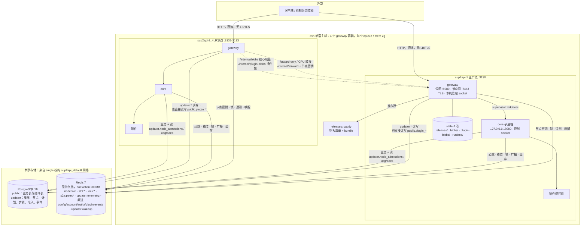
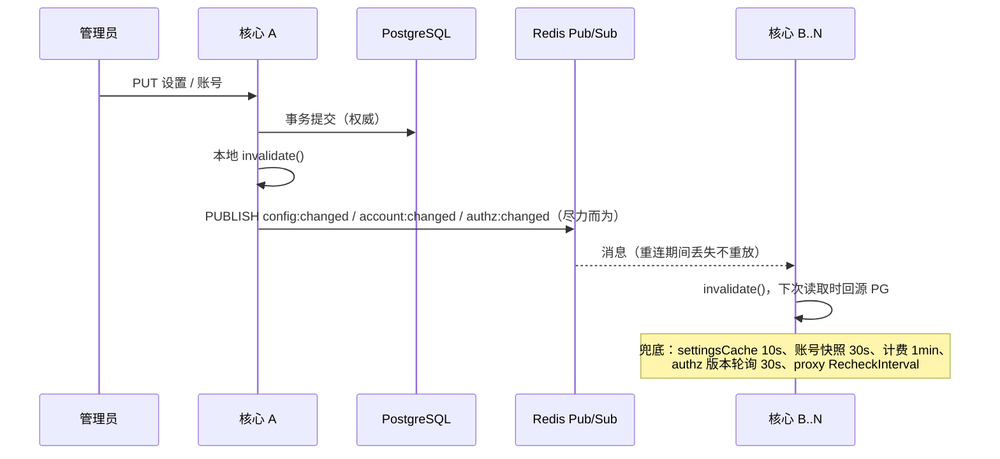
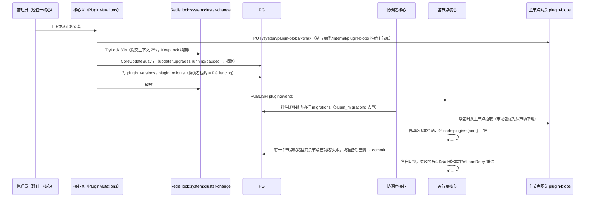
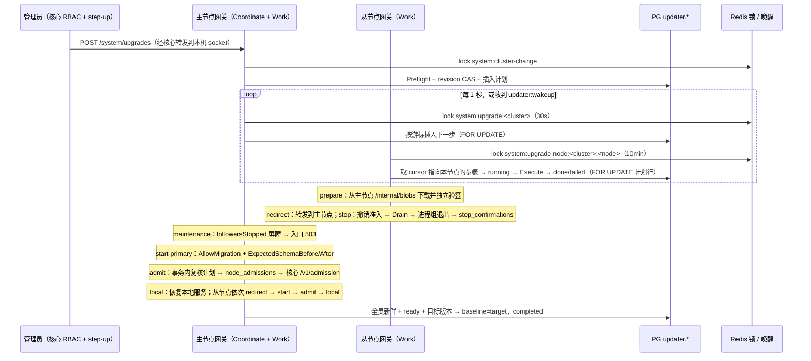
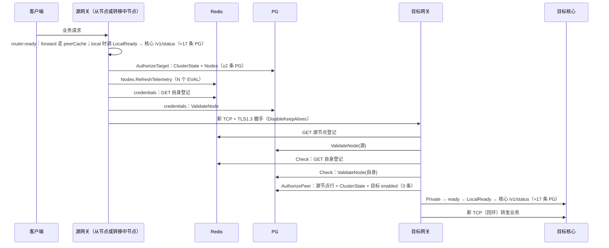
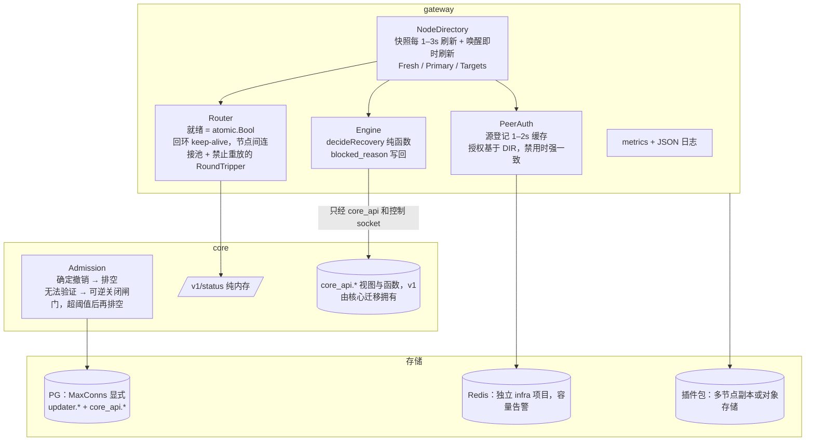

# 06 · 整体架构与多节点交互审计

日期：2026-10-04。分支 `feat/next-platform`（HEAD `d61dd3e5a`）。审计人：agent team「架构 / 多节点」成员。
性质：只读审计，没有改源码，没有执行 git 写操作，也没有连接 ovh 或任何远程环境。

范围：`next/server/internal/{cluster,updater,background,job,event,config,app,deps,core,store}`、`next/gateway`（全部）、`next/runtime-contract`、`next/deploy`（gateway/ovh、single、docker）、`next/Dockerfile`，以及上述模块之间的同步协议实现。
对照的真相源：`ARCHITECTURE.md`、`MULTINODE-SYNC-PROTOCOL.md`、`GATEWAY-MANAGED-UPDATES.md`、`HANDOVER-2026-10-02-MULTINODE.md`、`HANDOFF-2026-10-03.md`、`CONTRACTS.md`（§7、§27、§33–§39），以及 `audits/2026-10-01`、`audits/2026-10-02` 两轮历史记录。

---

## 0. 总评

**结论：控制面的正确性设计扎实，数据面的可用性与性能被控制面"绑"住了。**

做得好的地方：

- **升级状态机有持久化，可以续跑**：`primary-first-v1` 的步骤、停止确认、准入都以 PG 为准，Redis 锁只管"谁在执行"。锁一丢就取消，结果不入账；迟到的结果会被 `late_result` 吸收。准入事务对计划行、集群行加 `FOR SHARE` 复核，Pause/Admit 竞态已经修掉（`engine.go:903-935`）。
- **迁移只跑一次，有三重保障**：只有主节点持有 `AllowMigration`；PG advisory 迁移锁之内会复核"已应用前缀 + 校验和"（`managed_checks.go:53-123`）；迁移前要求所有从节点在当前 boot 下给出与本计划绑定的真实停止确认（`engine.go:565-601`）。
- **签名与制品校验**：Ed25519 签名覆盖原始 payload 字节，校验逐文件 sha256、大小、权限；解包时拒绝链接、特殊文件和未声明的文件；不跟随重定向；从节点自己再验一遍签名（`release/manager.go`）。
- **节点间鉴权**：每节点一份可复用密钥，续期和注销都用 Lua 先比对再改；节点密钥不会进入核心或插件的环境（`supervisor.go:161-173`）；公网入口会清掉所有 `X-Sub2api-*` 头。
- **多节点下的业务计数都基于 Redis TIME**：并发槽、账号限额（`account/limiter.go:160-189`）、粘性会话都放在 Redis；缓存失效走"广播 + TTL 兜底"（设置 10s、账号 30s、计费 1min、权限 30s）。
- 本轮在 Windows 上 `go build`、`go vet`、`go test -short` 全部通过（见 §1）。

主要问题（细节见 §4）：

1. **P0｜PG 短暂抖动就能让全集群核心不可逆地排空**：核心的准入看门狗每秒查一次 PG，超时 1 秒；只要报错（不论是"被撤销"还是"查不到"），就把核心置为 `draining`。这个状态不可恢复，只能由网关整个重启核心。
2. **P0｜每个业务请求都同步调一次核心 `/v1/status`**，而 status 在 serving 状态下每次要跑大约 `1 + 2×插件数` 条 PG 查询（现有约 8 个插件，约 17 条）。超时也是 1 秒，超时直接返回 503。
3. **P1｜转发请求同样很重**：节点间每个转发请求的鉴权和授权都直查 PG/Redis（单个转发请求合计约 25 条 PG 查询），每个请求还新建 TCP 连接加 TLS 握手。这正好叠加在"升级期间全部流量汇聚主节点"和"CPU 保护在高负载时转移"两个场景上。
4. **P1｜主节点是控制面单点，却没有切换手段**：主节点身份有两个真相源（网关配置文件里的 `primary_node` 和 PG 的 `updater.clusters.primary_node`）；没有 set-primary 命令，也没有移除节点的操作。插件上传、市场安装、核心升级、冷节点加入都依赖主节点在线。
5. **P1｜网关与核心直接读写对方的表**：网关直接读写核心 `public` schema 的插件表，核心直接读 `updater` schema。两者独立发版，`runtime-contract` 只约束 socket 协议，库表层面没有任何契约。
6. **P1｜可观测性**：没有任何指标；引擎的错误基本都被 `_ =` 吞掉，计划卡住时界面上看不到原因。
7. **P1｜ovh 部署配置**：插件签名校验是关闭的；核心没配可信代理，所有客户端 IP 都是 127.0.0.1，登录限流退化成全局一个桶；PG 连接池没设上限（pgxpool 按宿主 384 核算）。

`next/server` 的体量（plugin 包 1.56 万行、gateway 7.2 千行、单文件 `app.run` 360 行）已经到了该按"装配 / 生命周期 / 托管控制"拆分的时候。`next/gateway` 的 `control/store.go`（1105 行）也混合了五类职责。详见 §6。

---

## 1. 审计中运行的命令与结果

| 命令（Windows，Go 1.27.0） | 结果 |
|---|---|
| `server: go build ./...` | 通过 |
| `server: go vet ./internal/{cluster,updater,background,job,event,config,app,deps,core,store,httpapi}/...` | 通过（`deps` 带 build tag `deps`，没有匹配到包，属正常） |
| `server: go test -short -count=1` 上述包 | 全部 `ok` |
| `gateway: go build ./... && go vet ./...`，外加 `GOOS=linux go vet ./...` | 通过 |
| `gateway: go test -short -count=1 ./...` | 全部 `ok`（localapi 没有测试文件） |
| `runtime-contract: go vet / go test` | 通过（没有测试文件） |

需要说明：本机没有 `TEST_DATABASE_URL`，PG/Redis 用例全部 SKIP。被跳过的用例包括 gateway control 包 20 个 `TestPostgres*`，以及 cluster/app/core 包的 `TestLockerRealRedis`、`TestManaged*`、`TestCoreUpdateBusy` 等，合计 30 余个。因此本轮"通过"只能证明编译和纯逻辑没问题，**不能代替**第 2 轮验证记录中的 Linux `-race` 与真实三节点结果。验证记录 §5、§8 **没有覆盖"服务期间 PG 断连"这个场景**，这正是下面 P0-1 的触发条件。

---

## 2. 当前架构

### 2.1 组件与数据流

### 2.2 职责划分（按代码实际）

| 层 | 实际职责 | 关键实现 |
|---|---|---|
| 外壳（gateway） | 公网入口与路由（local / forward / maintenance / candidate）、节点鉴权、制品下载验签、核心进程监管、升级状态机、CPU 保护、插件包存储（只有主节点） | `cmd/sub2api-gateway/main.go`、`internal/{proxy,peer,release,supervisor,control,pluginblob}` |
| 控制面 | 共有三套：① 升级控制面在网关（`updater` schema + Redis 锁）；② 插件发布控制面在核心（`plugin_rollouts`，PG 协调者租约）；③ 准入：网关写 `node_admissions`，核心读后自我把关 | `control/engine.go`、`plugin/rollout`、`app/managed*.go` |
| 数据面 | 核心 HTTP、网关流水线、计费、异步任务；插件经 gRPC 调用 | `server/internal/{gateway,billing,usage,...}` |
| 集群原语 | Redis 节点注册、redsync 锁、Pub/Sub、并发槽 | `server/internal/cluster` |
| 契约 | 网关和核心之间的控制协议 2、清单格式、锁名、`locklease.KeepLock` | `runtime-contract` |

### 2.3 启动与关闭顺序（实际）

- **网关启动**（`main.go:98-319`）依次是：读配置 → PG 连接池 → `EnsureSchema`（advisory xact 锁 + 幂等 DDL）→ supervisor 进程锁（发现旧进程就拒绝启动）→ TLS → Redis → `peer.Maintain`（失败不退出，留在维护态）→ peer 续期协程 → peerCache 每 3 秒轮询 → router / LocalRuntime → 三个监听器 → 在 `system:upgrade-node:<node>` 锁内同步执行 `Recover`（最长 10 分钟）→ `engine.Run`。
- **网关关闭**（`main.go:320-338`）：路由切到 maintenance → `supervisor.Terminate`（SIGTERM 给核心，最多 150 秒）→ 关闭三个 server → 注销 peer。
- **核心（托管模式）**（`managed.go:294-381`）：先只开控制 socket，处于 candidate 状态 → 收到 Prepare 后执行 `run()`（迁移或只读校验 → Redis → 集群 → 服务 → HTTP 监听，请求闸门默认关闭）→ 进入 prepared → 收到 Admission 后进入 serving，打开闸门并启动后台任务 → 收到 Drain 后不可逆地进入 draining → drained → 收到 Shutdown 退出。
- **依赖注入**：`app.run` 手工装配 30 多个服务，通过 `onClose` 栈逆序关闭。思路清楚，但函数有 360 行；托管 / 非托管两条路径交织在同一个函数里（`managed == nil` 分支 8 处）。

---

## 3. 关键流程时序

### 3.1 配置变更传播（以账号、计费、网关设置为例）

判断：PG 是权威，Redis 只负责加速，周期性复核兜底，**正确**。代价是丢一条消息时，权限撤销最多延迟 30 秒才在其他节点生效（P2-11）。

### 3.2 插件更新（§36：按节点独立切换，迁移只执行一次）

### 3.3 核心升级（primary-first-v1）

### 3.4 节点间转发请求的鉴权与授权（每个请求都走一遍）

### 3.5 锁的使用点与第二重保护（核实）

| 锁 | 位置 | 第二重保护 | 评价 |
|---|---|---|---|
| `usage:reconcile` | `usage/reconcile.go:168` | `FOR UPDATE SKIP LOCKED` 加租约、账本幂等键 | 安全 |
| `job:{p}:{j}:{slot}` | `job/job.go:306` | 唯一索引 `plugin_job_runs_slot_uniq` | 安全 |
| `job:...:manual` | `job/job.go:371` | 无（文档明确接受） | 可接受 |
| `events:{plugin}` | `event/delivery/worker.go:141` | 游标 CAS，至少一次投递 | 安全 |
| `jobs:retention` / `events:retention` | 各自的 `retention.go` | 工作本身幂等 | 安全 |
| `plugins:builtin` | `app/builtin.go:48,112` | rollout 协调者租约 | 安全 |
| **`system:cluster-change`** | `cluster/mutation.go:32`、`gateway control/store.go:742` | 双方只在拿锁后读一次对方的表，**写入不在同一个 PG 事务里互斥** | 见 P2-1，未登记在 §27.2 |
| `system:upgrade:<c>` / `system:upgrade-node:<c>:<n>` | `engine.go:64,66` | 计划行 `FOR UPDATE`、游标 CAS、`late_result` | 安全，未登记在 §27.2 |
| `system:node-registration:<c>:<n>` | `store.go:755-767` | Redis `SETNX` + Lua 比对 boot | 安全，未登记在 §27.2 |
| 插件锁 `plugin:{key}:*` | `grpcruntime/lock.go:76` | 由插件作者负责（§27.4） | 契约清楚 |

---

## 4. 风险与问题清单

工作量：S ≤ 0.5 天；M 1–2 天；L 3–5 天；XL > 1 周。

### P0

#### P0-1 准入看门狗把"PG 暂时查不到"当作"准入被撤销"，全集群核心会不可逆地排空

- **位置**：`server/internal/app/managed.go:260-291`（`watchAdmission`：每秒一次，`checkCtx` 超时 1 秒，第 278 行；任何 `err` 都会触发 `drainLocked`，第 284-287 行）；`server/internal/app/managed_checks.go:204-216`（`verifyLiveAdmission` 把 `QueryRow` 错误原样返回）；`managed.go:239-258`（draining 状态不可逆）。
- **场景**：PG 主从切换、重启、`max_connections` 打满、网络抖动、长事务锁表，只要持续超过 1 秒。
- **后果**：4 个核心几乎同时进入 draining，已建立的请求和 WebSocket 被切断（1012），新请求返回 503。网关随后在 `Work → Recover → startStable` 中整体重启核心：插件进程重启、schema 重新校验、准入重做。一次 1 秒的 PG 抖动会放大成数十秒的全集群中断，并伴随批量插件重启。ARCHITECTURE §2.3 写的是"连续 15 秒失联才自我隔离"，与代码不符。验证记录只测过 Redis 断连，没测过 PG 断连。
- **改法**：区分两种结果。① **确定撤销**：查询成功但行不匹配，才走不可逆排空。② **无法验证**：查询报错或超时，只关闭闸门、暂停后台领取（可逆），等 PG 恢复后自动重新打开；如果持续时间超过可配置的阈值（建议 30–60 秒，并大于 `Registry` 的 15 秒自我隔离），再升级为排空。`requestGate` 已有 `open()`，可以直接复用。补一个"服务期间切断 PG 5 秒"的 realcore 用例。
- **工作量**：M。

#### P0-2 热路径上每个请求都同步调用核心 `/v1/status`，status 每次执行约 17 条 PG 查询，1 秒超时直接 503

- **位置**：`gateway/cmd/sub2api-gateway/main.go:259-267`（`LocalReady` 每次调用都执行 `rt.Status`，超时 1 秒）→ `gateway/internal/proxy/router.go:147-149, 169`（Public 每个请求调一次 `ready`）、`router.go:208`（Private 转发接收端再调一次）→ `server/internal/app/managed.go:90-97`（serving 时执行 `check`）→ `server/internal/app/app.go:410-415` → `server/internal/app/managed_checks.go:221-306`（`approvedPluginsReady`：1 条查 `plugins`，每个启用的插件再各查 `plugin_versions` 和 `plugin_permission_grants` 1 条）。`/readyz`、`/healthz` 走的也是这条路径。
- **场景**：任何业务流量。约 8 个启用插件时，每个请求约 17 条 PG 查询，外加一次 unix socket 往返。`localapi` 用默认 Transport，`MaxIdleConnsPerHost=2`，高并发时会反复建连。
- **后果**：PG 的 QPS 被放大约 17 倍以上，挤占计费和任务事务使用的连接池；PG 稍慢（超过 1 秒）时所有请求在网关就被 503，哪怕核心本身还能服务。这个问题与 P1-2（连接池无上限）、P0-1 叠加，形成雪崩链：负载升高 → PG 变慢 → 503 → 看门狗排空。
- **改法**：就绪状态改由网关**缓存**。引擎 Heartbeat 已经每 1–3 秒取一次 status，把 `st.Ready` 写进 `atomic.Bool`，`LocalReady` 只读这个原子值；核心侧把 `approvedPluginsReady` 的结果缓存到插件 generation 或 rollout 事件变化时再算（只在 Admission 和 Heartbeat 时重算），`/v1/status` 改为纯内存读。
- **工作量**：S–M。

### P1

#### P1-1 节点间转发请求每次都直查 PG 和 Redis，且每个请求新建 TLS 连接

- **位置**：发送端 `gateway/internal/peer/peer.go:339-357`（`RoundTrip` 每次调 `target` 和 `credentials`）、`gateway/internal/control/store.go:883-899`（`AuthorizeTarget` = `ClusterState` + `Nodes`，`Nodes` 内含 Redis 遥测管道）；接收端 `peer.go:292-323`（Redis 读源节点、PG `Validate` 源节点，第 315 行 `m.Check` 再读一遍自身的 Redis 和 PG）、`store.go:804-879`（`AuthorizePeer` 3 条以上 PG）；`gateway/internal/proxy/router.go:75-77`（`DisableKeepAlives: true`，回环和节点间都是每个请求一个新连接）。
- **场景**：① 升级期间所有从节点把全部流量 forward 给主节点（cpus:2）；② CPU 保护恰好在节点过载时开始转移；③ SSE/WS 之外的大量短请求。
- **后果**：单个转发请求合计约 25 条 PG 查询（含两端的 status）、约 4 次 Redis 读、一次 TLS 1.3 握手；主节点在承载全部流量的同时还要承担这些开销，很容易出现容量悬崖。高 QPS 下回环 TIME_WAIT 堆积也会耗尽临时端口。
- **改法**：
  1. 引入一个统一的 `NodeDirectory` 组件，由心跳每 1–3 秒刷新快照，供 `AuthorizeTarget`、`AuthorizePeer`、`PeerReady`、`peerCache` 共用；只有节点禁用这类撤销操作才走 PG 强一致检查（禁用会递增 revision 并发唤醒消息）。
  2. 接收端的源节点登记做 1–2 秒的本地缓存（以 boot 和 key 摘要为键），去掉自身的 `Check`（自己的登记由 Maintain 维护）。
  3. 防重放问题用"不复用连接 + 去掉 `GetBody`"之外的办法解决：保留 keep-alive，同时让 Transport 对业务请求禁止重试（net/http 只对幂等方法或没有 body 的请求在复用连接上重试，可以通过给 GET 加 `X-Idempotency-Key` 之外的显式包装 RoundTripper 拦截 `ErrServerClosedIdle` 一类错误）。或者至少对回环核心改用 unix socket 或 keep-alive，因为回环没有半写重放的风险。
- **工作量**：M–L。

#### P1-2 PG 连接池没有上限：ovh 上每个池最多 384 连接，远超 PG 的 `max_connections=100`

- **位置**：`server/internal/store/db.go:27-33`（`pgxpool.ParseConfig` 没有设置 `MaxConns`）；`gateway/cmd/sub2api-gateway/main.go:104`（`pgxpool.New` 同样没有设置）；`deploy/gateway/ovh/compose.yml:26`（DSN 里没有 `pool_max_conns`）。pgxpool 的默认值是 `max(4, runtime.NumCPU())`，而 `NumCPU` 按亲和性计算，`cpus: 2` 的配额并不会让它变小（ovh README 也写明节点能看到 384 核）。
- **场景**：4 个核心池加 4 个网关池，再加插件的 `MaxConns=1` 池；遇到突发流量，或 P0-2、P1-1 带来的查询放大。
- **后果**：PG 报 `too many clients`，触发 P0-1 的排空；单栈 compose 里的 `postgres:16` 使用默认的 100 个连接。
- **改法**：配置层显式设置 `MaxConns`（核心建议 20–30，网关 4–8），并提供 `SUB2API_PG_MAX_CONNS` 环境变量；部署文档写明 `max_connections ≥ Σ池 + 余量`；启动时把池参数打到日志里。
- **工作量**：S。

#### P1-3 主节点身份有两个真相源，没有切换手段，也不能移除节点

- **位置**：`gateway/cmd/sub2api-gateway/main.go:44`（配置 `primary_node`）和 `main.go:268`（把它传给 `LocalRuntime.PrimaryNode`）；`gateway/internal/control/runtime.go:143-150`（`redirectLocked` 以**配置**为准拒绝转发）；`gateway/internal/control/store.go:46-48`（`InitCluster ... ON CONFLICT DO NOTHING`：PG 写入一次后再也改不了）；命令列表 `main.go:76` 里没有 set-primary 或 remove-node；`store.go:233-237`（Preflight 中只要有禁用节点就产生阻塞项）、`engine.go:580-586`（迁移屏障统计所有非主节点，不区分启用状态）。
- **场景**：主节点宿主机或卷永久故障，或者需要下线某个节点。
- **后果**：主节点离线时，核心升级、插件上传和市场安装（`install/upload.go:51` 要求包先推到主节点）、没有缓存的节点冷启动全部不可用；要切换主节点，必须同时改 4 份配置、手写 SQL 改 PG、再重启所有网关，两边不一致时从节点会拒绝转发。被禁用的"死节点"会永久阻塞所有后续升级，只能靠手写 SQL `DELETE`。GATEWAY 文档 §10 和 MULTINODE §8 说"经本机受控恢复 CLI 修改主节点"，但这个 CLI 不存在。
- **改法**：
  1. 只认 PG 一个真相源：`LocalRuntime` 不再读配置里的 `primary_node`，配置项只在 `init` 时使用。
  2. 新增 `set-primary -node X`：要求没有 running/paused 计划，在 `system:cluster-change` 锁内执行，校验新主节点已有 baseline 制品和插件包，修改 `primary_node` 并发唤醒消息。
  3. 新增 `remove-node -node X`：前提是节点已禁用，并且有停止确认或管理员显式声明"已隔离"；删除节点行，并保留审计记录。
  4. 插件包改为多副本，见 P1-6。
- **工作量**：M。

#### P1-4 网关和核心直接读写对方的表，没有库表契约

- **位置**：网关读写核心的 `public` 表：`gateway/internal/control/store.go:316-361`（`plugins`、`plugin_rollouts`、`plugin_versions`）、`store.go:977-1001`（`plugin_uninstalls`、`plugin_rollout_cleanup`、`plugin_rollout_nodes`）、`store.go:1019-1053`（`ConfirmStoppedCore` **写** `plugin_runtime_nodes` 和 `plugin_rollout_cleanup`）、`store.go:1055-1084`。核心读 `updater` schema：`server/internal/cluster/mutation.go:56-63`、`server/internal/app/managed_checks.go:187-216`。
- **场景**：核心迁移改了插件表的列或状态枚举；网关不随核心升级（要人工滚动），新旧版本长期混跑。
- **后果**：网关的预检和停止清理会静默失效（`to_regclass` 只防得住"表不存在"，防不住"列或语义变了"）。最坏情况是 `cleanup_pending` 永远清不掉，所有升级被阻塞；或者状态名变了导致屏障误放行。`runtime-contract` 只约束 socket 协议，这部分依赖完全隐式。
- **改法**：把跨边界的读写收敛成**由核心迁移拥有的、带版本号的 SQL 视图或函数**，例如 `core_api.plugin_barrier_v1()`、`core_api.confirm_core_stopped_v1(boot)`，网关只调用这些对象，并在 `runtime-contract` 里登记版本号。或者改走核心控制 socket（Status 里带上插件屏障摘要）。反方向，核心读 `updater` 也改成网关拥有的视图 `updater.core_view_v1`。
- **工作量**：L。

#### P1-5 引擎错误被吞掉，没有任何指标，计划卡住时看不到原因

- **位置**：`gateway/internal/control/engine.go:62-66`（`_, _ = e.Locks.WithLock(..., e.Coordinate)` / `e.Work`）、`engine.go:48,59`（`_ = e.Heartbeat`）、`gateway/cmd/sub2api-gateway/main.go:319`（`_ = engine.Run(ctx)`）、`gateway/internal/peer/peer.go:109`（`_ = m.Maintain`）。全仓库没有 prometheus、expvar 或 otel。网关用默认的 `slog`（文本格式，不带 `node_id`、`shell_boot_id`）。
- **场景**：`waiting for fresh follower observations`、`unmanaged live cores block migration`、`waiting for current-boot plan-bound follower stop confirmations`、Redis 登记反复失败等。
- **后果**：计划状态一直显示 running，事件流里没有任何记录，只能登录服务器查 PG 和 Redis。MULTINODE §9 承诺的按类别计数（登记缺失、密钥不匹配、boot 错误……）和 GATEWAY §11 列出的指标都没有实现。
- **改法**：
  1. `Coordinate` 和 `Work` 返回的"等待类"错误写进 `updater.upgrades.blocked_reason`（去重、限频），并在界面上展示。
  2. 网关启动时设置 JSON handler，统一带上 `cluster_id`、`node_id`、`shell_boot_id`、`core_boot_id`。
  3. 加一个最小的 `/metrics`（只在管理 socket 或私网暴露）：请求本地/转发/503 计数、peer 鉴权失败分类、锁续期失败、步骤耗时、PG 和 Redis 错误。
- **工作量**：M。

#### P1-6 上传和首装插件包的唯一权威副本在主节点卷上

- **位置**：`gateway/internal/pluginblob/pluginblob.go:215-271`（`pull` 和 `push` 只对主节点）；`server/internal/plugin/install/upload.go:46-53`（每次安装都要先 `Put` 到主节点）；MULTINODE §6.2。
- **场景**：主节点卷损坏或丢失；主节点离线时安装市场插件。
- **后果**：手动上传的包和首装包丢失后无法恢复（已经拉过的从节点有本地缓存，但不会互相提供）；新节点或空盘节点永远无法加载这些插件。主节点离线期间，所有插件安装（包括市场包）都会失败。
- **改法**：`pull` 失败时改向其他已启用、持有该摘要的节点拉取（授权条件同 `plugin-artifact`）；`push` 改成"写本地并异步复制到至少一个其他节点"，或接入对象存储。市场包安装不应强制依赖主节点在线：先写本机，再尽力复制。
- **工作量**：M。

#### P1-7 ovh 部署的安全与正确性配置

- **位置**：`deploy/gateway/ovh/compose.yml:36`（`SUB2API_PLUGIN_VERIFY_SIGNATURES: "false"`）；同一文件的 env 块里没有 `SUB2API_TRUSTED_PROXIES`（对比通用版 `deploy/gateway/compose.yml:17` 已设置 `127.0.0.1/32`）；`compose.yml:61-77`（`0.0.0.0:3130-3133` 直接对公网暴露 HTTP，前面没有 LB 和 TLS）。
- **后果**：
  1. 插件签名校验关闭，不能再说"节点加载前重新验证签名"。
  2. 核心 `engine.SetTrustedProxies([])` 不信任网关传来的 XFF，`c.ClientIP()` 永远是 127.0.0.1：登录限流（`iam/auth.go:37-58`，按 email 加 IP）的 IP 维度退化成全局一个桶，使用记录、审计中的客户端 IP 全部失真。
  3. 没有 LB，单个网关宕机时对应端口直接不可用；管理员凭据和 API Key 以明文经公网传输。
- **改法**：补上 `SUB2API_TRUSTED_PROXIES: 127.0.0.1/32`；用正式插件签名密钥并开启校验；前面放 Caddy 负责 TLS 和按 `/readyz` 做健康检查，节点端口只绑定回环（与 `deploy/gateway/README.md:57` 的建议一致）。
- **工作量**：S（配置），加 M（TLS 和 LB 上线）。

### P2

| # | 问题 | 位置 | 后果 | 改法 | 工作量 |
|---|---|---|---|---|---|
| P2-1 | `system:cluster-change` 锁没有 fencing：插件变更提交与核心计划创建，在 Redis 卡顿导致丢锁时可能交错 | `server/internal/cluster/mutation.go:31-50`；`gateway/internal/control/store.go:363-433, 742-754` | 双方都是"拿锁 → 读对方的表 → 稍后写自己的表"，丢锁后正在提交的写仍可能落库，出现计划已创建而插件 rollout 也已开始的状态 | 互斥判断下沉到 PG：双方在各自写入事务里对 `updater.clusters` 行 `SELECT … FOR UPDATE`（或使用同一个 `pg_advisory_xact_lock`），Redis 锁降级为只负责减少冲突；同时把该锁登记进 CONTRACTS §27.2 | M |
| P2-2 | 核心发布目录和 bundle 没有 GC | `gateway/internal/release/manager.go:162-258`（只写不删） | 每个节点的 `releases/` 和 `blobs/sha256` 只增不减（ovh 已有 0.1.0–0.1.23，共 21 个版本），磁盘持续增长 | 只保留 current、previous、活动计划目标和 baseline，其余定期清理 | S |
| P2-3 | supervisor 发现 `Starting=true` 时拒绝启动，容器会陷入重启循环 | `gateway/internal/supervisor/supervisor.go:73-76` | 如果网关在 persist 和 `cmd.Start` 之间被 OOM 或 SIGKILL（窗口很小），容器会一直 `restart: unless-stopped` 重启，必须人工删除 `process.json`。容器的 PID 命名空间已经保证没有孤儿进程 | 能识别出新 PID 命名空间时（自己是 PID 1，或 `/proc/1` 就是自己），把 `Starting` 视为已失效；或者给出明确的 `reconcile` 命令 | S |
| P2-4 | `DisableNode` 不在同一个事务里，且通知发得过早 | `gateway/internal/control/store.go:779-800` | `enabled=false` 与撤销准入分成两条语句，中间有窗口；`NotifyUpgrade` 在撤销准入之前就发出 | 合并成一个事务，提交后再发通知 | S |
| P2-5 | 协议常量重复、魔法数字散落 | `gateway/internal/peer/peer.go:21` 与 `control/types.go:99`（同一个 peer 协议定义了两个常量）；网关代码中 `20*time.Second` 出现 14 次（`telemetryTTL` 已经存在） | 只改一处时节点登记会被拒；新鲜度阈值难以统一调整 | `PeerProtocol = peer.Protocol`；定义 `freshness = telemetryTTL`，统一由 `NodeDirectory.Fresh(n)` 判断 | S |
| P2-6 | 引擎恢复逻辑嵌套过深 | `gateway/internal/control/engine.go:681-796`（`Recover` 115 行，4–5 层嵌套） | 难以审查，分支组合难以穷举测试 | 拆成纯函数 `decideRecovery(plan, node, primary) Action`（表驱动测试）加执行器 | M |
| P2-7 | `control/store.go` 有 1105 行，混合五类职责 | 同一文件内 | 改一处牵动全局 | 拆为 `nodes.go`（登记、心跳、目录）、`plans.go`（预检、创建、动作、回滚）、`peerauth.go`、`corebridge.go`（所有触碰 `public.*` 的 SQL 集中放这里，为 P1-4 铺路）、`releases.go` | M |
| P2-8 | 两套 redsync 包装 | `server/internal/cluster/locker.go` 与 `gateway/internal/control/lock.go` | 超时因子、丢锁语义可能逐渐漂移（网关版用的是 redsync 默认超时因子） | 把 `Locker` 下沉到 `runtime-contract/locklease`（或新建 `next/pkg/redislock`），两边共用 | S–M |
| P2-9 | 网关配置的未知字段被静默忽略 | `gateway/cmd/sub2api-gateway/main.go:364` | 拼错的 `peer_auth_kye` 会被当作未配置，退回自动密钥 | 用 `json.Decoder` 加 `DisallowUnknownFields` | S |
| P2-10 | 共享 Redis 无持久化、`noeviction` 200MB，并且属于另一个 compose 项目 | `deploy/single/compose.yml:33`；ovh 通过外部网络 `sup2api_default` 引用 | 内存打满时所有写操作失败（槽位、锁、登记），等于全集群不可用；对 single 项目执行 `down` 会连带托管集群的 PG 和 Redis 一起停掉 | 把 PG 和 Redis 迁入托管项目，或单独建一个 infra 项目；按预估容量放宽内存并接入告警；锁和登记相关的 key 与缓存分库 | M |
| P2-11 | 权限撤销跨节点生效依赖 Pub/Sub，消息丢失时兜底是 30 秒 | `server/internal/authz/service.go:61-63` | 敏感权限撤销在其他节点最多延迟 30 秒 | 兜底周期缩短到 5 秒（只查版本号，开销很低） | S |
| P2-12 | 网关镜像没有 HEALTHCHECK；核心 Dockerfile 有重复的 COPY | `deploy/gateway/Dockerfile`；`next/Dockerfile:70-71` | 网关进程假死时 compose 察觉不到；镜像多一层冗余 | 加 `/livez` 健康检查；删掉重复行 | S |
| P2-13 | 发布私钥存放在生产宿主机上 | `deploy/gateway/ovh/prepare.sh:45-47, 93` | 与 CONTRACTS §33 "发布私钥不进入运行节点"相悖；宿主机被攻破后可以签发任意核心版本 | 在 CI 或离线机器上签名，生产只放公钥；至少在文档里记录这一例外 | M |
| P2-14 | 没有防降级门槛 | `gateway/internal/control/store.go:279-304`（`Compatibility` 只检查 schema 链和 build 是否不同） | 同 schema 的旧版本（例如 0.1.23 → 0.1.19）可以当作"升级"执行，与 GATEWAY §4.1 的"防降级"描述不符 | 要么明确允许并修改文档，要么要求 `semver(target) > semver(baseline)`，降级只走 rollback | S |
| P2-15 | 网关周期性查询偏多且重复 | `engine.go:40-51, 59, 98-185`（每秒和每 3 秒各一次 Heartbeat，每次含 `Nodes`、`ClusterState`、`ValidateNode` 和 2 次 status）；`main.go:232-250`（peerCache 每 3 秒再查一次 `Nodes`） | 4 个节点合计每秒数十条 PG 查询，外加核心 status 的放大 | 由 `NodeDirectory` 统一刷新，Heartbeat 只取一次 status | S（在 P1-1 之后） |
| P2-16 | 步骤超时固定 10 分钟且不可配置 | `engine.go:36-38` | 超长迁移会反复超时再续跑（核心不会被杀，可以续上），但每 10 分钟会产生一次"重新执行"的噪音事件 | 改为可配置，按步骤类型给预算；超时只记事件，不重入 | S |

---

## 5. 文档与代码不一致

| # | 文档说法 | 代码或部署实际 | 处理建议 |
|---|---|---|---|
| D1 | ARCHITECTURE §2.1 写"所有节点对等，没有主节点"；§2 全章没有提到网关层 | 有固定主节点，负责升级组织、核心制品分发和插件包存储；所有入口都经过网关 | 重写 §2：加入网关、控制面和主节点职责，链接到 MULTINODE |
| D2 | ARCHITECTURE §2.3 写"连续 15 秒无法与 Redis/PG 通信才自我隔离" | 托管模式下 PG 失败 1 秒就不可逆排空（P0-1） | 修代码后同步更新文档 |
| D3 | MULTINODE 文首写"网关托管部署尚未上线" | 2026-10-02 起 ovh 已是 4 个网关托管节点（验证记录 §9） | 更新状态行 |
| D4 | MULTINODE §9、GATEWAY §11 承诺按类别计数和一组指标，日志带 `upgrade_id`、`step_id` 等字段 | 没有任何指标，网关日志不是结构化格式（P1-5） | 实现，或者把这些描述改为"计划中" |
| D5 | GATEWAY §10、MULTINODE §8 说"经本机受控恢复 CLI 修改主节点" | 没有这个命令；配置和 PG 两处都要改（P1-3） | 实现 `set-primary`，或者写出手工 runbook |
| D6 | CONTRACTS §27.2 只列了"七个调用点"，并要求"新增调用点必须登记第二重保护" | 漏了 `system:cluster-change`（核心和网关）、`system:upgrade:*`、`system:upgrade-node:*`、`system:node-registration:*`，以及 `builtin.go:112` 的升级路径 | 补登记，并写明各自的第二重保护（见 §3.5） |
| D7 | CONTRACTS §7 的 Redis key 表 | 缺少 `s2a:peer:{c}:node:*`、`updater:telemetry:*`、频道 `updater:wakeup:*`、WebSocket 槽 `ws:*` | 补全 |
| D8 | CONTRACTS §33 写"发布私钥不进入运行节点" | ovh 的 `prepare.sh` 在生产宿主机上生成并保存私钥 | 见 P2-13 |
| D9 | GATEWAY §4.1 写"防降级门槛"，§4.4 写"GC 只保留被引用的版本" | 两者都没有实现（P2-14、P2-2） | 在 GATEWAY 文首的"当前落地"处注明 |
| D10 | MULTINODE §6.2 写"市场安装由各节点自己下载" | 安装流程仍然强制先把包推到主节点（`upload.go:51`），主节点离线时市场安装同样失败 | 在 §8 故障规则中写明，或按 P1-6 修改 |
| D11 | `deploy/gateway/README.md:57` 写"生产反向代理指向回环端口并检查 `/readyz`" | ovh 直接以 `0.0.0.0` 暴露 HTTP，前面没有 LB | 见 P1-7 |
| D12 | HANDOVER-2026-10-02 仍使用 `next/shell/*` 路径 | 目录已改名为 `next/gateway` | 在文首加一句改名说明（历史文件，不改正文） |

---

## 6. 架构评审：边界、臃肿与解耦

### 6.1 模块边界

- **控制面、数据面、外壳三者的边界基本清楚**：网关不解析业务、不调用插件、不记账；核心不管进程生命周期，也不执行版本切换。
- **边界被三处打穿**：
  1. 库表双向直连（P1-4）。
  2. 就绪状态走同步 RPC 加 PG 查询（P0-2），把控制面的检查放进了数据面的热路径。
  3. 主节点信息在配置和 PG 两处（P1-3）。
- **准入和"活性"混在一起**：同一个 status 既用于升级屏障（需要强一致），又用于逐请求就绪判断（需要高可用、低延迟），这是 P0-1 和 P0-2 的共同根源。应拆成两个通道：**强一致的准入**（只在 Admission 和 Heartbeat 时校验）和**低延迟的就绪**（网关用原子位缓存，核心状态纯内存）。

### 6.2 next/server 是否过于臃肿

- 单进程装配了 30 多个服务，这符合"核心是一个可替换单元"的设计，**不建议拆成多个进程**。
- 但代码组织应该拆分：
  - `app.run`（360 行）拆成 `app/wire`（装配，返回 `*Services`）、`app/phases`（storage → cluster → services → background → http，每个阶段一个函数，逆序关闭）、`app/managed` 独立成包（目前 `managedCore` 和 `run` 通过 `managed.mu` 修改彼此的字段，`app.go:401-420`）。
  - `internal/plugin`（1.56 万行）已经有子包，规模尚可。
  - 体量大的是 `internal/gateway`（7.2 千行），它属于业务模块，不在本报告范围。
  - `internal/deps` 只是 build tag 依赖钉，可以保留。
  - `internal/updater` 只是一个转发桥，职责合理。
- **可以合并的部分**：`cluster.Locker` 与 `gateway/control.RedisLocks`（P2-8）；`peer.Protocol` 与 `control.PeerProtocol`（P2-5）；主节点优先的排序代码在 `store.go:254-265` 和 `store.go:703-714` 各写了一遍。
- **应该拆出的部分**：网关 `control` 包里的"节点目录与新鲜度"应成为独立组件 `NodeDirectory`，它同时服务 router、peer 授权、引擎和 offload，是消除重复查询的关键。

### 6.3 配置体系

- 有两套：网关用 JSON 文件加 3 个环境变量覆盖；核心用约 30 个环境变量，由网关注入。网关把自己的 `os.Environ()` 原样透传给核心（只过滤掉节点密钥），于是 compose 的 env 块实际上同时在配置网关和核心，**谁消费哪个变量并不直观**（例如 `DATABASE_URL` 和 `SUB2API_DATABASE_URL` 同时存在）。
- 建议：
  1. 网关配置中增加显式的 `core_env` 白名单，或者按前缀 `SUB2API_` 透传并写进文档；
  2. 核心 `config.Load` 启动时打印生效配置（脱敏）；
  3. 网关 JSON 严格解码（P2-9）；
  4. PG 池、超时等运维参数统一纳入配置（P1-2、P2-16）。

---

## 7. 多节点一致性逐项核对

| 主题 | 实现 | 判断 |
|---|---|---|
| 节点发现与心跳 | 核心：Redis `node:live` ZSET，5s/15s，使用 Redis TIME；网关：PG `updater.nodes` 只在变化时写，Redis 遥测 20s TTL，带 boot 和顺序号 | 正确；网关节点目录被多处重复读取（P2-15） |
| 主节点判定 | 固定主节点，存在 PG，不做选举 | 设计如此；缺少切换和移除手段（P1-3） |
| 配置与插件状态同步 | PG 权威，Redis 广播，TTL 和对账兜底；插件 rollout 使用 PG 协调者租约，每节点各自切换 | 正确（§3.1、§3.2） |
| 缓存失效 | 本地失效、广播、周期复核三者都做 | 正确；权限兜底 30s 偏长（P2-11） |
| 限流与粘性 | 账号 rpm/tpm/tpd/spm 用 Redis Lua 加 Redis TIME；粘性存 Redis，200ms 超时后放行 | 正确；粘性在 Redis 故障时降级为不粘，属于有意设计 |
| 并发槽 | 每次获取都有独立 lease，丢失即取消；回收时先确认自己存活 | 正确（历史 F03、F04 已修复） |
| 分布式锁 | 见 §3.5 | 除 `system:cluster-change` 外都有第二重保护（P2-1） |
| 脑裂与分区 | 不存在"两个主节点"的问题（主节点不是选出来的）；节点与 Redis 断开时，槽位 fail-closed，入口 503；与 PG 断开时，**排空**（P0-1） | 需要修复 P0-1 |
| 节点重启 | 网关新 boot 先读计划；supervisor 拒绝孤儿进程；`Starting` 状态会导致重启循环（P2-3） | 基本正确 |
| 版本混跑 | 核心：升级期间从节点只转发，不混跑；CPU 保护只转给同一 release 的节点；网关：通过 `telemetry_boot_id` 兼容旧 boot | 正确 |

---

## 8. 历史问题复核

- 2026-10-01 审计中 F03、F04（槽位续期、丢失后反馈）、F11（RPM/SPM 原子化）、F17（停止宽限）：已修复（`cluster/slots.go:127-176`、`account/limiter.go:160-189`、compose `stop_grace_period: 180s`）。
- HANDOVER-2026-10-02 §8 的 Pause/Admit 竞态：已修复（`engine.go:497-516` 加上 `planAuthorizesTx`）。
- HANDOFF-2026-10-03 §2：问题 1（内置插件升级门槛）已修复（`app.go:295-303` 增加 `CoreUpdateBusy`）；问题 4（日志轮转）已修复（ovh compose 加了 `x-logging`）；问题 6（升级审计）已修复（`updater/http.go:68-98`）。

---

## 9. 目标架构建议

要点：

1. **准入与就绪分离**（P0-1、P0-2）。
2. **NodeDirectory 作为网关里唯一的集群视图**（P1-1、P2-5、P2-15）。
3. **主节点只在 PG 一处登记，并提供可操作的切换和移除**（P1-3），插件包去单点（P1-6）。
4. **跨进程的库表访问收敛成带版本号的契约**（P1-4），`runtime-contract` 同时登记 socket 协议版本和 `core_api` 版本。
5. **可观测性内建**（P1-5）。
6. 部署：TLS/LB 前置，PG/Redis 独立成 infra 项目，连接池有上限，签名在离线环境完成（P1-7、P1-2、P2-10、P2-13）。

---

## 10. 分批计划

| 批次 | 内容 | 预计 | 验收 |
|---|---|---|---|
| 第 1 批：止血（建议先于下一次核心发版） | P0-1 看门狗分级；P0-2 就绪缓存与 status 去 PG；P1-2 PG 池上限；P1-7 补 `TRUSTED_PROXIES` 并开启插件签名校验（配置项） | 2–3 天 | 新增 realcore 用例："serving 期间切断 PG 5 秒，核心 boot 不变，闸门恢复"；压测确认每请求 PG 查询数从约 17 降到 0；确认 ovh 的 `pg_stat_activity` 连接数有上限 |
| 第 2 批：转发链路与观测 | P1-1 NodeDirectory、peer 缓存、连接复用；P1-5 `blocked_reason`、JSON 日志、`/metrics`；P2-5、P2-15 | 4–6 天 | 升级期间主节点在 4 倍流量下的 p99 延迟与 PG QPS；人为制造一个阻塞项，界面能显示原因 |
| 第 3 批：控制面可运维性 | P1-3 `set-primary` / `remove-node`，主节点只认 PG；P1-6 插件包多副本；P2-3、P2-4、P2-2、P2-16 | 4–5 天 | 演练"主节点卷丢失 → 切换主节点 → 新节点加入 → 安装插件 → 升级核心"全流程 |
| 第 4 批：契约与重构 | P1-4 `core_api` 视图与函数；P2-1 互斥下沉到 PG；P2-6、P2-7、P2-8 拆分重构；`app.run` 分阶段；D1–D12 文档修订 | 1–2 周 | 网关单测里不再出现 `public.` 表名；CONTRACTS §27.2、§7 补全；ARCHITECTURE §2 重写 |
| 第 5 批：部署收敛 | P1-7 TLS 和 LB；P2-10 infra 独立；P2-12、P2-13 | 2–3 天 | ovh 端口只绑定回环；Caddy 健康检查 `/readyz`；在离线环境签名 |

（开发阶段可以不考虑兼容：第 4 批的 `core_api` 可以与网关一次性切换，旧的直连 SQL 直接删除，不需要过渡期。）
