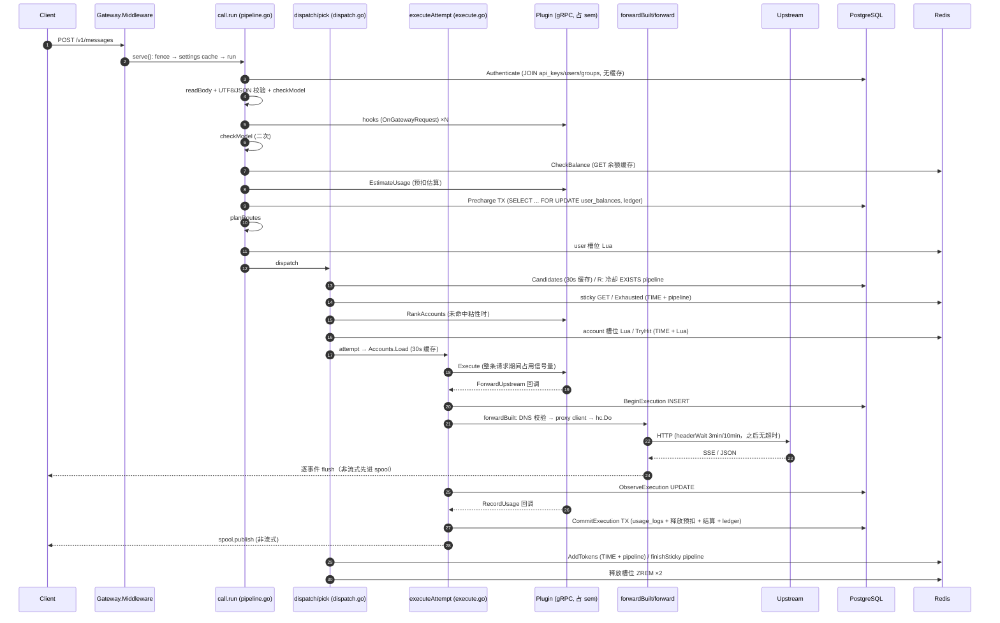

# 07 · API 请求转发链路（数据面）审计

- 日期：2026-10-04　分支：`feat/next-platform`（HEAD `d61dd3e5a`）
- 范围：`next/server/internal/{gateway,account,apikey,group,usage,billing,usagerules,tokenizer,proxy,ccgateway,httpapi}`，`cluster/slots.go`，`plugin/grpcruntime` 的调用侧（`adapters.go` / `execute.go`）。
- 方式：只读；对照 `CONTRACTS.md` §18 / §24 / §25 / §31 / §35、`PLUGIN-EXECUTES-CORE-RECORDS.md`、`OPENAI-RESPONSES-WEBSOCKET.md`，以及 sub2api 原版（`backend/internal/service`）与 new-api（`relay/`、`middleware/distributor.go`、`controller/relay.go`）。
- 行号以本次 HEAD 为准。

---

## 0. 总评

**结论：正确性底子扎实，容量和健壮性有硬伤。** 核心原则「插件执行、核心记录」落实得很严：插件碰不到归属和金额，usage 有幂等键，失败后的观察能恢复，流开始后一律不重试，价格全程用 `decimal`。这几块没发现会造成重复扣费的路径。

但数据面有三类问题，正式放量前必须处理：

1. **容量天花板（P0）**：全部内置插件都走 `platform.execute.v1`。`Execute` 这个一元 RPC 在**整条请求（包括整段 SSE）期间**一直占着插件实例的调用信号量（默认 64）。结果是单个插件、单个节点最多只能同时跑 64 个请求；这 64 个位还和 `EstimateUsage` / hook / `ClassifyError` 等热路径 RPC 共用，满了以后新请求在预扣阶段就会 300ms 超时，返回 500。
2. **热路径重 I/O**：内置插件的每个请求同步执行约 25 条 PG 语句、3 个事务，其中用户余额行 `FOR UPDATE` 要锁两次；另外还有约 15 次 Redis 往返、一次 DNS 解析、一次未缓存的鉴权 JOIN。同一用户的并发请求会在余额行上排队。
3. **健壮性缺口**：上游流没有空闲超时，WebSocket 回合没有超时，流内 error 事件不会触发冷却，`stick` 规则在账号忙时仍会换号（违反 CONTRACTS §18.1），客户端在最后一个 SSE 事件前断开可以只付输入 token，槽位续租一次失败就会取消本节点全部在途流。

**代码质量**：`call` 是一个约 40 个字段的上帝对象。`forwardBuilt` 里有 5 处 `if execution != nil` 分支，新旧两条执行路径交织在一起。WebSocket 的 `connect` / `dial` 基本是 `dispatch` / `attempt` 的复制品。错误映射散落在 6 处以上。方向见 §4：把 pipeline 中间件化，用 Executor / Sink / Meter / Recorder 四个接口拆开。

**测试**：`go vet` 全部通过。`go test -short` 覆盖的 15 个包全部 ok：gateway / account / usage / billing 四个包中 223 个用例 PASS、85 个 SKIP（需要 PG）。`-race` 跑不了，因为本机 Windows Git Bash 没有 cgo/gcc（`go: -race requires cgo`）。

---

## 1. 请求链路

### 1.1 时序图（HTTP，内置插件 Execute 路径）



### 1.2 函数清单

| # | 步骤 | 函数（文件:行） | 职责 | 耦合 / 备注 |
|---|---|---|---|---|
| 1 | 入口 | `Gateway.Middleware` gateway.go:191 | 在原子路由表上做线性匹配，挂在 `engine.NoRoute`（app.go:383） | 网关请求不经过 gin.Recovery，也不经过 httpapi 的 recover |
| 2 | 服务 | `serve` pipeline.go:96 | 生成 rid、自隔离检查、`settings.get`、分流到 WS 或 HTTP | |
| 3 | 主流程 | `call.run` pipeline.go:130-197 | 鉴权 → body → model → hooks → model → 计费 → 路由 → user 槽 → dispatch | 顺序固定写死，没有中间件抽象 |
| 4 | 鉴权 | `apikey.Authenticate` apikey.go:174 / `lookup` :226 | 4 表 JOIN，加上 `authz.Can`（本地缓存） | 每个请求一次 PG 查询 |
| 5 | 读体 | `readBody` pipeline.go:249 | MaxBytesReader + `io.ReadAll` + UTF-8 和 JSON 校验 | 没按 Content-Length 预分配 |
| 6 | 模型 | `checkModel` pipeline.go:296 / `resolveModelFromPlugin` :353 | path/body/plugin 三种来源，加分组白名单 | 前后各调一次 |
| 7 | 钩子 | `runHooks` hooks.go:390 / `runHook` :408 | 熔断、超时、补丁 | 每次调用都用 `hookID` 做 reflect.DeepEqual（hooks.go:360） |
| 8 | 计费 | `prepareBilling` pipeline.go:386 → `precharge` precharge.go:16 → `billing.Precharge` billing/precharge.go:20 | 价格、计费类型、余额检查、预扣 | 在 user 槽位**之前**执行（P1-6） |
| 9 | 路由 | `planRoutes` routing.go:66 | 原生路由 + 转换路由，WS 和任务两个后置过滤 | 两个 `defer` 过滤器读起来绕 |
| 10 | 用户并发 | `core.AcquireSlot` ports_cluster.go:131 → `cluster.Slots.AcquireLease` slots.go:127 | Redis ZSET 租约 | 没有排队，满了直接 429 |
| 11 | 调度 | `dispatch` dispatch.go:39-138 | 候选、粘性、限流准入、失败切换 | 约 100 行；WS 有一份复制（websocket.go:394） |
| 12 | 选号 | `pick` dispatch.go:155-225 | 粘性优先 → rank 改写 → 优先级 + 加权随机 → 抢槽 | 每次 pick 都调 `exhausted`（2 RTT） |
| 13 | 准入 | `Limiter.TryHit` account/limiter.go:178 | rpm/tpm/tpd/spm 原子准入 | `TIME` 和 Lua 分两次 RTT |
| 14 | 尝试 | `attempt` dispatch.go:291-363 | 加载账号、转换协议、映射模型、构造请求、选执行路径 | |
| 15a | 新路径 | `executeAttempt` execute.go:69-152 | Execute RPC；Forward/Record/Watch 回调；同步提交 | 状态标志 7 个（observed/recorded/sent/...） |
| 15b | 旧路径 | `BuildUpstreamRequest` → `forwardBuilt` dispatch.go:365 | 第三方插件、跨 owner 的 usage 解析 | 和 15a 共用 forwardBuilt，靠 `execution != nil` 分叉 |
| 16 | 发送 | `forwardBuilt` dispatch.go:365-487 | SSRF/DNS、proxy client、header、headerWait、错误分类 | 120 行，5 处执行路径分支 |
| 17 | 分类 | `classify` dispatch.go:502 / `applyClassification` :527 | 冷却、禁用、client 状态码和错误码 | header map 的构造写了 3 份 |
| 18 | 回传 | `forward` forward.go:48 → `forwardSSE` :240 / `forwardJSON` :162 / `forwardJSONConverted` :209 | 回传、转换、usage 累计 | SSE 没有空闲超时 |
| 19 | 用量 | `usagerules.Acc` usagerules.go:38；`usageCapture` usageplugin.go:62 | 声明式规则 + 插件抓取 | 每个事件做 2-3 次 `gjson.ValidBytes` |
| 20 | 收尾 | `finishSticky` sticky.go:400；`countTokens` pipeline.go:720；`TouchLastUsed` | 粘性绑定、TPM 计数、最后使用时间 | |
| 21 | 记录 | `submit` pipeline.go:617 → `Settler.Submit` settler.go:170（旧路径异步）；`CommitExecution` usage/executions.go:46（新路径同步） | | 两种记录模型并存 |
| 22 | WS | `serveWebSocket` websocket.go:62 → `wsSession.run` :142 → `begin`/`connect`/`dial`/`reuse`/`observe`/`finish` | 一个连接多个回合，每回合单独计费 | 调度和尝试逻辑是复制的 |

### 1.3 热路径 I/O 计数（单次成功的流式请求，内置插件、有价格、粘性开、账号设了限流）

| 资源 | 次数 | 明细 |
|---|---|---|
| PG 语句 | ≈25 条，3 个事务 | 鉴权 1；预扣 TX ≈7（INSERT ON CONFLICT、SELECT FOR UPDATE、EXISTS、INSERT precharge、ledger INSERT + UPDATE、event）；BeginExecution 1；ObserveExecution 1；Commit TX ≈15（FOR UPDATE exec、INSERT usage_logs、释放预扣 4、settle 6、UPDATE exec） |
| 余额行锁 | 2 次 | 预扣一次，提交时释放加结算一次。同一用户的并发请求在这里排队 |
| ledger 行 | 3 行 | 预扣扣款、预扣退回、实际扣款（ledger 表增速是请求数的 3 倍） |
| Redis RTT | ≈15 | 余额 GET；user 槽；冷却 pipeline；sticky GET；Exhausted 2；account 槽；TryHit 2；finishSticky 1；AddTokens 2；ZREM 2；CacheBalance ≥2 |
| 插件 RPC | EstimateUsage + hooks×N + RankAccounts? + Execute（长时间占用） | |
| DNS | 每次 attempt 1 次 | `checkUpstreamURL` → `netguard.CheckURL`（netguard.go:73），走代理时也要解析 |

---

## 2. 问题清单

格式：**位置｜触发场景｜后果｜改法｜工作量**（S ≤ 0.5 天，M 1–2 天，L ≥ 3 天）

### P0

**P0-1　Execute 在整条请求期间占用插件信号量，单插件并发上限 64，并拖死其他热路径 RPC**
- 位置：`plugin/grpcruntime/execute.go:193`（`a.i.call(ctx, 0, ...)`）；`adapters.go:41-67`（`i.sem`）；`runtime.go:89-90`（默认 64，`app.go:226` 没有配置）；调用侧 `gateway/execute.go:78-81`。
- 触发场景：anthropic、openai、gemini、relay、volcengine 全部声明了 `platform.execute.v1`（各插件 manifest.json），所以每个请求都走 `executeAttempt`。SSE 流持续几十秒到几分钟，这段时间里 `Execute` 一直没返回。
- 后果：① 单节点对单个插件最多 64 个在途请求。第 65 个请求在 `Execute` 处等信号量，等满 `PrepareTimeout`（2s）后 ctx 被 cancel，返回 plugin_unavailable，然后切换到同插件的其他账号，结果一样，最后回给客户端 503 no_available_account。② 同一插件实例的其他 RPC 也用这个信号量：`EstimateUsage`（tokenizer.go:22，hotpath 300ms）、`ResolveModel`、旧路径的 `BuildUpstreamRequest` / `ClassifyError`，以及同一插件自己声明的 hook 和 rank。hook 和 rank 如果由 guard、moderation 等其他插件提供，则不受影响。64 个长流在跑时，新请求在**预扣阶段**就超时，`prepareBilling` 返回 500 internal。表现是长流一多，全站请求失败。CONTRACTS §31.1 只要求「避免在占用执行并发位的 RPC 内再等同一插件的普通 RPC」，没考虑信号量本身的容量。
- 改法：① Execute 用独立的信号量（或者不限流，只靠核心的账号和用户槽位限制并发），普通 RPC 保留原来的 64；② 或者在 ForwardUpstream 回调进入网络阶段时释放 Execute 的槽位，RecordUsage 时再拿回来（实现更复杂）；③ `MaxConcurrency` 做成可配置，并按 `rate(usage RPC)` 和 `concurrency(execute)` 两个维度分别统计。
- 工作量：S（独立信号量）到 M（按阶段释放）。

### P1

**P1-1　上游流（SSE / 非流式 body）没有空闲超时，卡住的上游会无限期占住槽位**
- 位置：`forward.go:306-385`（`readLine` 没有任何 deadline）；`dispatch.go:438`（`headerWait` 只管到响应头）；`gateway.go:269-274`。
- 触发场景：上游返回 200 和响应头后不再发数据，也不断开（上游负载过高、代理半开连接）。
- 后果：请求挂到客户端自己断开为止。user 和 account 槽位由 `Slots.refresh` 持续续租，一直不释放。账号看起来一直忙，客户端也收不到任何保活数据，常被中间的 LB 在 60–100s 时切断。
- 改法：给 `resp.Body` 包一层 idle-timeout reader：每读到数据就重置计时器，超时则 `ucancel()`，记录为 `upstream_timeout`，同时调用 `ClassifyError(status=0, "stream idle timeout")` 让账号冷却。可选在客户端侧每 N 秒写 SSE 注释 `: ping`（sub2api 有类似保活，见 §5）。超时时长做成网关设置。
- 工作量：S。

**P1-2　WebSocket 回合没有超时，空闲计时器在回合进行中被跳过**
- 位置：`websocket.go:228-231`（`case <-idle.C: if turn != nil { continue }`）；上游读取 `websocket.go:558` 没有 deadline。
- 触发场景：上游 WS 不发终止事件（`response.completed` 等），也不关闭连接。
- 后果：回合一直不结束，user 槽、account 槽以及 per-key 的 WS 槽都被占住；客户端连接还在时也无法发起新回合（只会收到 409 response_in_progress）。
- 改法：每个回合加一个「上游消息间隔」计时器和一个回合最长时长；超时后按上游超时 `finish`，并关闭上游连接。
- 工作量：S。

**P1-3　流内 error 事件不触发 ClassifyError，账号不会冷却（HTTP SSE 路径）**
- 位置：`forward.go:76-81`（`u.StreamError` 只把记录标为失败）；对比 `websocket.go:656-661`，WS 会调 `classify`。
- 触发场景：Anthropic 常见的情况是先返回 200，然后第一个事件就是 `event: error {"type":"overloaded_error"}`；OpenAI 和 Gemini 也有流内 `{"error":...}`。
- 后果：过载或被限流的账号不会冷却，后续请求继续调度到它，失败率持续偏高。同类问题 HTTP 路径不处理、WS 路径处理，行为不一致。
- 改法：① `forward` 结束后如果 `u.StreamError != ""`，用流内 error 的 type/status 合成一次 `ClassifyError` 调用，只应用 `AccountEffect`（不改 action，因为字节已经发出去了）；② 进阶：SSE 先缓冲到第一个非 error 事件再提交响应头（peek），这样开头的 error 还能 failover（sub2api 的做法见 §5）。
- 工作量：S（①）/ M（②）。

**P1-4　`stick` 规则在绑定账号忙或被限流时仍然换号并重新绑定，违反 CONTRACTS §18.1**
- 位置：`dispatch.go:157-183`（粘性分支只处理拿到槽位的情况，否则直接落入普通池）；`dispatch.go:79-84`（TryHit 拒绝后 `continue` 进入普通池）；`dispatch.go:117`（`stick` 只在 attemptFailover 时生效）。契约原文在 CONTRACTS.md:831。
- 触发场景：`on_failure=stick` 的规则命中，绑定账号并发已满或 rpm 用尽。
- 后果：契约要求返回 429，实际却换到别的账号，`finishSticky` 再把绑定改写过去，上游 prompt cache 失效，而 `stick` 本来就是为了保护缓存。
- 改法：`pick` 返回一个结构化结果（`stickyBusy`）；在 `dispatch` 和 WS `connect` 里，如果规则是 `stick` 并且绑定账号可用但忙或被限流，直接 `fail(429)`。可选做法是对 stick 规则先等一小段时间（见 §5 sub2api 的粘性等待）。
- 工作量：S。

**P1-5　客户端在最后一个事件前断开，可以少付 output token**
- 位置：`forward.go:93-97`（客户端断开时只记录已累计的 usage）；新路径 `execute.go:159-165`，客户端 ctx 取消后网络 ctx 也取消，上游读取立即停止（CONTRACTS §31.1 写明是有意为之）。
- 触发场景：Anthropic 的 output_tokens 只在末尾的 `message_delta` 里，OpenAI 的 usage 只在最后一个 chunk 里。客户端读完正文后，在最后一个事件前主动断开。
- 后果：只按 input 计费，甚至完全不计费（OpenAI 的 include_usage chunk 在最后，断开后 `hasUsage=false`，记录不可计费，预扣也被释放）。这可以被稳定利用来少付钱。
- 改法：客户端断开后，**用独立的 ctx 继续把上游读完**（有字节和时间上限，比如 30s / 8MiB，读到的内容丢弃，只累计 usage）；或者用本地 tokenizer 对已经转发的 content delta 估算 output token，作为下限。需要先修改 §31.1 的表述。
- 工作量：M。

**P1-6　预扣（2 次 PG 事务）发生在 user 并发槽和账号类型检查之前**
- 位置：`pipeline.go:172`（`prepareBilling`）早于 `pipeline.go:177`（`planRoutes`）和 `pipeline.go:184`（user 槽位）。
- 触发场景：用户超过并发上限、没有可用账号类型，或者有恶意 Key 高频请求。
- 后果：每个被拒绝的请求都要执行一次预扣事务和一次 settler 释放事务（锁余额行、写 3 条 ledger），把 PG 写入放大成一个 DoS 面，也会拖慢该用户的正常请求。
- 改法：顺序改成 `planRoutes → user 槽位 → prepareBilling`。价格类型的校验（`SupportsBillingType`）可以保留在前面，但不扣钱。
- 工作量：S。

**P1-7　槽位续租一次失败，本节点所有在途请求都被取消**
- 位置：`cluster/slots.go:239-250`（pipeline 出错，或 `n != 1`，或 `remaining <= 0` 时 `lease.cancel(ErrSlotLost)`）；`refresh` 的超时是 `min(TTL/5, 3s)`（:229）。
- 触发场景：Redis 抖动 3 秒（主从切换、慢查询、网络瞬断）。
- 后果：节点上全部 SSE 流、WS 会话和长请求同时中断。网关在 `forward.go:93` 把这类中断记成 `client_canceled`（错误归因），运维会误判为客户端问题。
- 改法：只有在「明确丢失」（`n == 0`）或「剩余租期不足一个续租周期」时才 cancel；网络错误只记 warn，下一个周期重试（租约 TTL 是 5 分钟，有足够余量）。`forward` 用 `context.Cause(ctx) == ErrSlotLost` 来区分并记录 `lease_lost`。
- 工作量：S。

**P1-8　每个请求都要同步完成 3 个 PG 事务、锁 2 次余额行（Execute 路径）**
- 位置：`billing/precharge.go:46-70`；`usage/executions.go:18-25`、`:27-44`、`:46-104`；`usage/settler.go:465-472` 和 `:869-885`（release + charge）。
- 触发场景：所有内置插件的有价请求。
- 后果：吞吐受 PG 延迟和单用户余额行串行化的限制。PG 稍慢时，非流式请求的响应时间会直接加上提交耗时（`spool.publish` 要等提交完成）。同步提交本身是 §31.1 的用户要求，属于设计取舍，但可以优化实现：
- 改法：① `BeginExecution` 合并进预扣事务，或者改成异步批量写入（意图行只用于审计和恢复）；② `ObserveExecution` 和 `CommitExecution` 合并：插件的 RecordUsage 回调到达时一次提交，只有 RecordUsage 超时才写 observation；③ 预扣不再写 ledger，改成 `user_balances.reserved` 列，余额检查用 `balance - reserved`，提交时只写一条 usage ledger，ledger 行数从 3 降到 1；④ `CheckBalance`（Redis）在预扣之前做了一遍重复检查，预扣返回 0 时才需要它。
- 工作量：L（③ 涉及账务模型，需要单独设计）；①② 是 M。

**P1-9　ccgateway 托管模式：每个请求都读 DB、解密、新建 SSH 隧道，并且有 4 分钟硬上限**
- 位置：`ccgateway/client.go:82`（`context.WithTimeout(req.Context(), 4*time.Minute)` 覆盖整个响应 body）；`:83`（每次 `Load` 都 SELECT settings 并解密）；`:91`、`:101`（再查 DB）；`:112` → `remotedocker/http.go:21-51`（ssh 模式下每次请求都做 TCP + SSH 握手）。
- 触发场景：使用 ccgateway 插件的部署。
- 后果：长回复（扩展思考、长代码输出超过 4 分钟）被截断；每个请求多出几百毫秒到数秒的 SSH 握手；高并发时 SSH 连接数暴涨。
- 改法：配置做成带 epoch 失效的进程内缓存；SSH 客户端按配置 revision 做池化复用；4 分钟改成「到响应头的超时」，body 阶段交给 P1-1 的空闲超时。
- 工作量：M。

**P1-10　鉴权每个请求都查一次 PG（4 表 JOIN，无缓存）**
- 位置：`apikey/apikey.go:226-249`；注释 :154-156 说明是为了防止「撤销后缓存回填」而故意不缓存。
- 后果：每个请求固定一次 PG 往返，PG 故障时全站鉴权失败（Redis 余额等还有降级，这里没有）。
- 改法：进程内 LRU（TTL 5–10s），用 `apikey:changed`（key/user/group 的变更都要广播）加版本号失效。缓存项带上 `authz` 版本号，判断方式和 `authz.PermissionSet` 的 `minVersion` 一样，可以避免撤销后被回填。
- 工作量：M。

### P2

| # | 位置 | 问题 | 改法 | 工作量 |
|---|---|---|---|---|
| P2-1 | dispatch.go:172 / :79-84；rank.go:73-75 | 粘性账号在 pick 时就设了 `s.hit=true`，之后 TryHit 拒绝或 failover 时没有复位：① 之后改用别的账号成功，仍记为 `StickyHit=true`，命中统计偏高；② `rankOverrides` 看到 `hit` 后直接跳过，回退选号时插件 RankAccounts **不会被调用** | 在 TryHit 拒绝、failover 时复位 `s.hit=false` | S |
| P2-2 | dispatch.go:168-169 与 sticky.go:416-421 | 注释说「类型不可转换时保留绑定」，但实际换号成功后 `finishSticky` 会 Set 新账号，绑定还是被改写了 | 明确语义：类型不可用时不改写绑定（加 `s.keep` 分支） | S |
| P2-3 | websocket.go:588-621 | `reuse` 不检查账号是否已被冷却或禁用（`observe` 里的 classify 可能刚把它冷却），后续回合继续打到坏账号 | 每个回合 reuse 前调用 `IsCoolingDown` 和账号状态（缓存），不可用就关闭会话并返回 1012/1013 让客户端重连 | S |
| P2-4 | websocket.go:347 | user 槽位的租约 ctx 被丢弃（`_`），租约丢失后回合不会被取消 | 把回合 ctx 和 user、account 两个租约合并成一个 ctx | S |
| P2-5 | forward.go:93 | 租约丢失、上游空闲超时等核心侧取消都被记成 `client_canceled` / 499 | 用 `context.Cause` 区分原因 | S |
| P2-6 | netguard/netguard.go:89-93 vs proxy/dialguard.go:21-32 | 两份内网段列表已经不一致：netguard 缺 `::/96`、`2002::/16`、`fec0::/10`、`64:ff9b:1::/48`、`100::/64`，proxy 缺 `64:ff9b::/96`。netguard 包注释自己就写了「两份必然漂移」 | `proxy.IsBlockedUpstreamIP` 改为直接调用 `netguard.BlockedAddr`，合并成一份列表 | S |
| P2-7 | dispatch.go:381 → netguard.go:73 | 每次 attempt 都做一次 DNS 解析（Go 解析器自身没有缓存）；走代理时域名由代理解析，本地解析既多余又可能失败（内网 DNS 不通时请求直接失败） | 直连时依赖 `guardControl`（拨号时已经校验了解析结果），URL 校验阶段只查字面 IP 和 localhost；走代理时只做名称校验，或加一个 TTL 缓存 | S |
| P2-8 | account/limiter.go:44-49、:178-190、:61-132、:193-212 | `TryHit`、`Exhausted`、`AddTokens` 都是先 `TIME` 再执行，多一次 RTT；每次 pick 都重新调 `Exhausted` | 像 cluster 包的 `redisTimeLua` 那样在 Lua 里取 TIME；`AddTokens` 也改成 Lua | S |
| P2-9 | gateway/settings.go:139-170；sticky.go:156-185；billing/settings.go:43-61 | TTL 缓存没有 singleflight，过期瞬间并发请求全部打 DB；DB 出错时不做负缓存，PG 故障期间每个请求都要再查一次 DB，再降级 | 用统一的 `cache.Loader`（singleflight + stale-while-revalidate + 出错时继续用旧值） | S |
| P2-10 | execute.go:254-259 | `cloneUsage` 通过 JSON 往返深拷贝（每个请求 2–3 次）；`Metrics` 里的 int64 会变成 float64 | 手写 `Clone()`（大多数字段是值类型，map 和 slice 浅拷贝即可） | S |
| P2-11 | forward.go:162-204 + spool.go | 非流式响应在 forwardJSON 里缓冲最多 32MiB 用于 usage 提取，Execute 路径的 spool 又缓冲一份（1MiB 以内在内存，超过写临时文件），最坏 2 倍内存 | spool 直接作为 usage 的 body 来源（解析时读文件），或者 forwardJSON 在 spool 模式下不再自己缓冲 | M |
| P2-12 | pipeline.go:255 | `io.ReadAll` 不按 Content-Length 预分配，大 body 多次扩容拷贝 | 用 `bytes.Buffer.Grow(min(cl, limit))` | S |
| P2-13 | forward.go:313-321；usagerules.go:258、:300 | 每个 SSE 事件做 2–3 次 `gjson.ValidBytes` 加多次 Get | 每个事件只 parse 一次（`gjson.ParseBytes` 后复用 Result） | S |
| P2-14 | hooks.go:360-372 | 没有 id 的 hook 每次调用都对 manifest.Hooks 做 `reflect.DeepEqual` | 在 generation 构建时把 hookID 预计算好放进 `HookBinding` | S |
| P2-15 | forward.go:162-169、:240-252 | 上游响应头只透传 Content-Type（request-id、ratelimit 等都被丢弃），客户端和 SDK 拿不到上游 request-id 来排障 | 加白名单透传（`x-request-id`、`anthropic-ratelimit-*`、`openai-*` 等，由端点 manifest 声明） | S |
| P2-16 | app.go:340、:383、:387；lifecycle.go:23-44 | 网关路径没有 recover（panic 由 net/http 兜底，客户端拿不到 JSON 500）；`http.Server` 没设 `IdleTimeout`，空闲 keep-alive 连接永不回收；`requestGate.wrap` 每个请求加一次互斥锁 | 网关 serve 加 `defer recover`（排除 `http.ErrAbortHandler`）；设置 IdleTimeout；gate 改用 atomic | S |
| P2-17 | dispatch.go:504-509、execute.go:188-193、usageplugin.go:226-231 | 「header → 小写 map」写了 3 份；`fields` 的构造（dispatch.go:338-343、websocket.go:489-494、pipeline.go:364-369）也写了 3 份 | 抽成 `lowerFirstHeaders(h)` 和 `pickFields(body, paths)` | S |
| P2-18 | pipeline.go:386-433、dispatch.go:125-131、websocket.go:459 | 「core 错误码 → usage error_type」映射分散；HTTP 和 WS 的最终兜底条件不一样（WS 少了 `errTypeInvalidRequest`） | 一张 `recordTypeOf(code)` 表 + `finalError(last)` 函数，两边共用 | S |
| P2-19 | usage/settler.go:286-290 | 批量插入后对每条 pending 记录单独开结算事务（旧路径） | 按 user 分组批量结算，或者在 `insertAtomic(settleNow=true)` 里一次完成 | M |
| P2-20 | gateway/execute.go:143-145 | 记录确认失败时 `panic(http.ErrAbortHandler)` 中断连接（符合 §31.1）。但 PG 故障时，已完整收到的流全部变成连接错误，客户端 SDK 会重试，造成上游重复消耗 | 保留语义，同时加告警指标；考虑「PG 不可用超过 N 秒就自隔离（`healthy()=false`）」，让 LB 摘掉节点，不要继续接流 | S |
| P2-21 | dispatch.go:89 + forward.go | 没有并发等待队列：user 或账号槽位满了直接 429（sub2api 和 new-api 的做法见 §5） | 可选的短暂排队（例如最多等 3s，每 200ms 重试一次） | M |

### 已确认没问题的部分

- **流开始后不重试**：`forward` 永远返回 `attemptDone`（forward.go:107）；Execute 路径只有非 2xx 才会设置 `x.response.Error`（execute.go:181-196），这时还没有向客户端写任何字节。
- **重复记账**：新路径 `acceptCommit` 设置 `taskPersisted`，之后 `submit` 直接返回（pipeline.go:619）；恢复扫描遇到 `committed` 时是幂等的（executions.go:61-66）；预扣、usage、释放各自有幂等键（`precharge:` / `usage:` / `precharge_release:`）。
- **failover 期间的 usage**：只有最后一次进入 `forward` 的尝试会累计 token；RPM 每次尝试都计数，符合 §18.1。
- **计费精度**：全程 `shopspring/decimal`，`Round(8)`，`numeric(20,8)`；只有 Metrics 里的 float64 事实值进入表达式，这是表达式引擎的输入层，可以接受。
- **槽位泄漏**：账号槽位的释放都在 `defer` 或 `func(){defer release()}` 里（dispatch.go:89）；WS 的 `connect` 失败、`begin` 写入失败这些分支都会 release；租约 TTL 5 分钟，节点挂掉后由 reclaim 回收。
- **粘性与限流身份一致**：SPM 会话身份用的就是粘性 key（dispatch.go:142-147），各节点算出来一样。

---

## 3. 与插件交互的调用点（只看调用侧）

> 「是否占信号量」指占用**被调用插件实例**的 `i.sem`（每个实例 64 个）。只有被调用的插件和 Execute 是同一个插件时，才会和 Execute 争抢。

| 调用 | 位置 | 超时 | 是否占信号量 | 失败策略 |
|---|---|---|---|---|
| ResolveModel | pipeline.go:371 | hotpath 300ms | 是 | 400 model is required |
| OnGatewayRequest | hooks.go:444 | hook 默认 300ms，最长 30s | 是 | 按 failure 配置 open 或 closed；有熔断 |
| EstimateUsage | precharge.go:45 | hotpath 300ms | 是 | 500（受 P0-1 影响最大） |
| ResolveAffinityKey | sticky.go:372 | 200ms | 是 | 忽略 |
| RankAccounts | rank.go:119 | 200ms，最长 1s | 是 | fail-open |
| Execute | execute.go:81 | Prepare 2s / Finish 15s / 总计 6h | **是，长时间占用** | failover |
| BuildUpstreamRequest（旧） | dispatch.go:351 | platform 2s | 是 | failover |
| ClassifyError（旧） | dispatch.go:515 | platform 2s | 是 | `defaultClassification` |
| ExtractUsage（旧，异步） | usageplugin.go:183 | hotpath 300ms | 是 | 回落到规则并打 fallback 标记 |

---

## 4. Pipeline 重构草图

目标：低嵌套，每一阶段单一职责；HTTP 和 WS 共用调度和执行；新旧两条执行路径变成两个实现；记录模型显式化。参考 new-api 的 `distributor`（选渠道）+ `adaptor`（协议适配），但适配器由插件执行，核心只负责调度、计量和记录。

```go
// ---- 请求上下文：按职责拆开 call 这个上帝对象 ----
type Request struct {          // 入站事实，不可变
    Endpoint  manifest.Endpoint
    Platform  PlatformRef
    Principal *core.APIKeyPrincipal
    Body      Body             // 带版本号；derived 缓存（prompt、fields）跟着版本走
    Model     string
    Stream    bool
}
type Exchange struct {         // 一次请求的可变状态
    Req     *Request
    Routes  RouteTable         // planRoutes 的结果
    Billing BillingPlan        // 价格、预扣句柄
    Session *StickySession
    Rec     *RecordBuilder     // 唯一能写 UsageRecord 的地方
}

// ---- 中间件化的前置阶段 ----
type Stage func(ctx context.Context, x *Exchange) *gwError

var httpStages = []Stage{
    fence, authenticate, readBody, resolveModel, runHooks, resolveModel,
    planRoutes,            // 先确认有路由
    admitUser,             // 再占 user 槽（P1-6）
    priceAndPrecharge,     // 最后才动钱
}
var wsTurnStages = []Stage{resolveModel, runHooks, resolveModel, admitUser, priceAndPrecharge}

// ---- 调度：distributor ----
type Scheduler interface {
    // Next 返回一个已占槽、已通过 TryHit 的账号；stick 规则忙时返回 ErrStickyBusy（P1-4）
    Next(ctx context.Context, x *Exchange, excluded IDSet) (*Lease, error)
}
type Lease struct { Ref core.AccountRef; Account *core.Account; Route *typeRoute; Ctx context.Context; Release func() }

// ---- 执行：adaptor，由插件执行 ----
type Executor interface {     // 两个实现：pluginExecute（platform.execute.v1）/ legacyBuild
    Attempt(ctx context.Context, x *Exchange, l *Lease, sink Sink, meter Meter) Outcome
}
type Outcome struct { Kind attemptKind; Err *gwError; Delivered bool }

// ---- 输出：把各种回传方式统一成 Sink ----
type Sink interface {          // httpJSON / httpSSE / jsonArray / spool / wsTurn
    Begin(status int, h http.Header) error
    Event(ev convert.Event) error   // SSE 或 WS 消息
    Body(p []byte) error            // 非流式
    End() error
}
// Upstream 读取统一包一层 idleReader（P1-1），超时取消并调用 classify。

// ---- 计量与记录 ----
type Meter interface { Event(name string, data []byte); JSON(body []byte); Result() Usage }  // usagerules.Acc + usageCapture
type Recorder interface {      // asyncSettler（旧）/ syncExecution（§31）
    Commit(ctx context.Context, rec *core.UsageRecord) error
}

// ---- 主循环：dispatch 和 WS connect 共用 ----
func relay(ctx context.Context, x *Exchange, s Scheduler, e Executor, sink Sink) {
    for n, excluded := 0, IDSet{}; n < x.Settings.MaxAttempts; n++ {
        l, err := s.Next(ctx, x, excluded)
        if err != nil { x.Fail(finalError(err)); return }
        out := func() Outcome { defer l.Release(); return e.Attempt(l.Ctx, x, l, sink, newMeter(l.Route)) }()
        x.Session.Observe(l.Ref.ID, out)        // hit/miss/rebind 在一个地方处理（P2-1）
        if out.Kind != attemptFailover || out.Delivered { x.Finish(out); return }
        excluded.Add(l.Ref.ID)
    }
}
```

要点：
- **错误映射**收敛成 `recordTypeOf(code)` + `finalError(last)` 两个函数（P2-18）。
- **header 和 fields 工具函数**集中到 `reqshape.go`（P2-17）。
- **WS**：`connect` = `Scheduler.Next` + `Executor.Dial`；回合 = `wsTurnStages` + `wsTurnSink` + 回合计时器（P1-2）。
- **旧执行路径**：保留成 `legacyBuild` Executor。`forwardBuilt` 拆成 `send(ctx, built) (*http.Response, error)` 和 `deliver(resp, sink, meter)`，两个 Executor 共用，`execution != nil` 分支全部去掉。
- **`gatewayExecution` 的 7 个状态标志**改成显式状态机：`intent → sent → observed → recorded | uncertain`，每次转换只写一处。

---

## 5. 与 sub2api / new-api 的健壮性差距

> 说明：仓库里的 `backend/` 是改动很多的 sub2api fork（含 grok、antigravity 等扩展），这里只取 Anthropic `/v1/messages` 链路上原版大概率也有的机制。sub2api 路径相对 `backend/internal/`，new-api 路径相对仓库根目录。

| # | 能力 | sub2api | new-api | next 现状 | 差距 / 建议 |
|---|---|---|---|---|---|
| 1 | 流开始后禁止重试 | 有（`handler/gateway_handler.go:893,1034` 比较写入字节数） | **没有**（`relay.go` 只在任务路径检查 `Written()`，`RetryTimes>0` 时可能把两段 SSE 拼在一起） | 有（forward 永远返回 Done） | 持平 sub2api |
| 2 | 同账号短退避重试 | 有（`service/gateway_forward.go:23-34`，最多 5 次，300ms→3s，总预算 10s；池模式 `failover_loop.go:79-103`） | 有（渠道级 429/503 原地重试，`relay.go:180-228`） | **没有**，一律换号 | 账号很少时（单账号分组）429/503 会直接失败。建议在 ClassifyError 里加 `ACTION_RETRY_SAME`，带退避和总预算 |
| 3 | 换号退避 / 单账号分组兜底 | 有（单账号分组遇 503 等 2s，清空排除列表再选，`failover_loop.go:276-319`） | 无 | 无 | 低优先级 |
| 4 | 429 冷却时长来源 | `anthropic-ratelimit-unified-5h/7d-reset`，兜底 5s，写 DB（`ratelimit_service.go:1163-1346`） | 不读，只有 AIMD 自适应限速 | 插件读 retry-after 和 `anthropic-ratelimit-*-reset`，兜底 60s，存 Redis（anthropic classify.go:97-99,118-126） | 基本持平。冷却不持久化，Redis 丢失后会消失（可接受） |
| 5 | 529 过载 | 冷却 10 分钟，可配置，写 DB（`ratelimit_service.go:1943-1979`） | 无 | 冷却 30s（classify.go:19,100-101） | 时长偏短。建议改成管理员可配置（插件 settings） |
| 6 | 401 处理 | OAuth 账号：先清 token 缓存、临时不可调度 10 分钟等待刷新，第二次再禁用（`ratelimit_service.go:452-507,2634-2646`） | 默认关闭自动禁用 | **401/403 立即 DISABLE**（anthropic classify.go:90-96） | 上游偶发 401（网关抖动、token 轮换窗口）就会永久禁用账号。建议：第一次 401 冷却 N 分钟，同一账号在时间窗内第二次 401 才禁用（计数放 Redis） |
| 7 | 403 分级 | HTML 或 Cloudflare 拦截不罚账号；其他在 180 分钟窗口内累计 3 次才禁用（`:1020-1094`） | 关键词匹配禁用 | 一律 DISABLE | 同上，加错误计数阈值 |
| 8 | 自定义临时不可调度规则（状态码 + 关键词 → 时长，可只封某个模型） | 有（`ratelimit_service.go:2624-2746`） | 无 | 无（只有插件写死的分类） | 建议做成核心设置：管理员规则在 ClassifyError 之后覆盖 AccountEffect |
| 9 | 按「账号 × 模型」冷却 | 有（404 model not found 冷却 30 分钟，`ratelimit_service.go:2469-2518`） | 无 | **没有**，冷却只到账号级 | 某个模型被下线或无权限时，整个账号都被冷却或禁用，误伤其他模型。建议 `cooldown:{id}:{model}` |
| 10 | OAuth token 刷新 | 后台定时刷新加请求前刷新，Redis 分布式锁，refresh_token 竞争恢复（`token_refresh_service.go`、`claude_token_provider.go:55-162`、`oauth_refresh_api.go:168-437`） | 只有 Codex，没有分布式锁 | **核心没有**（插件拿不到写回凭证的 host API，内置插件都是 API Key 类型） | 以后接 OAuth 账号类型时需要：host API `UpdateAccountCredentials`（带 CAS）加核心调度的刷新任务。建议先在 CONTRACTS 里预留 |
| 11 | 粘性账号忙时排队 | 有（等待数小于 3 时等最多 45s，`gateway_scheduling.go:194-201`） | 无 | 无，并且 `stick` 规则会错误地换号（P1-4） | 先修 P1-4；再给 stick 规则加短暂等待 |
| 12 | 并发等待队列和 ping | 用户排队上限 = 并发数 + 20，等 30s；账号按 WaitPlan 等待；等待期间每 10s 发 SSE ping（`handler/gateway_helper.go:274-458`） | 无 | 无，满了直接 429 | P2-21 |
| 13 | 客户端断开后继续读上游拿 usage | 有（`clientDisconnected`，`gateway_upstream_response.go:847,1087-1099`） | 没有，但用已收文本估算补齐 output（`relay-claude.go:245-258`） | **两者都没有**（P1-5） | 至少做到 new-api 的估算；最好做到 sub2api 的继续读 |
| 14 | 流空闲超时 | 180s（`config.go:2498`） | 300s（`STREAMING_TIMEOUT`） | **没有**（P1-1） | 必须补 |
| 15 | 给客户端的 keepalive | 10s 内没写过数据就发 ping（`gateway_upstream_response.go:1132-1153`） | 每 10s 发 ping，最长 30 分钟 | 无 | 和 P1-1 一起做 |
| 16 | 上游流中途断开但还没写给客户端时的 failover | 有（`:1051-1065`，包成 502，可同账号重试） | — | 部分有：SSE 的响应头和第一次 flush 是立即写出的（forward.go:251-252），所以开头的 error 事件无法 failover | P1-3 ② peek |
| 17 | 400 自愈（thinking 签名、budget 约束降级重试） | 有（`gateway_forward.go:407-609`） | 无 | 无 | Anthropic 平台的特有逻辑，适合放在插件的 Execute 里实现（ForwardUpstream 只允许一次调用，需要放宽成「每次尝试一次」） |
| 18 | prompt too long 切兜底分组 | 有（`gateway_handler.go:980-1029`） | 无 | 无 | 低优先级 |
| 19 | 账号到期自动暂停 / 定时测试自动恢复 | 有（`account_expiry_service.go:59-70`、`scheduled_test_runner_service.go:134-155`） | 定时测试加自动启用（默认关闭） | 没有到期字段；被禁用的账号只能手动恢复 | 建议加「禁用账号定时探测，成功后恢复」（BuildTestRequest 已经有了） |
| 20 | 请求体 | 只读一次，256MB，每次尝试克隆 | 缓存，超过阈值落盘，128MB | 只读一次，默认 32MB，转换结果按路由缓存 | 持平 |

**结论**：next 在「流开始后不重试」「账务幂等」「多节点槽位租约」上不比参考实现差，有的地方更好；明显落后的是 **#6/#7/#9（账号惩罚粒度太粗，误伤大）、#13/#14/#15（流生命周期管理）、#11/#12（排队与等待）、#10（OAuth 能力缺位）**。

---

## 6. 分批计划

| 批次 | 内容 | 涉及问题 | 预估 |
|---|---|---|---|
| **B1 止血（本周）** | Execute 用独立信号量并可配置；上游流空闲超时 + WS 回合超时；槽位续租容错；预扣挪到 user 槽之后；stick 规则忙时返回 429 | P0-1、P1-1、P1-2、P1-7、P1-6、P1-4 | 2–3 天 |
| **B2 健壮性** | 流内 error 触发冷却（+ 可选 peek 后 failover）；客户端断开后继续读完上游取 usage；WS reuse 检查账号可用性；租约丢失归因；粘性 hit 复位；合并内网段列表；去掉逐次 DNS；401/403 改成「先冷却、计数后禁用」；按模型冷却；SSE keepalive | P1-3、P1-5、P2-1~P2-7、§5 #6/#7/#9/#15 | 4–5 天 |
| **B2.5 等待与恢复** | stick 规则短暂等待；用户和账号排队（可选）；禁用账号定时探测恢复；管理员临时不可调度规则；同账号退避重试（`ACTION_RETRY_SAME`） | P2-21、§5 #2/#8/#11/#12/#19 | 3–4 天 |
| **B3 热路径 I/O** | 鉴权缓存 + 版本失效；Limiter 用 Lua TIME；缓存 singleflight；cloneUsage；ccgateway 配置缓存 + SSH 连接池 + 去掉 4 分钟上限；合并 Observe/Commit | P1-10、P2-8~P2-10、P1-9、P1-8①② | 4–5 天 |
| **B4 Pipeline 重构** | 按 §4 拆 `call`；引入 Stage / Scheduler / Executor / Sink / Meter / Recorder；WS 复用；错误映射收敛 | P2-17、P2-18 及代码质量项 | 5–8 天 |
| **B5 账务模型（单独设计）** | 预扣改成 `reserved` 列，ledger 行数从 3 降到 1；批量结算 | P1-8③、P2-19 | 需要先出设计文档 |

建议 B1 的 P0-1 和 P1-1 先补回归测试（64+1 并发流、上游 hang），再动重构。
